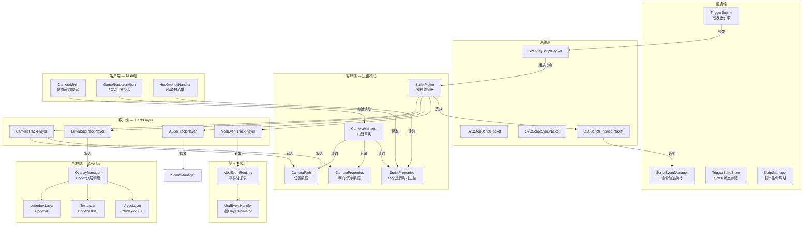
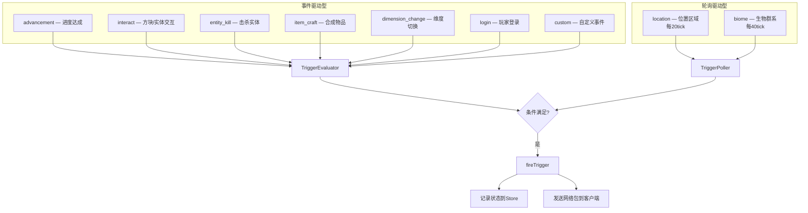
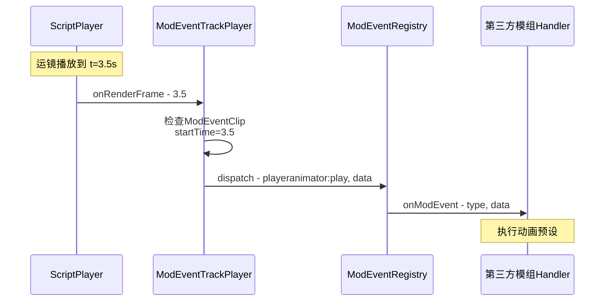
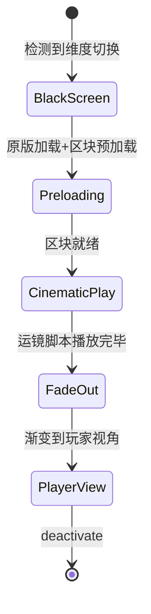
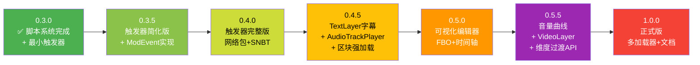

# ImmersiveCinematics 模组设计文档

> **文档职责**：本文件是 ImmersiveCinematics 的权威设计文档，定义模组的定位、架构、已实现功能、待实现功能和版本路线图。
> **最后更新**：2026/5/1

---

## 1. 模组定位

ImmersiveCinematics 是一个 Minecraft 电影级运镜引擎，核心做三件事：

1. **运镜** — 按时间轴自动控制镜头的位置/朝向/光学参数，达到3D软件级自由度
2. **调用** — 在运镜的某个时间点触发外部行为（命令、模组事件），但不自己实现那些行为的内容
3. **Overlay生态** — 音频/字幕/视频作为overlay层扩展，整合在自己的模组里，避免外部依赖，编辑器可预览

**不做的事**：角色动画、光影渲染、粒子系统、物理模拟 — 这些交给其他模组和MC本身。

**差异化**：ImmersiveCinematics 不是"又一个相机模组"，而是 Minecraft 中的**叙事引擎** — 让整合包作者和地图制作者能够像3D软件一样编排运镜体验，并通过触发器系统实现自动化叙事流程。

---

## 2. 架构原则

| # | 原则 | 说明 |
|---|------|------|
| 1 | **纯数据相机** | 相机系统不依赖 Minecraft Entity，使用纯 POJO 数据类管理所有相机属性和位置 |
| 2 | **CameraManager 唯一桥梁** | CameraProperties 与 CameraPath 互不知晓，通过 CameraManager 间接交互；Mixin 层只读取 CameraManager |
| 3 | **脚本驱动** | 所有运镜行为由 JSON 脚本定义，运行时由 ScriptPlayer 驱动，零硬编码 |
| 4 | **标志位优先于事件注册** | 运行时行为通过标志位 + Mixin 检查实现，避免动态注册/注销 Forge 事件监听器 |
| 5 | **帧回调驱动** | 每帧由 `onRenderFrame()` 用实时时间精确计算，不依赖 tick 计数 |
| 6 | **Overlay 分层渲染** | 所有视觉覆盖层（黑边/字幕/视频）通过 OverlayLayer 接口 + zIndex 分层，统一由 OverlayManager 调度 |
| 7 | **调用不实现** | 模组只负责"在正确的时间触发"，不负责"被触发的行为如何执行" — 命令交给服务端，模组事件交给注册的 handler |
| 8 | **客户端-服务端分离** | 服务端负责触发器判断和命令执行，客户端负责运镜播放和渲染 |

---

## 3. 整体架构



---

## 4. 已实现功能

### 4.1 相机系统 ✅

| 组件 | 文件 | 说明 |
|------|------|------|
| 相机位置 | `camera/CameraPath.java` | 纯POJO，x/y/z 三维坐标 |
| 相机属性 | `camera/CameraProperties.java` | yaw/pitch/roll/fov/zoom/dof，双缓冲 staged/commit + partialTick 帧级插值；默认值从 Config 读取（含 try-catch 回退） |
| 相机管理器 | `camera/CameraManager.java` | 门面单例，Mixin层唯一入口，虚拟时钟驱动 |
| Mixin注入 | `mixin/CameraMixin.java` | 覆写相机位置/朝向/roll，支持编辑器预览模式 |
| 渲染注入 | `mixin/GameRendererMixin.java` | FOV除法zoom + 手臂隐藏 + bob/摇晃/反胃屏蔽 |
| HUD控制 | `handler/HudOverlayHandler.java` | 白名单机制，检查 ScriptProperties 标志位 |

**实施结果与原设计的关键差异（均为改进）**：
- CameraPath 只管 position(x,y,z)，yaw/pitch 移到了 CameraProperties
- 增加了双缓冲 staged/commit 架构支持多段镜头硬切换
- 增加了 partialTick 帧级插值消除 20tick/s 阶梯感
- Roll 通过 Forge 事件 `ViewportEvent.ComputeCameraAngles` 实现
- HUD 通过 Forge 事件 `RenderGuiOverlayEvent.Pre` + 白名单机制

### 4.2 脚本系统 ✅

| 组件 | 文件 | 说明 |
|------|------|------|
| 脚本容器 | `script/CinematicScript.java` | 顶层容器，id/name/timeline |
| 脚本属性 | `script/ScriptMeta.java` | 元信息 + RuntimeBehavior 15标志位 + 插值控制 |
| 时间轴 | `script/Timeline.java` | 轨道容器 |
| 轨道 | `script/TimelineTrack.java` | 多态轨道，5种TrackType，类型安全getter（类型不匹配抛IllegalStateException） |
| 镜头片段 | `script/CameraClip.java` | 关键帧数组 + 过渡/插值/路径/循环；无限时长判断改为 `duration < 0f`；过渡类型改为 `TransitionType` 枚举 |
| 过渡类型 | `script/TransitionType.java` | CUT/CROSSFADE 枚举，替换原 String 类型 |
| 关键帧 | `script/CameraKeyframe.java` | 8属性 + 逐关键帧插值覆盖 |
| 贝塞尔曲线 | `script/BezierCurve.java` | 2控制点三次贝塞尔 |
| 路径策略 | `script/PathStrategy.java` + `PathStrategies.java` | 可扩展路径插值注册表，当前注册 bezier + linear，默认策略为 linear |
| 插值类型 | `script/InterpolationType.java` | LINEAR/SMOOTH/EASE_IN/EASE_OUT/EASE_IN_OUT |
| 插值作用域 | `script/InterpolationScope.java` | CLIP(整体进度映射) / SEGMENT(逐段映射) |
| 曲线组合模式 | `script/CurveCompositionMode.java` | OVERRIDE(覆盖) / COMPOSED(数学组合) |
| 插值器 | `script/KeyframeInterpolator.java` | 5曲线 + 三层覆盖 + 贝塞尔 + 角度环绕 + NaN防护 |
| 脚本解析 | `script/ScriptParser.java` | JSON → POJO，Gson + 验证规则 |
| 播放器 | `script/ScriptPlayer.java` | 纯调度器，创建TrackPlayer + 驱动帧回调 |
| 运行时属性 | `script/ScriptProperties.java` | 15个标志位单例，Mixin层直接读取 |
| 轨道播放器接口 | `script/TrackPlayer.java` | isActiveAt/onRenderFrame/onStop + 6参数工厂 |
| 镜头轨道播放器 | `script/CameraTrackPlayer.java` | clip定位 + 插值计算 + 写入CameraManager；缓存索引优化顺序播放搜索 |
| 黑边轨道播放器 | `script/LetterboxTrackPlayer.java` | clip定位 + 写入OverlayManager |
| 音频片段 | `script/AudioClip.java` | 数据层完成 |
| 音频轨道播放器 | `script/AudioTrackPlayer.java` | 占位实现 |
| 命令事件片段 | `script/EventClip.java` | 数据层完成，播放层待服务端实现 |
| 模组事件片段 | `script/ModEventClip.java` | 数据层完成，播放层空壳 |
| 模组事件播放器 | `script/ModEventTrackPlayer.java` | 占位实现，isActiveAt永远返回false |
| 坐标数据 | `script/PositionData.java` | relative(dx/dy/dz) / absolute(x/y/z) |
| 黑边片段 | `script/LetterboxClip.java` | aspectRatio + fadeIn/fadeOut/fadeOutDuration |

### 4.3 Overlay系统 ✅

| 组件 | 文件 | 说明 |
|------|------|------|
| 层接口 | `overlay/OverlayLayer.java` | render/isVisible/isAnimating/getZIndex/reset/tick/startFadeOut；`isAnimating()` 区分"正在动画"与"仅可见" |
| 层管理器 | `overlay/OverlayManager.java` | zIndex排序 + 分层渲染 + 生命周期管理；`isAnimating()` 委托给各层的 `isAnimating()` |
| 黑边层 | `overlay/LetterboxLayer.java` | 画幅比黑边 + smooth缓动渐变动画；零/负画幅比防护 |
| Forge注册 | `overlay/CinematicOverlay.java` | registerAboveAll + 白名单放行 |

### 4.4 命令系统 ✅

| 组件 | 文件 | 说明 |
|------|------|------|
| 命令入口 | `command/CinematicCommand.java` | /immersive 命令注册 |

---

## 5. 待实现功能

### 5.1 触发器系统 ⏳

> 详细设计见 `plans/trigger_system_plan_v4.md`

**核心能力**：让运镜脚本可以自动触发，而非手动按P。



**关键组件**：

| 组件 | 说明 | 状态 |
|------|------|------|
| TriggerEngine | 双通道调度：事件索引 + 轮询桶 | ⏳ 设计完成 |
| TriggerStateStore | SNBT文件持久化，per-player | ⏳ 设计完成 |
| ScriptManager | 脚本加载/热重载/卸载 | ⏳ 设计完成 |
| TriggerRegistry | 触发器类型注册表 | ⏳ 设计完成 |
| ScriptEventManager | 服务端命令轨道执行 | ⏳ 设计完成 |
| CustomTriggerAPI | 第三方模组触发器注册入口 | ⏳ 设计完成 |
| 目录系统 | 编辑器查询可用触发器目标 | ⏳ 设计完成 |
| 网络包 | S2C/C2S 7种包 | ⏳ 设计完成 |

### 5.2 ModEventTrackPlayer 实现 ⏳

**核心能力**：在运镜某时触发第三方模组的行为（如动画预设）。

当前 `ModEventTrackPlayer` 是空壳，需要实现：

1. **时间戳触发** — 在 `onRenderFrame()` 中检查 `ModEventClip.startTime`，到达时触发
2. **命名空间分发** — 从 `eventType`（如 `"playeranimator:play"`）提取命名空间，分发给注册的 handler
3. **ModEventRegistry** — 静态注册表，第三方模组在初始化时注册 handler
4. **一次性触发保护** — 每个 clip 只触发一次，避免重复



**注册表设计**：

```java
public interface ModEventHandler {
    void onModEvent(String eventType, Map<String, Object> data);
}

public class ModEventRegistry {
    private static final Map<String, ModEventHandler> handlers = new HashMap<>();

    public static void register(String namespace, ModEventHandler handler) {
        handlers.put(namespace, handler);
    }

    public static void dispatch(String eventType, Map<String, Object> data) {
        String namespace = eventType.split(":")[0];
        ModEventHandler handler = handlers.get(namespace);
        if (handler != null) {
            handler.onModEvent(eventType, data);
        }
    }
}
```

### 5.3 服务端 EventClip 命令执行 ⏳

> 详细设计见 `plans/script_system.md` §3.9

event 轨道存储的是游戏命令（`/time set`、`/weather rain`、`/particle` 等），必须在服务端执行。客户端不处理 event 轨道。

**ScriptEventManager** 在每 tick 检查每个活跃播放的 event clip 时间戳，到期的命令通过 `server.getCommands().performPrefixedCommand()` 执行。

### 5.4 Overlay 扩展 ⏳

#### 5.4.1 TextLayer — 字幕/屏幕文字

**定位**：运镜中的叙事文字，不是富文本编辑器。

| 能力 | 实现方式 | 复杂度 |
|------|---------|--------|
| 百分比定位 | x=0.5, y=0.8 → screenWidth*0.5, screenHeight*0.8 | 低 |
| 淡入淡出 | 复用 LetterboxLayer 的 progress 模式 | 低 |
| 多行文字 | \n 分割 + 逐行绘制 | 低 |
| 字体样式 | GuiGraphics.drawString + MC自带字体 | 低 |
| 多文字层 | 多个 TextClip 在同一轨道，或多个 text 轨道 | 低 |

**需要新增**：

| 文件 | 说明 |
|------|------|
| `script/TextClip.java` | 文字片段数据：text/x/y/fadeIn/fadeOut/duration/style |
| `script/TextTrackPlayer.java` | 按时间戳驱动 TextLayer |
| `overlay/TextLayer.java` | implements OverlayLayer, zIndex=100+ |
| `script/TrackType.java` | 新增 TEXT 枚举值 |

#### 5.4.2 AudioTrackPlayer — 音频播放

**定位**：运镜的氛围配套，不是专业音频编辑器。

| 能力 | 实现方式 | 复杂度 |
|------|---------|--------|
| 播放原版音效/音乐 | Minecraft.getInstance().getSoundManager().play() | 低 |
| 按时间戳触发 | AudioTrackPlayer 在 onRenderFrame() 中检查 clip.startTime | 低 |
| 音量控制 | SimpleSoundInstance 构造时设置 volume | 低 |
| 多轨音频 | 多个 audio 轨道各自独立播放 | 低 |
| 淡入淡出 | 每帧调整 volume | 中 |
| 音量曲线 | 扩展 AudioClip 增加 volume keyframes | 中 |

#### 5.4.3 VideoLayer — 视频播放

**定位**：运镜中嵌入预录视频片段（如回忆闪回），不是视频编辑器。

| 能力 | 实现方式 | 复杂度 |
|------|---------|--------|
| 读取视频文件 | FFmpeg Java绑定 或 JavaFX MediaPlayer | 高 |
| 解码为纹理 | 逐帧解码到 OpenGL 纹理 | 高 |
| 绘制到GUI | GuiGraphics.blit() 绘制纹理到指定区域 | 中 |
| 音视频同步 | 视频帧 PTS 与 ScriptPlayer 时间对齐 | 高 |

> 视频播放是三个overlay扩展中复杂度最高的，建议推迟到后期版本。

### 5.5 区块强加载 ⏳

> 详细设计见 `plans/0.3.0plan.md` Phase 1.5

电影模式下相机远离玩家时，服务端会卸载相机附近的区块，导致生物消失/声音缺失/方块消失。

**方案**：ForgeChunkManager + NaturalSpawnerMixin 刷怪注入

| 层级 | 范围 | ticking | 用途 |
|------|------|---------|------|
| 核心圈 | 相机位置 ±2 区块 | ✅ true | 实体tick、刷怪、声音 |
| 渲染圈 | 相机位置 ±4 区块 | ❌ false | 渲染远处地形/建筑 |
| 路径预加载 | 后续 N 个关键帧位置 | ❌ false | 镜头移动前区块已就绪 |
| 跨维度预加载 | 脚本声明的目标维度 | ✅ true | 跨维度镜头的区块+实体 |

### 5.6 可视化编辑器 ⏳

> 详细设计见 `plans/0.3.0plan.md` Phase 3

游戏内编辑器，FBO预览区域 + 时间轴 + 关键帧编辑。

| 组件 | 说明 | 复杂度 |
|------|------|--------|
| CameraEditorScreen | 编辑器Screen基类，布局框架 | 高 |
| PreviewRenderer | 离屏FBO + renderLevel + 纹理绘制到预览区域 | 高 |
| TimelinePanel | 轨道+clip块+时间标尺+播放头 | 高 |
| KeyframeEditor | 选中关键帧编辑属性 | 中 |
| PropertyPanel | 位置/角度/FOV/Zoom输入框 | 中 |
| PlaybackControls | 播放/暂停/停止/回起点 | 低 |
| PositionPicker | F3+鼠标点击拾取坐标到关键帧 | 中 |

---

## 6. 远期愿景

### 6.1 维度过渡运镜

当玩家进入末地传送门/下界传送门时，不显示原版的 "Loading terrain..." 进度条，而是播放一段预设的运镜过场动画。

**核心矛盾**：原版 `ReceivingLevelScreen` 显示期间，客户端还没有目标维度的区块数据，无法渲染。解决方案：黑幕过渡 → 区块预加载 → 区块就绪后运镜 → 渐变到玩家视角。



### 6.2 多加载器支持

适配器模式：IModInitializer + IModContext 接口，各加载器实现 ForgeModInitializer / FabricModInitializer。

### 6.3 双产品版本

- 完整版（包含编辑器）：`./gradlew :forge:build -Pbuild.editor=true`
- 播放器版（仅播放逻辑）：`./gradlew :forge:build -Pbuild.editor=false`

---

## 7. 版本路线图



| 版本 | 核心交付 | 依赖 |
|------|---------|------|
| **0.3.0** ✅ | 脚本系统：运镜播放 + 画幅 + 命令/模组事件数据层 | — |
| **0.3.5** | 触发器简化版：命令触发 + 位置触发 + ModEventTrackPlayer实现 + ModEventRegistry + CustomTriggerAPI + 服务端EventClip命令执行 | 0.3.0 |
| **0.4.0** | 触发器完整版：网络包 + SNBT存储 + 进度/交互/维度触发 + 目录系统 | 0.3.5 |
| **0.4.5** | Overlay扩展：TextLayer字幕层 + AudioTrackPlayer基础播放 + 区块强加载 | 0.3.0 |
| **0.5.0** | 可视化编辑器：FBO预览 + 时间轴 + 关键帧编辑 | 0.4.5 |
| **0.5.5** | Overlay进阶：音量曲线 + VideoLayer视频播放 + 维度过渡创作者API | 0.5.0 |
| **1.0.0** | 正式版：多加载器 + 文档 + 发布 | 全部 |

---

## 8. 包结构

```
com.immersivecinematics.immersive_cinematics/
├── camera/                          # 相机系统
│   ├── CameraManager.java           # 门面单例，Mixin层唯一入口
│   ├── CameraPath.java              # 位置数据 POJO
│   └── CameraProperties.java        # 朝向/光学数据 POJO
├── script/                          # 脚本系统
│   ├── CinematicScript.java         # 顶层容器
│   ├── ScriptMeta.java              # 元信息 + RuntimeBehavior
│   ├── ScriptParser.java            # JSON → POJO
│   ├── ScriptPlayer.java            # 播放调度器
│   ├── ScriptProperties.java        # 运行时标志位单例
│   ├── Timeline.java                # 时间轴容器
│   ├── TimelineTrack.java           # 多态轨道
│   ├── TrackType.java               # 轨道类型枚举
│   ├── TrackPlayer.java             # 轨道播放器接口 + 工厂
│   ├── CameraClip.java              # 镜头片段
│   ├── CameraKeyframe.java          # 关键帧
│   ├── TransitionType.java          # 过渡类型枚举 (CUT/CROSSFADE)
│   ├── CameraTrackPlayer.java       # 镜头轨道播放器
│   ├── BezierCurve.java             # 贝塞尔曲线
│   ├── PathStrategy.java            # 路径策略接口
│   ├── PathStrategies.java          # 路径策略注册表
│   ├── BezierPathStrategy.java      # 贝塞尔路径策略
│   ├── KeyframeInterpolator.java    # 插值器
│   ├── InterpolationType.java       # 插值类型枚举
│   ├── InterpolationScope.java      # 插值作用域枚举
│   ├── CurveCompositionMode.java    # 曲线组合模式枚举
│   ├── PositionData.java            # 坐标数据
│   ├── LetterboxClip.java           # 黑边片段
│   ├── LetterboxTrackPlayer.java    # 黑边轨道播放器
│   ├── AudioClip.java               # 音频片段
│   ├── AudioTrackPlayer.java        # 音频轨道播放器（占位）
│   ├── EventClip.java               # 命令事件片段
│   ├── ModEventClip.java            # 模组事件片段
│   ├── ModEventTrackPlayer.java     # 模组事件轨道播放器（占位）
│   ├── TextClip.java                # ⏳ 文字片段
│   └── TextTrackPlayer.java         # ⏳ 文字轨道播放器
├── overlay/                         # Overlay系统
│   ├── OverlayLayer.java            # 层接口
│   ├── OverlayManager.java          # 层管理器
│   ├── CinematicOverlay.java        # Forge注册入口
│   ├── LetterboxLayer.java          # 黑边层 zIndex=0
│   ├── TextLayer.java               # ⏳ 文字层 zIndex=100+
│   └── VideoLayer.java              # ⏳ 视频层 zIndex=200+
├── trigger/                         # ⏳ 触发器系统
│   ├── server/                      # 服务端
│   │   ├── TriggerEngine.java       # 触发器引擎
│   │   ├── ScriptEventManager.java  # 命令轨道执行
│   │   ├── TriggerRegistry.java     # 类型注册表
│   │   ├── TriggerType.java         # 类型定义
│   │   ├── TriggerRegistration.java # 注册项
│   │   ├── ListenStrategy.java      # 监听策略枚举
│   │   ├── store/                   # 状态存储
│   │   ├── evaluator/               # 条件评估器
│   │   ├── action/                  # 触发动作
│   │   ├── catalog/                 # 目录系统
│   │   └── CustomTriggerAPI.java    # 第三方API
│   ├── client/                      # 客户端
│   │   ├── ClientScriptReceiver.java
│   │   ├── ClientScriptNotifier.java
│   │   ├── ClientScriptCache.java
│   │   └── ClientTriggerStateCache.java
│   └── network/                     # 网络包
├── mixin/                           # Mixin注入层
│   ├── CameraMixin.java             # 相机位置/朝向覆写
│   └── GameRendererMixin.java       # FOV/手臂/bob屏蔽
├── handler/                         # Forge事件处理器
│   └── HudOverlayHandler.java       # HUD白名单
├── command/                         # 命令系统
│   └── CinematicCommand.java        # /immersive 命令
├── util/                            # 工具类
│   └── MathUtil.java                # 数学工具 + sanitize
└── Config.java                      # Forge配置
```

---

## 9. 性能目标

| 指标 | 目标 | 说明 |
|------|------|------|
| 播放器模块内存 | < 50MB | 纯POJO，无Entity开销 |
| 相机动画帧率 | 60+ FPS | 帧回调驱动，不依赖tick |
| 脚本分发延迟 | < 100ms | 两阶段分发：预同步 + 触发时引用 |
| 编辑器启动 | < 5秒 | 懒加载，按需构建 |
| 区块强加载 | ~100区块 | 核心圈25 + 渲染圈75，轻量 |

---

## 10. 修复记录

### 10.1 Plan C — 深度审查修复 (2026/5/1)

| 编号 | 修复项 | 文件 | 说明 |
|------|--------|------|------|
| A1 | OverlayManager.isAnimating() 语义错误 | `OverlayLayer.java`, `OverlayManager.java`, `LetterboxLayer.java` | `isAnimating()` 原检查 `isVisible()`，无法区分"正在动画"和"仅可见"；在接口增加 `default isAnimating()` 方法，`OverlayManager` 改为委托 `layer.isAnimating()` |
| A2 | CameraClip.isInfinite() 浮点等值比较 | `CameraClip.java`, `ScriptParser.java` | `duration == -1f` 改为 `duration < 0f`；Parser 验证从 `!= -1f && <= 0f` 改为 `== 0f`（仅零无效） |
| A3 | 创建 TransitionType 枚举替换 String | `TransitionType.java`(新), `CameraClip.java`, `ScriptParser.java` | 新增 `CUT`/`CROSSFADE` 枚举，`CameraClip.transition` 字段类型从 `String` 改为 `TransitionType`，Parser 增加 `parseTransitionType()` |
| A4 | Parser 使用 Builder 构建 RuntimeBehavior | `ScriptParser.java` | 替换位置参数构造为 `RuntimeBehavior.builder()...build()`，消除15参数位置依赖 |
| A5 | LetterboxTrackPlayer 每帧调用 startFadeOut() | `LetterboxTrackPlayer.java` | `activeClip == null` 分支增加 `&& letterbox.isVisible()` 前置检查，避免已隐藏层重复触发 |
| A6 | Config.defaultFov/defaultZoom 未被消费 | `CameraProperties.java` | 删除硬编码 `DEFAULT_FOV=70`/`DEFAULT_ZOOM=1`，改为 `getDefaultFov()`/`getDefaultZoom()` 从 Config 读取（含 try-catch 回退） |
| A7 | findActiveClip() 每帧线性扫描 | `CameraTrackPlayer.java` | 增加 `lastClipIndex` 缓存，从上次匹配位置开始搜索；`onStop()` 时重置 |
| A8 | onRenderFrame() 重复调用 getCurrent() | `CameraManager.java` | 方法开头获取 `currentProps` 一次，后续复用，删除两处重复局部声明 |
| A9 | LetterboxLayer.render() 隐式除零 | `LetterboxLayer.java` | `render()` 开头增加 `targetAspectRatio <= 0f` 防护，提前返回 |
| A10 | parseDataMap() 多余的 @SuppressWarnings | `ScriptParser.java` | 删除 `@SuppressWarnings("unchecked")` 注解，Gson tree API 无需此抑制 |

### 10.2 Plan D — 深度审查额外发现修复 (2026/5/1)

| 编号 | 修复内容 | 文件 | 说明 |
|------|----------|------|------|
| B1 | LetterboxClip/Timeline.isInfinite() 浮点等值比较 | `LetterboxClip.java`, `Timeline.java` | `duration == -1f` / `totalDuration == -1f` 改为 `< 0f`，与 CameraClip.isInfinite() 修复一致；Javadoc 更新为"负数=无限" |
| B2 | CinematicCommand 异步反馈不准确 | `CinematicCommand.java` | `playScript()`/`stopScript()` 在客户端回调内检查实际结果，通过 `displayClientMessage()` 反馈成功/拒绝；服务端仅发送"正在调度"消息 |
| B3 | ScriptProperties.revert() 硬编码默认值 | `ScriptProperties.java` | `revert()` 从 `RuntimeBehavior.DEFAULT` 读取默认值，消除与 DEFAULT 常量的重复定义（DRY） |
| B4 | MathUtil.smoothstep() 除零 NaN | `MathUtil.java` | 添加 `edge0 == edge1` 守卫条件：`x >= edge0` 返回 1，否则返回 0，避免 0/0 产生 NaN |
| B5 | ScriptPlayer holdAtEnd 魔法数 | `ScriptPlayer.java` | 提取 `0.0001f` 为命名常量 `HOLD_END_EPSILON`，添加 Javadoc 说明其含义和选择依据 |
| B6 | ScriptPlayer 双重扫描 TrackPlayer | `ScriptPlayer.java` | 移除 `onRenderFrame()` 热路径中的 `isActiveAt()` 预检查，让 `onRenderFrame()` 内部自行判断是否有活跃 clip，避免每帧双重扫描 |