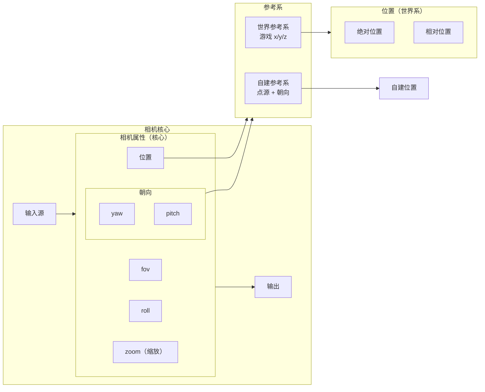

```mermaid
flowchart LR
    subgraph CAM["相机核心"]
        SRC["输入源"]
        subgraph CORE["相机属性（核心）"]
            POS["位置"]
            subgraph ORI["朝向"]
                Y["yaw"]
                PI["pitch"]
            end
            FOV["fov"]
            R["roll"]
            Z["zoom（缩放）"]
        end
        DEST["输出"]
        SRC --> CORE
        CORE --> DEST
    end
    subgraph FRAMES["参考系"]
        W["世界参考系<br/>游戏 x/y/z"]
        SELF["自建参考系<br/>点源 + 朝向"]
    end
    subgraph WPOS["位置（世界系）"]
        ABS["绝对位置"]
        REL["相对位置"]
    end
    POS --> FRAMES
    ORI --> FRAMES
    W --> WPOS
    SELF --> SELFPOS["自建位置"]
```
