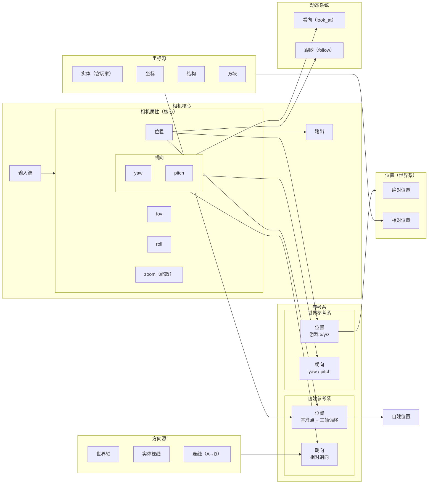

```mermaid
flowchart LR
    subgraph CAM["相机核心"]
        SRC["输入源"]
        subgraph CORE["相机属性（核心）"]
            POS["位置"]
            subgraph ORI["朝向"]
                Y["yaw"]
                PI["pitch"]
            end
            FOV["fov"]
            R["roll"]
            Z["zoom（缩放）"]
        end
        DEST["输出"]
        SRC --> CORE
        CORE --> DEST
    end
    subgraph FRAMES["参考系"]
        subgraph SELFF["自建参考系"]
            SP["位置<br/>基准点 + 三轴偏移"]
            SO["朝向<br/>相对朝向"]
        end
        subgraph WORLDF["世界参考系"]
            WP["位置<br/>游戏 x/y/z"]
            WO["朝向<br/>yaw / pitch"]
        end
    end
    subgraph DYN["动态系统"]
        LOOK["看向（look_at）"]
        FOLLOW["跟随（follow）"]
    end
    subgraph WPOS["位置（世界系）"]
        ABS["绝对位置"]
        REL["相对位置"]
    end
    subgraph COORDSRC["坐标源"]
        ENT["实体（含玩家）"]
        COORD["坐标"]
        STRUCT["结构"]
        BLOCK["方块"]
    end
    subgraph DIRSRC["方向源"]
        AXIS["世界轴"]
        VIEW["实体视线"]
        LINE["连线（A→B）"]
    end
    POS --> WP
    POS --> SP
    ORI --> WO
    ORI --> SO
    ORI --> LOOK
    POS --> FOLLOW
    WP --> WPOS
    SP --> SELFPOS["自建位置"]
    COORDSRC --> SP
    DIRSRC --> SO
    COORDSRC --> REL
```
