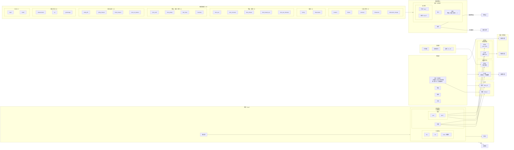

```mermaid
flowchart LR
    subgraph CAM["相机（lane）"]
        SRC["输入源"]
        subgraph CORE["相机核心"]
            subgraph MAIN["主要核心"]
                POS["位置"]
                subgraph ORI["朝向"]
                    Y["yaw"]
                    PI["pitch"]
                end
            end
            subgraph SECOND["次要核心"]
                FOV["fov"]
                R["roll"]
                Z["zoom（缩放）"]
            end
        end
        DEST["输出"]
        SRC --> CORE
        CORE --> DEST
    end
    subgraph FRAMES["参考系"]
        subgraph SELFF["自建参考系"]
            SP["位置<br/>基准点 + 三轴偏移"]
            SO["朝向<br/>相对朝向"]
        end
        subgraph WORLDF["世界参考系"]
            WP["位置<br/>游戏 x/y/z"]
            WO["朝向<br/>yaw / pitch"]
        end
    end
    subgraph TRACK["追踪"]
        LOOK["看向（look_at）"]
        FOLLOW["跟随（follow）"]
    end
    subgraph WPOS["位置（世界系）"]
        ABS["绝对位置"]
        REL["相对位置"]
    end
    subgraph COORDSRC["坐标源"]
        ENT["实体（含玩家）<br/>（可通过 AABB 百分比偏移：脚 / 头 / 其他部位）"]
        COORD["坐标"]
        STRUCT["结构"]
        BLOCK["方块"]
    end
    subgraph DIRSRC["方向源"]
        AXIS["世界轴"]
        VIEW["实体视线"]
        LINE["连线（A→B）"]
    end
    subgraph TRIGGER["触发器核心"]
        subgraph COND["条件（含状态）"]
            C_SINGLE["单一"]
            subgraph C_COMB["组合器"]
                C_ANY["任意（any）"]
                C_ALL["全部（all_of）"]
            end
            C_REQ["前置<br/>（物品 / 成就 / 脚本 / …）"]
        end
        ACT["动作"]
    end
    subgraph TYPES["触发器类型（25）"]
        subgraph G1["位置 / 世界（5）"]
            T1["location"]
            T2["biome"]
            T3["structure"]
            T4["dimension"]
            T5["dimension_change"]
            T1 ~~~ T2
            T2 ~~~ T3
            T3 ~~~ T4
            T4 ~~~ T5
        end
        subgraph G2["视线（2）"]
            T6["facing"]
            T7["observation"]
            T6 ~~~ T7
        end
        subgraph G3["物品 · 使用（5）"]
            T8["item_use"]
            T9["item_consume"]
            T10["item_release"]
            T11["item_instant_use"]
            T12["item_use_interrupt"]
            T8 ~~~ T9
            T9 ~~~ T10
            T10 ~~~ T11
            T11 ~~~ T12
        end
        subgraph G4["物品 · 流转 / 持有（4）"]
            T13["item_craft"]
            T14["item_pickup"]
            T15["item_drop"]
            T16["inventory"]
            T13 ~~~ T14
            T14 ~~~ T15
            T15 ~~~ T16
        end
        subgraph G5["实体与交互（4）"]
            T17["entity_kill"]
            T18["entity_interact"]
            T19["block_interact"]
            T20["item_on_interact"]
            T17 ~~~ T18
            T18 ~~~ T19
            T19 ~~~ T20
        end
        subgraph G6["进度 / 阶段（3）"]
            T21["advancement"]
            T22["xp"]
            T23["gamestage"]
            T21 ~~~ T22
            T22 ~~~ T23
        end
        subgraph G7["会话（2）"]
            T24["login"]
            T25["death"]
            T24 ~~~ T25
        end
    end
    CAM -->|× N| MULTI["多相机"]
    POS --> WP
    POS --> SP
    ORI --> WO
    ORI --> SO
    ORI --> LOOK
    POS --> FOLLOW
    COORDSRC --> LOOK
    ENT --> FOLLOW
    WP --> WPOS
    SP --> SELFPOS["自建位置"]
    COORDSRC --> SP
    DIRSRC --> SO
    COORDSRC --> REL
    TYPES --> COND
    ACT -->|控制脚本| PLAY["播放实例"]
    ACT -->|回报等待点| WAITPT["等待点"]
```
