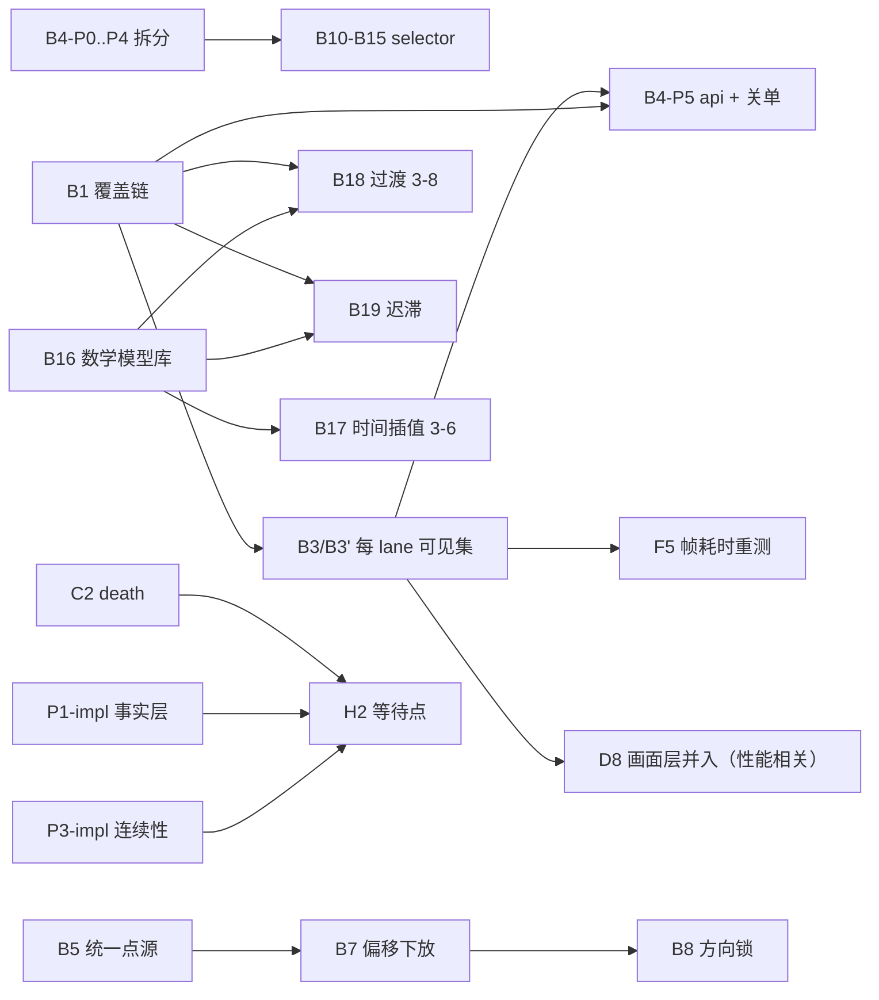

# 0.3.6 下一阶段批次开工计划（批次 B~H + 用户裁决遗留）

> 生成：2026-10-09 晚（批次 A 已关单后的第一份开工计划）。**本文件只做计划**：不改代码、不改既有文档；明天照此开工。
> 真源：`implementation-progress.md`（批次 B/C/D/E/F/G/H 表 + 用户裁决新增表 = 任务清单唯一真源）；实现程度与证据：`re/00-评估总览.md` + `re/01`~`re/06`（本地评估稿，不入库但可读）；缺口总清单：`implementation-audit-2026-10-07.md`；未定项：`pending-discussions.md`。
> 引用口径：行号取自 2026-10-09 工作区，**会漂移**——一律「文档 + 小节（+ 行号）」双标；re 报告的引用给「文件:行号」（其内部给的是代码类名:行号，可直接核对）。
> 审计文档的行号换算：**审计 §三 12 条 = audit:93-104**（第 N 条 = 行 92+N）；**审计 §四 7 条 = audit:110-116**（第 N 条 = 行 109+N）；审计 §二 功能缺口 = audit:49-89。
> 执行规则（沿用，progress:5）：**计划类任务可并行**（各写各的文档，互不冲突）；**执行类（改代码）任务必须串行**——一个子任务完成、验收、提交后才开下一个。任务书粒度 = 单一职责、可验收。
> 范围外：编辑器阶段（最后做，`implementation-progress.md:154-157` 已列清单）；`plans/0.4.0/` 三篇（跨维度运镜 / 运动模型 / 路径形状）= 下一版本，本计划只标注归属。

---

## 〇、总览（批 × 待办数 × 建议顺序）

| 批 | 待办项 | 子任务数估计 | 建议顺序 | 性质 | 关键前置 |
|---|---|---|---|---|---|
| B 相机底层 | 19（B1–B19，其中 B3 = 用户裁决 B3'） | ~32 | ① 主体（波 1–3） | 计划 + 编码混合 | — |
| G script-model | 6（G1–G6） | 6–7 | ②（G4 与 B4-P1 合并、G1/G2/G3 小件穿插） | 编码（小件） | G3←G1；G4 = `clock-abstraction.md` |
| C 触发器 | 4（C1–C4） | 4–5 | ③（小件穿插） | 编码（小件） | C3 与 P3-impl 步骤 4 合并 |
| 遗留 P1-impl / P3-impl | 2（各 7 / 6 步） | 13 | ④（C 批之后、H2 之前） | 编码（触发器底层） | P3 最小版本不依赖 P1 |
| F 播放/渲染主线 | 4（F2–F5） | 4–6 | ⑤（F3 调研提前到波 1） | 调查 + 编码 | F5←B3 |
| D 转场/遮罩/覆盖层 | 10（D1–D10） | 10–12 | ⑥ | 编码 | D4→D6→D1→D2/D3 |
| E 模板 | 4（E1–E4） | 1 重审 + 4 | ⑦（先口径重审） | 计划→编码 | progress:145 口径重审 |
| H 其它 | 5（H1–H6） | 8–10 | ⑧（H5 提前、H6 收尾） | 文档 + 编码 + 实机 | H2←C2+P1-impl+P3-impl；H6←A,B,D |
| CLEANUP-2 | 1 | 0 编码 + 1 回写 | 随 H5 | 文档回写 | 代码已完成（见 §三） |

**依赖主链**（只画倒挂风险最高的边）：

---

## 一、批次 B：相机底层（逐项 19 条）

> 批次 B 是本阶段主体（`implementation-progress.md:49-70`）。三条通用说明：
> 1. **B4 的拆分是后续 selector 系列（B10–B15）与 B2 结案的落点**——`camera-core-split.md §2.2` 指定 `EntityTargetResolver` 为 selector-model 的落点，`§五` 指定 B2 在新结构上结案、B10–B15 在新类上做。因此波 1 先做 B4 的 P0–P4。
> 2. **B4 整行关单依赖 B1、B3**（progress:52），但 `camera-core-split.md` 明确拆分本体不依赖：`§〇` COVER 层「本轮只立接口留位，接链归 B1」、`§五`「Base Provider 接链留给 B1，接口先留位」。本计划的排期按此拆分理解：P0–P4 先行（功能不变），P5/关单在 B1 接口定稿后收口。
> 3. B5–B9（coordinate-frame 族）与 B16–B19（math-models 族）互不依赖，可与其他批交错，但**编码仍串行**。

### B1 Base/Modifier 覆盖链（优先级、通道掩码、REPLACE/ADD/MULTIPLY + 示例）
- **现状**：零实现。re/04:24 证据——全仓 Grep `Base Provider|Modifier|REPLACE|MULTIPLY|suppressModifiers|CameraApi` 仅命中无关的 `TriggerStateStore.java:160`；无任何 Base/Modifier 类、优先级、通道掩码、合成模式。已落地的前半：六参数快照（camera-state-plan §6 接口定稿 L119-129）+ staged 删除（§4 L54-74）。
- **缺口**：方向已确认但未实现——Base Chain（camera-state-plan §5.1 L80-87）、Modifier Chain（§5.2 L88-94，字段方向 = 优先级 / 通道掩码 / 合成模式；合成模式已确认 REPLACE/ADD/MULTIPLY，见 pending-discussions §二）、组合顺序（§5.3 L95-105）；`§8` 九条待定（优先级层级、`suppressModifiers`、每通道默认合成方式、Modifier 后统一 clamp、无 Base 活跃时回退、每帧零分配等，L176-189）、`§9` 待定（接口形态、优先级数值、状态 buffer、api 时机、zoom 与 effectiveFov，L190-200）。
- **依赖**：—（B3 / B4-P5 / B18 / B19 依赖它）。
- **子任务拆解**（4 个）：
  1. **B1-a 设计定稿**（计划类，可并行，与 B2 合并——同一文件同一主题，见 §四）：逐条定 §8 九条 + §9 未结项；定 Base Provider 名单（脚本导演 / 编辑器直控 / 飞行 / 外部接管，transition.md §事实核查③ L150 已列现状来源）；产出 camera-state-plan.md 定稿小节 + 接口形状（供 B4-P1/P2 留位）。
  2. **B1-b 实现 Base Chain**：`Base Provider` 接口 + 注册 + 优先级 + 切换语义；`CameraTrackPlayer` 作为脚本导演 Provider 接入。
  3. **B1-c 实现 Modifier Chain**：通道掩码 + REPLACE/ADD/MULTIPLY + 优先级 + `suppressModifiers`。
  4. **B1-d 示例与文档**：示例脚本（`cinematics/tests/camera/`）+ `docs/SCRIPT_FORMAT.md` 字段 + 旧脚本零回归。
- **验收**：camera-state-plan §10 覆盖目标逐项（L202-216）；validator 0 新增 issue；quadrant 实机像素回归不变；每帧状态对象零分配（读码 + 需要时压测）。

### B2 每 lane 独立 CameraPath/CameraProperties 核对（可能已被 lane 快照模型取代 → 结案回写文档）
- **现状**：未做，且很可能是「不需要做」。re/04:25 证据——全局 `activePath`/`activeProperties` 仍由顶层 clip 写入（`CameraTrackPlayer.writeAttributes:1061-1062` 直写 `cameraManager.getPath()/getProperties()`）；lane 侧已是快照模型（`CameraLane(state, clip, clipLocalTime)` 已存在，`LaneSnapshotCollector` 在 camera-core-split §2.2 规划中）。camera-state-plan §6 L156、§7 L168-169 仍把「每 lane 一份 CameraPath/CameraProperties」与「CameraPath/CameraProperties 是否被状态 buffer 取代」列为未做/待定。
- **缺口**：**文档口径结案**，不是代码缺口：需在 B4 新结构（`CameraStateHolder` / `LaneSnapshotCollector`）上给出「已被 lane 快照模型取代」的结论并回写。
- **依赖**：B4-P1/P4（新结构落地后核对）。
- **子任务拆解**（1 个，计划/文档类）：核对写侧/读侧各调用点 → 结论 + 回写 camera-state-plan.md（§6/§7）+ camera-core-split.md §五 + progress B2 行。
- **验收**：结论带代码证据（谁在写全局、lane 读的是哪份快照）；文档不再留该悬项。

### B3 每 lane 独立可见集合/遮挡剔除（长期解，消除 smartCull=false 缓解的代价）= 用户裁决 **B3'「做」**
- **现状**：未做。现为**整帧共享单份 + `smartCull=false` 缓解**：multi-camera-rendering §12.8-B L401-429——根因 = `renderChunkStorage` 单份共享、BFS 由某个 pass 播种（L402-404）；处置 = lane 活跃时整帧 `smartCull=false` + 每 lane pass 强制重刷可见集合（L405-420）；代价 = 无遮挡剪枝、绘制/区块编译量上升（L422-426）；长期解 = 每 lane 独立可见集合 / 剔除状态（L427-429）。缓解的播放期代价见 multi-camera-rendering §4 L96、audit:57。
- **缺口**：per-lane `renderChunkStorage` + BFS + frustum 独立维护；各 lane 允许自己的遮挡行为；拿回性能。
- **依赖**：B1（progress:51）；用户裁决 = 做、工程大、拆「设计 → 实现 → 性能实测」（progress:142）。
- **子任务拆解**（4 个）：
  1. **B3-a 设计**（计划类，可并行）：状态拆分边界（`LevelRenderer.renderChunkStorage` / `renderChunksInFrustum` / `updateRenderChunks` / `smartCull` 门闩）、与 `LevelRendererMixin` 现有包夹（L408-409）的关系、停播恢复、与 `CinematicOcclusion` 的替代关系、内存与编译量预算。
  2. **B3-b 实现**：per-lane 可见集合 + 各 pass 自播种；复核 `LevelRendererAccessor.applyFrustum` 门闩绕过（multi-camera-rendering §12.1 L305）的去留。
  3. **B3-c 性能实测 + 视觉回归**：quadrant 实机像素回归 + 「倾斜裁切矩形」症状 B 像素实证（audit:114）+ 成本曲线（并入 F5）。
  4. **B3-d 收尾**：删 `CinematicOcclusion`（camera-core-split §一处置行 + §五「B3' 落地后删」），`LevelRendererMixin` 包夹同步拆除。
- **验收**：倾斜矩形不再产生（像素实证）；停播后 `smartCull` 交回原版（现日志口径 L425-426 保持）；性能不低于现缓解档；成本曲线更新。

### B4 外部 API（common api 包）+ 相机核心拆分与死代码清理（方案已定稿：`camera-core-split.md`）
- **现状**：**方案定稿、零执行**。re/04:119-127 证据——`CameraManager` 仍 1016 行、`CameraTrackPlayer` 仍 1570 行；§2.3 七条死代码逐条仍在（`hasPendingScript:324`、`deactivate() :199`、`previewSetCamera:645`、`blendVec3:1142`、`cachedTarget/cachedTargetResolvedAt:1152-1153`、`lastClipIndex:29`、`interpolatePosition` 5 参 `:170`）；无 `api/` 包、无 `camera/core/`、`camera/source/`。
- **缺口**：按 `camera-core-split.md` 落地：§2.1 CameraManager → 薄门面 + 6 类；§2.2 CameraTrackPlayer → 编排 + 4 类；§2.3 死代码删除；§2.4 api 包 + 可见性收紧。
- **依赖**：整行关单 ← B1,B3（progress:52）；**拆分本体（P0–P4）不依赖**（§〇 / §五「接口先留位」）。
- **子任务拆解**（照 `camera-core-split.md §三` 迁移顺序，每步编译过、行为不变、可独立提交）：
  1. **B4-P0** 删死代码（§2.3 七条）——机械、最低风险，波 1 第一件。
  2. **B4-P1** `PlaybackClock` + `CameraStateHolder`（§2.1）——**建议与 `clock-abstraction.md` 步骤 1 合并**（两者改同一批时钟字段：`gameTimeSeconds` / `previewTime` / `clockSource`，分两次做会改两遍；见 §四冲突与合并点）。
  3. **B4-P2** `PlaybackRegistry` / `PreviewChannel` / `PlaybackLedger` / `PlaybackLifecycle`（§2.1）。
  4. **B4-P3** `EntityTargetResolver`（§2.2）——**B10–B15 / B14 的落点**；只搬不改行为（已知缺口留给 B10-B15）。
  5. **B4-P4** `CameraKeyframeEvaluator` / `LaneSnapshotCollector` / `WorldPointLocator`（§2.2）。
  6. **B4-P5** api 包 + 可见性收紧 + 边界检查（§2.4）——与 B1 接口定稿合流收口。
- **验收**：每步 `compileJava` + validator + icv2/icgl 复跑 + quadrant 实机回归（§四「功能不变」= camera-state-plan §10 逐项）；§四「干净简洁」= 门面 ≤150 行 / 编排 ≤200 行 / `grep CameraPath\|CameraProperties` 在 `mixin/`、`api/` 零命中 / `camera/core/` 不 import 外围包。

### B5 统一点源清单（yaw_base_from/to、facing_target 接受完整点源）
- **现状**：未做。re/04（coordinate-frame 依据）——`lineDir:1014-1015` 对 `yaw_base_from/to` 只调 `resolveEntity`，不识别坐标/结构/方块来源；`resolvePointSource:562` 的 javadoc 声称「位置基准/注视点/连线端点共用」，实际仅位置基准调用（`:524`），注视点走 `evalLookTarget`、连线端点走 `resolveEntity`。
- **缺口**：点源清单统一（玩家 / 实体选择器 / 坐标 / 结构 / 方块 / …），**连线端点与位置基准共用同一套**（coordinate-frame §3 L82-89、§5.1 L119-121）；progress:53 点名 `yaw_base_from/to`、`facing_target`。
- **依赖**：—（B7 依赖它）。
- **子任务拆解**（2 个）：B5-a 点源清单与字段形态定稿（coordinate-frame §6 L199-211 相关条目：端点来源与位置基准是否共用同一清单）+ 实现 `resolvePointSource` 统一三个调用点；B5-b 测试脚本 + 文档。
- **验收**：连线端点可用坐标 / 结构 / 方块；旧脚本零回归（现有实体选择器路径不变）。

### B6 look_at 方块来源 + 部位百分比微调
- **现状**：未做。re/04——`look_at=entity` 注视点写死 AABB 中心（`evalLookTarget:790`：`entityPosition(target).add(0, bbHeight/2, 0)`），无百分比 / 部位微调。
- **缺口**：来源补齐（实体 / 坐标 / 结构 / 方块）+ 部位百分比微调（coordinate-frame §5.5 L139-157「注视点即点源」：看包围盒中心 / 看头 / 看某部位 = 同一机制的不同参数）。
- **依赖**：—（与 B5 同族，建议相邻排期）。
- **子任务拆解**（2 个）：来源补齐（复用 B5 点源解析）；百分比微调字段 + schema + 校验 + 测试。
- **验收**：可看指定部位；默认（不填微调）行为与旧脚本逐点一致。

### B7 偏移下放到点源 / 通道相对化
- **现状**：未做。re/04——无通用 `space` 的点源抽象，只有 `look_at_target.space: facing` 一处特例；通道相对化无实现。
- **缺口**：偏移成为点源的**通用属性**（来源 + 偏移；表达空间可选世界轴 / 基准坐标系，coordinate-frame §5.4 L133-137）；位置 / yaw / pitch / 注视点各项独立开关、水平面与垂直面可分开取来源（§5.3 L129-131）；字段形态待定（§6 L199-211「通道相对化字段形态：每通道开关 vs 来源枚举」）。
- **依赖**：B5（progress:55）。
- **子任务拆解**（2 个）：B7-a 偏移下放（点源通用偏移 + 表达空间）；B7-b 通道相对化（逐通道开关 + 来源）。
- **验收**：任一来源可带偏移；相对化可用且旧脚本零回归。

### B8 方向锁（yaw/pitch 分轴锁值）
- **现状**：未做（coordinate-frame §5.8 L172-195 方向；§5.8 待定 5 条 L189-193：锁的参照（世界角 / 相对来源）、没锁时的来源清单、锁后关键帧自己的 yaw/pitch 偏移是否还叠、锁挂基准系/角度通道还是同一机制共用、命名）。
- **缺口**：分轴锁值机制 + 字段 + 校验 + 与 `look_at` 的优先关系（§5.6 L158-167、§6 L199-211）。
- **依赖**：B7（progress:56）。
- **子任务拆解**（1–2 个）：定稿（§5.8 五条 + look_at 优先级）+ 实现 + 测试。
- **验收**：分轴锁可用；锁与 look_at / 关键帧偏移的叠加规则明确且文档化。

### B9 垂直线边界修复 + 「视线/身体朝向」措辞
- **现状**：缺陷在。re/04——`lineDir:1023` 仅拦零长度（`horizontal < 1e-4 && |dy| < 1e-4`），**纯垂直线**（horizontal≈0、|dy|>0）通过，产出未定义朝向；措辞混用（「视线 / 身体朝向」在文档与字段里不统一，coordinate-frame §5.6 L158-167 区分实体视线与身体朝向，§7 待定 L217-224）。
- **缺口**：纯水平 / 纯垂直 / 零长度线的定义与拒绝规则（§6 L199-211 待定首条）；措辞统一（文档 + 字段名/注释）。
- **依赖**：—（小修，波 1 穿插；与 B4-P3 无冲突）。
- **子任务拆解**（1 个）：修复 + 校验告警口径 + 措辞回写（coordinate-frame / docs）。
- **验收**：垂直线不再产出 NaN/未定义朝向（测试脚本覆盖）；文档与字段措辞一致。

### B10 selector 调用点隔离补全（yaw_base_from/to + schema 声明）
- **现状**：**部分实现**。已落地：6 role 调用点隔离（`SELECTOR_CALLPOINTS` = follow / look_at / look_at_target / yaw_base / facing_origin / facing_target，re/04 selector 依据；`selectorPolicy(kf,role)` 先读 `<字段>_<调用点>` 再回落通用字段）。缺口：`yaw_base_from/to` **不在名单**（`lineDir:1014-1015` 只吃通用字段）；schema / 编辑器无策略字段（selector-model 事实核查 §② L196-197）。
- **缺口**：补 `yaw_base_from/to` 调用点 + schema 声明 + 校验 + 文档（progress:58）。
- **依赖**：—；落点 = B4-P3 的 `EntityTargetResolver`（camera-core-split §2.2 / §五）。
- **子任务拆解**（1 个）：补调用点 + schema 字段（`<字段>_<调用点>` 命名规则统一）+ 文档。
- **验收**：每个调用点可独立配置策略；不填时回落通用字段（旧脚本零回归）。

### B11 selector 缓存键含调用点/锚点
- **现状**：未做。re/04——`ClientEntitySelectorCache.CACHE` 键 = selector 字符串（`:33`、`:56`），锚点 x/y/z 只随包发出、不进键；请求去重与结果缓存归属待定（selector-model §4.3 L100-102）。
- **依赖**：B10（progress:59）。
- **子任务拆解**（1 个）：缓存键扩为（selector + 调用点 + 锚点）；失效语义定稿。
- **验收**：同 selector 不同调用点/锚点不再互相污染；重复请求去重行为明确（测试或读码 + 日志）。

### B12 selector 锚点可配置
- **现状**：未做——锚点写死 `lastWorldPos`（re/04；selector-model §4.4 L104-106）。
- **依赖**：B10（progress:60）。
- **子任务拆解**（1 个）：锚点字段（相机位置 / 指定点源 / 其它）+ schema + 校验。
- **验收**：`sort=nearest` 参考点可配；缺省 = 现状。

### B13 selector 多候选与择一策略
- **现状**：未做（selector-model §4.5 L108-110；`MAX_RESULTS=32` 已有，但择一规则无）。
- **依赖**：B10（progress:61）。
- **子任务拆解**（1 个）：择一策略枚举（最近 / 存活优先 / …）+ 实现 + 校验 + 测试。
- **验收**：多候选有确定规则；缺省行为 = 现状（首个/最近，实现时按现状对齐并写明）。

### B14 selector 解析缺陷（@a/@r/@n/@p[team]）
- **现状**：缺陷在。re/04——`resolveEntity` 仅特判 `@p/@s`，其余落入 warn + null；`@a/@r/@n/@p[team=…]` 不解析。
- **依赖**：—（建议排在 B4-P3 之后，一次落到新类，避免改两遍）。
- **子任务拆解**（1 个）：补齐解析（复用 `EntitySelectorResolver` 的服务端语义：原版 `EntitySelectorParser` + `SuccessOnlySource`，re/04 依据）+ 测试脚本 + 未知形式仍 warn 不崩。
- **验收**：四类选择器解析正确（含 `[team=…]`）；既有 `@p/@s` 行为不变。

### B15 selector 通用化
- **现状**：未做（selector-model §4.6 L112-115：其它属性、其它轨道、外部模组共用同一套选择器定义；编辑器呈现方式）。
- **依赖**：B10–B13（progress:62）。
- **子任务拆解**（1–2 个）：抽出通用选择器服务（解析 + 缓存 + 锚点 + 择一），把相机调用点改为消费方；非相机调用点（如触发器 / 未来轨道）接入验证。
- **验收**：新增调用点不改解析层；接口面稳定（`api/` 不泄漏内部类型，与 B4-P5 边界检查一致）。

### B16 数学函数模型库（spring/damper/… + 非线性变换 + 组合 + Registry）
- **现状**：**零落地**。re/04:62-73——全仓 Grep `spring|damper|smooth_damp|viscous|inertia|momentum|hysteresis|backlash|deadband` **零命中**；只有散落原语（`util/MathUtil`、`BezierPathStrategy`、`PathStrategies` 注册 `linear`+`bezier`）。
- **缺口**：定义 / 实例分离、统一接口（标量/向量/角度/颜色）、Registry + JSON 描述、组合（chain/blend/select/switch）、第一批模型清单（math-models §3 L66-93；§5 L112-125 / §6 L129-139 待定；§7 落地顺序 L141-152 七步）。
- **依赖**：—（B17 / B18 / B19 依赖它）。
- **子任务拆解**（2–3 个）：B16-a 设计定稿（接口形态 / 实例粒度 / dt 来源 / 状态重置 / 失败回退 / 零分配 / Registry 与 JSON schema —— §5/§6 逐条）；B16-b 实现基础模型（曲线 / 动态响应）+ Registry；B16-c 接入第一个调用方（相机参数运动，与 B19 共享）。
- **验收**：一处定义多处调用；确定性（同 seed + 同时间 = 同结果，math-models §2.6）；零分配；旧脚本零回归。

### B17 时间插值 步骤 3-6（相机快照插值/历史缓冲/模型接入/API）
- **现状**：步骤 1-2 已落地（`util/TimeInterpolation`；re/04 temporal 依据；temporal-interpolation §8 L138 落地记录）；步骤 3-6 未做——相机自身仍帧驱动直写（`writeAttributes:1061-1062` 每帧 `setPositionDirect` + `setAllDirect`），无 prev/current 快照。
- **缺口**：步骤 3 相机状态 prev/current 快照（§4.1 L58-64）、步骤 4 历史缓冲 / 外推（§4.3 L75-84）、步骤 5 模型接入、步骤 6 api（§8 L136-148）；待定：快照/缓冲设计、外推策略与默认开关、与覆盖链/过渡的先后（§7 L125-134）。
- **依赖**：B16（progress:67）。
- **子任务拆解**（2–3 个）：B17-a 相机快照插值（含与 B1 状态边界的对接）；B17-b 历史缓冲 / 外推（默认关，按需开）；B17-c 模型接入 + api。
- **验收**：tick/render 解耦下相机参数平滑（观感对拍：旧脚本逐帧一致或明确改善）；与 B18 过渡的先后关系文档化。

### B18 过渡 步骤 3-8（分参数过渡/曲线/覆盖链接入/打断链式/API）
- **现状**：步骤 1-2 已落地（`renderMorph:304`、`blendAngle:1137`、`blendZoom:1132`；`transition` 枚举 `{cut,morph}`，transition.md §事实核查① L140）。步骤 3-8 未做：现为**六参数同一 weight、线性斜坡**，无独立切/过渡/保持（§4 L49-60）；未接曲线（数学模型）；未接 Base/Modifier 链；无过渡级打断/链式；无 api（§9 L113-125）。
- **依赖**：B1, B16（progress:68）。
- **子任务拆解**（3 个）：B18-a 分参数过渡 + 曲线接入；B18-b Base/Modifier 接入 + 打断/链式（打断规则 snap/queue/blend/inherit 需定稿，§7 L85-101）；B18-c api + 文档（编辑器 UI 归编辑器阶段）。
- **验收**：分参数与曲线可用；打断规则定稿并实现；旧 morph 脚本零回归。

### B19 迟滞 6 步
- **现状**：**零落地**（re/04:105-115：6 步全未开工）。现状原语属实：`BreathDisturbance` 四类型（perlin / perlin_axis / sine / trauma）、`selector_switch_smooth` 只做目标点切换平滑、其余 `setDirect` 直写无过渡。
- **缺口**：hysteresis §8 落地顺序 6 步（L145-153）：① 行为分类与参数方向 → ② 复用底层数学模型实现基础行为 → ③ 接 6 个相机通道 → ④ 接 Base Provider / Modifier Chain → ⑤ 编辑器 UI → ⑥ 外部 API；§6 L118-132 / §7 L134-143 待定（第一版行为清单、各通道默认行为、参数命名/单位、dt 语义、状态生命周期）。
- **依赖**：B16, B1（progress:70）。
- **子任务拆解**（3 个）：B19-a 行为分类与参数定稿（①，计划类可并行）；B19-b 基础行为实现 + 接六通道（②③）；B19-c 接 Base/Modifier + api（④⑥；⑤ 归编辑器阶段）。
- **验收**：第一版行为（缓动 / 粘滞 / 阻尼弹簧 / 惯性）在六参数可用；**默认关**、旧脚本零回归；帧率无关（dt 语义与帧率一致性实测）。

---

## 二、批次 C~H 清点（按批汇总）

### 批次 C：触发器（4 项）
| ID | 现状（证据） | 缺口 | 依赖 | 子任务 | 验收要点 |
|---|---|---|---|---|---|
| C1 组合器嵌套（多层 all_of/any） | 禁嵌套：`Evaluators.evaluateCombinationChild` 对 `all_of`/`any` 直接 `return false`（re/03:10-24）；trigger-conditions §7 L153「组合器嵌套未做」 | 多层求值 + 校验 + schema；**与 P3-impl 步骤 5「组合器窗口语义」一次定**（同一求值器，避免语义做两遍——trigger-continuity §5.5 L199-207、§8 末条 L262-264） | — | 1–2 | 嵌套脚本触发正确；旧脚本零回归；validate 通过 |
| C2 death 触发器类型 | 未实现：`TriggerSchemas.typeList()` 无 `death`（re/03:10-24）；`mod-architecture-diagram.md` 标后续批次 | 新类型求值器 + 注册 + schema + 文档 + 测试；**H2 的前置**（wait-point 的 `player_death`） | — | 1 | 死亡事件触发正确（含重生前后语义）；文档 `docs/TRIGGER_TYPES.md` |
| C3 检测频率可配（按触发器/按脚本） | 类型级硬编码：`ImmersiveCinematics:48-50` 三组合器间隔写死 5；`location`/`xp`/`dimension` 用 `Config.triggerPollIntervalLocation`（默认 20）；`biome` 40（re/03:10-24；trigger-continuity §2.2 L62） | 按触发器 / 按脚本覆盖 + 校验 + 文档；**与 P3-impl 步骤 4 合并定字段**（trigger-continuity §7 L235 明写「与需求 3 一起定字段」、§8 末条「避免两套时间参数」） | — | 1（合并件） | 频率可配生效；下限/上限校验；旧脚本零回归 |
| C4 动作面收敛（3 个死代码动作） | 死代码：`StopPlaybackAction` / `PlaySoundAction` / `ExecuteCommandAction` 全工程无构造点，运行时只注册 `StartPlaybackAction`（re/03:10-24；`trigger/server/action/` 目录 4 个类 + 接口） | 按「命令归 EVENT 轨」新方向**删除**或注册（progress:76；feedback-04 §待改进-1） | — | 1 | 死代码 0；与 H4 同批结案（标注） |

### 批次 D：转场 / 遮罩 / 覆盖层（10 项）
| ID | 现状（证据） | 缺口 | 依赖 | 子任务 | 验收要点 |
|---|---|---|---|---|---|
| D4 渐变遮罩（线性/径向多色 stops） | 未做：`overlay/` 包无渐变实现（re/03:53-66：`FadeLayer` 仅纯色全屏 fill） | 渐变 shader / 顶点色 + stops 数据 + schema + 校验；overlay-color-mask §2.2 L36-45 | — | 2 | GL 冒烟 + 实机上屏视觉（audit:111） |
| D5 混合模式（正片叠底/屏幕/柔光/叠加） | 未做（re/03:53-66） | 覆盖层混合模式（与 A12 的 `blend_mode` 口径一致，可复用枚举）+ schema | — | 1 | 各模式视觉正确（GL 冒烟） |
| D6 局部遮罩（矩形/圆形区域） | 未做（re/03:53-66） | 形状遮罩（矩形/圆形）+ 区域参数；D2 wipe 的形状前置（scene-transition §3.5 L80-84） | D4（progress:84） | 2 | 遮罩区域可控；与渐变可组合 |
| D1 转场数据落点定稿（§4 A/B/C）+ 实现衔接字段 | 未定稿（scene-transition §4 L87-97 候选 A/B/C；§7 L122-129 待定） | 定稿（倾向 C 先行 / A 默认 / B 远期，pending-discussions §一）+ 实现衔接字段 + validator | D6（progress:85） | 2 | 字段落地 + 校验 + 测试脚本 |
| D2 wipe | 未做（scene-transition §3.5 L80-84：需遮罩形状） | source/dest rect 关键帧滑动 + 形状边缘 | D1（progress:86） | 1–2 | wipe 实机视觉 |
| D3 z 序策略（转场遮罩压字幕） | 遗留：fade z=10 < 字幕 z=30，压不住（scene-transition §3.3 L70-78、§6 L117；pending §一） | 更高 z 或转场专用层 + 默认 z 口径统一（现 `OverlayTrackPlayer` 默认 10 vs schema/文档默认 20 不一致，re/03:107） | D1（progress:87） | 1 | z 序可预期；测试脚本重做（并入 D7） |
| D7 test_overlay_zindex 重做（高对比 + 说明文字层） | 未做（overlay-color-mask §2.3 L47-53：要求一眼看出层级、高对比色） | 测试脚本重做 + 实机截图对照 | D4–D6（progress:88） | 1 | 截图可辨层级；归档 |
| D9 文本层 source/fit（variable-frame 步骤 5） | 未做：`source`/`fit` 未补到文本层（re/01:83-97；variable-frame §3.1 L103-172 字段表、§9 L269-278 步骤 5） | 文本层 source/fit 字段 + 实现 + schema | — | 1 | 文本取材/适配生效；旧脚本零回归 |
| D10 LETTERBOX opacity 接线 | 未接线：`LetterboxLayer` 已有 `setOpacity`，但 `LetterboxTrackPlayer` / `TrackSchemas.letterbox()` 未接、恒为 1（re/01:83-97；scene-transition L47 仍写「无 alpha 字段」） | 轨接线 + 关键帧通道 + schema + 文档 | — | 1 | opacity 关键帧生效；顺带回写 scene-transition L47 |
| D8 画面层并入统一模型（variable-frame 步骤 3；不统一则结案回写） | 未做：lane 走独立 `LaneCompositor` 路径，`dest` 是屏幕口径非画布口径，位置/锚点/缩放对画面层不适用（re/01:83-97；variable-frame §9 L269-278 步骤 3） | 要么并入统一覆盖层模型（含口径换算：相机侧 `dest` 与画布归一化，variable-frame §7 L250-254），要么**明确结案并回写**（progress:91 允许） | 建议在 B3 之后（性能与口径都受影响） | 1–2 | 二选一给出结论 + 文档；若并入则 quadrant 实机回归 |

### 批次 E：模板（4 项，先口径重审）
> **开工前置（强制）**：progress:145 用户裁决——「运行时只读只执行；修改/生成/调配运算归编辑器」，**E 批次任务书开工前按此口径重审（模板展开归编辑器）**；越界处置已点名 `script/template/ClipTemplate` 与 `script/ScriptTemplate`（progress:11 / :18）。现状：片段级模板 + `/icinematics template` 命令已落地（re/02:39-53：`script/template/` 10 文件、`TemplateRegistry:19-24` 注册 4 个模板、`CinematicCommand:107/276/306`），**这本身就是「运行时生成脚本」**，与口径冲突。
| ID | 现状（证据） | 缺口 | 依赖 | 子任务 | 验收要点 |
|---|---|---|---|---|---|
| E0 口径重审（本批新增前置） | 见上；templates.md §6 L107-118 步骤 1 ◐/2 ✅/3–6 未开始 | 定：运行时保留什么（模板数据解析/校验/纯数据应用？）、什么搬编辑器（展开与生成）、已落地命令的去留 | — | 1（计划类，可并行） | 结论 + 回写 templates.md / progress |
| E1 嵌套引用（片段级 ← 轨道级 id） | 未做（re/02；templates.md §1 L37 注「本版未实现，留给步骤 3」） | 引用机制 + 校验（环检测） | E0 | 1 | 嵌套展开正确；validator 覆盖 |
| E2 轨道级模板 | 未做（templates.md §6 L113） | 轨道级模板（环绕整圈三片段拼、双机位切） | E1 | 1 | 一键生成一条轨道；产物过 validator |
| E3 脚本级模板（meta/触发器/requires 骨架） | 未做（templates.md §6 L114） | 脚本级骨架 + 默认转场引用（scene-transition） | E2 | 1–2 | 整份脚本一键生成；过 validator |
| E4 纯数据/用户自定义模板 | 未做（templates.md §6 L116：依赖 math-models 的 JSON 模型化） | 纯数据模板（不写 Java） | E3（+B16） | 1–2 | 纯数据模板可加载/展开 |

### 批次 F：播放/渲染主线（4 项）
| ID | 现状（证据） | 缺口 | 依赖 | 子任务 | 验收要点 |
|---|---|---|---|---|---|
| F2 队列按脚本匹配接播（ScriptQueue API + deactivateNow 语义） | 未做：`ScriptQueue` 无匹配 API，`deactivateNow` 走 `scriptQueue.poll()` 而非按脚本取队头（re/01:11-27；parallel-playback §7 L204；pending §一） | 匹配 API + 接播语义（同脚本单实例口径下的排队）+ 文档 | — | 1–2 | 队列行为可预期；实机验证接播 |
| F3 Iris/Oculus 适配 | 未做：`RENDER_OPTIMIZER_MARKERS` 仅 Sodium 家族两类，**无 Iris/Oculus 检测**；主画面 master 调色挂点已解决（iris-oculus-compat §2.7 L109-122），副画面适配待调研（§3 ①–⑥ L128-170） | 先调研（挂点先后 / 第二遍可行性 / 色彩空间顺序 / Sodium `frame++` 语义 / Rubidium / 性能），再定「兼容」或「文档化限制」 | P2 计划已有（progress:139） | 2–3（调研可并行，改码串行） | 调研报告 + 策略结论；若做兼容则实机验证 |
| F4 视距档位 | 未做：内容档位已做，**视距档位未做**（re/01:45-63；multi-camera-rendering §6 L118-120、§8 步骤 5–6 L162-163） | 视距档位（内容档已有）+ 默认值 + 文档 | — | 1 | 档位生效；性能可测 |
| F5 帧耗时统计（新结构下重测成本曲线） | 未做：压测代码随原型删除（multi-camera-rendering §12.7 L380；§6 实测数字留档 L115） | 新结构下重测（含 B3 后）+ 档位建议更新 | B3（progress:109） | 1–2 | 数据归档（`quadrant-perf/` 或新文件）+ 结论回写 §6 |

### 批次 G：script-model（6 项）
| ID | 现状（证据） | 缺口 | 依赖 | 子任务 | 验收要点 |
|---|---|---|---|---|---|
| G1 参数寻址到分量（「只让 X 动」） | 未做：`Keyframe.getPosition()` 返回单个 `PositionData`，复合值整体插值（re/01:99-116；script-model §4 L64-75、§7 L97-106） | 分量寻址（写法 + 插值 + schema + 校验） | — | 1–2 | 「只让 X 动」可用；旧脚本零回归 |
| G2 FieldDef keyframable 标记 | 未做：`FieldDef` record 无 `keyframable`（re/01:99-116；script-model §6 L88-93） | 标记 + 校验/编辑器消费 | — | 1 | 标记生效（validator 或 schema 导出可见） |
| G3 meta 关键帧化（listener/hide_hud/可跳过等） | 未做：meta 仍整段单值（re/01:99-116；script-model §4 L64-75） | 清单 + 例外 + 实现 + schema | G1（progress:117） | 1–2 | 清单内 meta 可关键帧化；例外写明 |
| G4 时间精度（float → 高精度） | 未做，**已有实现方案**：`clock-abstraction.md`（2026-10-09 决策：Clock 抽象 + 单调秒 + 运行 double / 存储 float；6 步落地 §4 L…、影响面 §5） | 按 `clock-abstraction.md` 执行（含 elapsed 语义统一、overlay 真实 delta、死参数清理） | —（步骤 1 建议并入 B4-P1） | 3–4（步骤 1 合并；2–5 一件） | 每步编译 + 冒烟；跨脚本并行 + 宏观循环不再算错；非 20fps overlay 速度正确 |
| G5 叠化 hold 自动补帧工具/模板 | 未做（scene-transition §3.2 L61-68：末尾帧/首帧复制延长 = 插等值关键帧，**可由模板一键生成**；README 时间轴原则） | **先按 progress:145 口径重审**（生成类工具归编辑器），再定实现或归编辑器 | E0 口径重审 | 1（含在 E0 结论内） | 结论 + 落点明确 |
| G6 关键帧结构升级（自带插值/手柄）——按方案 E 结案（文档标注） | 状态 `⊘ 待标注`（progress:120）；方案 E 已落地（缓动 = 编辑器烘焙，`editor/src/operations.ts`） | **纯文档结案**：script-model §4-1 / §8 步骤 2 标注「按方案 E 结案，手柄归编辑器阶段」 | — | 1（文档类，可并行） | 标注完成，progress 行状态改 ✅ |

### 批次 H：其它（5 项）
| ID | 现状（证据） | 缺口 | 依赖 | 子任务 | 验收要点 |
|---|---|---|---|---|---|
| H1 region-sync 全部实现 | 零实现：全仓 `teleportTo|teleportRelative|connection.teleport` 零命中，无区域映射类，无传送动作（re/03:26-33）；region-sync §6 L99-112 实现形态、§8 L133-141 验收草案 | 平移映射 / 镜像旋转 / 多区域链 / 传送 / 防乒乓 / 朝向策略 + 测试 | —（fb-05 阻塞已解除，re/03:26-33） | 3–4 | 平移误差 ≤1 格；镜像/旋转朝向可切；循环链无乒乓（实机/集成，region-sync §8） |
| H2 wait-point-track 全部实现 | 零实现：`TrackType` 无 `WAIT_POINT`（7 值，re/03:86-93）、`ModEventTrackPlayer` 空占位、无 `player_death`（re/03:93） | WAIT_POINT 轨 + 事件源 + `pause_managed` + `player_death` + 分支 + 逐脚本冻结时钟（wait-point-track §5.1 L119-124、§6 L144-173、§8 L197-205、§10 L226-235） | **C2 + P1-impl + P3-impl**（progress:127 明写「事件/事实层先行」） | 4–5 | 等待点暂停/继续/结束/接播/分支可用；音频托管；实机 |
| H4 feedback-04 #1 结案（按「命令归 EVENT 轨」新方向标注） | 未结案：feedback-04 §待改进-1（触发器不能直接执行命令；`ExecuteCommandAction` 死代码） | 结案标注（与 C4 同批：动作面收敛后写明「命令走 EVENT 轨」）+ feedback README 状态 | C4 | 1（文档类） | 标注完成；feedback-0.3.5/README 04 行同步（audit §三-4） |
| H5 文档滞后清理（审计 §三 12 条） | 部分已清：`1f60c9d` 已回写 re/00 §三 5 处（editor-webui-migration §1.2/§2、temporal-interpolation 缺陷节、screen-color-adjust 头部等，progress:184）；**剩余见下** | 剩余条目逐条回写 | —（文档类，可并行） | 1–2 | 审计 §三逐条勾掉；无新增滞后 |
| H6 实机验证批次（审计 §四 7 条） | 未做（audit §四 L108-116 七条） | 调色 / 叠化 / hard-hide / 模板命令 / release 脚本游戏内跑 + i18n + 编辑器 UI（编辑器项留后） | A,B,D（progress:130） | 1 批（按条分次） | 逐条有截图/日志/结论；工具见 §五 |

**H5 剩余条目（按 audit §三 L93-106 + 本次核对结果）**：
1. `parallel-playback.md:204` 末行三项状态需逐条改（预览独立实例已落地、听者口径待对齐仍开放、队列接播 = F2）——audit §三-1。
2. `CameraManager.java:665` javadoc 挂点仍写 `LaneRendererMixin`（实际 `GameRendererMixin`，multi-camera-rendering §12.1 L303）——**代码注释**，随 B4-P1/P2 顺带修——audit §三-2。
3. `plans/0.3.6/README.md` 索引：`editor-script-graph` 仍标 🔵（其自身步骤 1–4 已 ✅）——audit §三-3（feedback 03 已改 ✅）。
4. `feedback-0.3.5/README.md` 04 行：只写「部分已调（config）」，未反映 #2 未实现（现归 C3）——audit §三-4。
5. `docs/SCRIPT_FORMAT.md:59-63` 与 `docs/AI_SCRIPTING_GUIDE.md:125`：仍写 `meta.preload`（`camera_mob_*` 需一并核）——**已复核仍在**——audit §三-5。
6. `docs/modules/editor.md:34` 仍记「`enterFlightMode` 忽略 x/y/z」（已修）——**已复核仍在**——audit §三-6。
7. `scene-transition.md:47` letterbox 行仍写「无 alpha 字段」（D10 接线后一并回写）；pip 行 L48 已改——audit §三-7。
8. `hysteresis.md` 事实核查 §② L174-176 的 clip 级 `interpolation` 表述：字段 0.3.6 已整体移除（`ScriptValidator:313-316` 报错）——需按「0.3.6 起」口径回写——audit §三-10。
9. `editor/src/demo.ts` 离线 schema 陈旧（无 `macro_loop` 三字段、无 ADJUST 轨、selector 策略字段缺失；已复核）——**归编辑器阶段**（audit §三-12）。
10. 已消：audit §三-11（§12.1 `LaneDebugDriver` 行——现表内已无该行、L360 已记删除）；audit §三-8/9 已由 `1f60c9d` 回写。

---

## 三、用户裁决遗留与零散欠账

### 3.1 P1-impl（按 `state-tracking.md` 实现状态机/事实追踪）
- **依据**：progress:137-138（P1 ✅ `6c1097f`，P1-impl ☐）；`state-tracking.md` §6.1 分期步骤（L310-322 七步）、§6.2 最小版本（L324-330）、§5.4 迁移口径（直接替换、不留兼容层、不双写）。
- **子任务拆解**（按 §6.1 拆 7 件，主链 = 1–3）：
  1. 事实模型 + 会话内存储 + 查询原语（最小版本：三个内置前置条件切到事实查询，**行为与今天逐点等价**）。
  2. 触发器身份 + 命中事实（`TriggerDefinition` 需独立身份；`shouldSkip`/`fireTrigger` 去重改查询）。
  3. 播放生命周期事实（结束事实带实例 id + 退出原因 → 跳过/打断/自然播完可区分；口径由查询参数表达）。
  4. 实例账本收编（历史数据进事实层；**顺带修 §2.6 空指针缺陷**：`ScriptPlayback.server` 从未赋值，`broadcastSkipVote:126` 读它）。
  5. 事件 tracker 收编（8 个单槽 → 事实写入 + 查询）。
  6. 持久化与生命周期定稿（旧 SNBT 存档处理必须先定：丢弃 / 转换 / 版本识别忽略）。
  7. 消费面（依赖 H2 与编辑器阶段）。
- **验收**：最小版本 = 旧脚本零回归 + 查询不引入每 tick 全表扫描（§6.2）；每步 `cinematics/tests/trigger/` 测试 + 服务端实机。
- **排期**：④（C 批之后、H2 之前）。

### 3.2 P3-impl（按 `trigger-continuity.md` 实现触发器连续性）
- **依据**：progress:140-141（P3 ✅ `8d6fc61`，P3-impl ☐）；`trigger-continuity.md` §7 落地步骤（L228-239 六步）、最小版本 = 步骤 2（L239）。
- **子任务拆解**：
  1. 采样点实测（原版 `xo/xOld/yRotO` 在采样点的实际值；传送 / 载具 / 鞘翅 / 维度切换 / 加入）——**纯实测，可并行**。
  2. 最小版本：位置扫掠 + 进入边沿（`location` box/radius 段判定；`on_enter` 边沿 = 段内为真即算进入；**默认保持现状、按触发器显式开启**）。
  3. 朝向弧（`facing`：yaw 弧段 + pitch 区间；`observation` 先成本实测再定）。
  4. 语义原语（持续 / 窗口）+ 配置面——**与 C3 合并**（trigger-continuity §7 L235、§8 末条 L262-264）。
  5. 事件侧时间戳与多事件——**与 P1-impl 步骤 5 合流**（§5.4 L194-197）。
  6. 编辑器与文档同步（编辑器阶段）。
- **验收**：§7 L241-247 验收草案（段穿过区域必触发、静止不重复触发、默认档零回归、成本可测）。
- **待拍板项**（§9 L250-264）：默认档（现状 vs 默认连续）——**需用户拍板**，其余执行时定。

### 3.3 B3'（用户裁决「做」）
- 即 **B3**（progress:142）：每 lane 独立可见集合，工程大，拆「设计 → 实现 → 性能实测」。详见 §一 B3 的 4 个子任务。

### 3.4 CLEANUP-2（删除运行时 pip 层）
- **代码已完成**（progress 表行仍 ☐ = 状态滞后）：`overlay/` 目录现为 6 层（无 `PipLayer.java`）；`OverlayTrackPlayer` / `TrackSchemas` 全无 `pip` 命中（本次核对）；pending-discussions §二已定稿（pip 层已删除，画中画 = lane 合成参数）；progress 日志 2026-10-08（续）记 `5b3265d`。
- **剩余**：① progress:136 行状态回写 `☐ → ✅`（随 H5）；② 「WebUI 便捷操作」登记编辑器阶段清单（progress:154-157 已含同类项）。

### 3.5 零散欠账
| 项 | 状态 | 处置 |
|---|---|---|
| icv 校验器 `meta.name` ≤50 规则（progress:185 欠账） | **已修**：`ScriptValidator.java:163` `checkMaxLength(meta,"meta","name",50,…)`（author 30 见 :164）；`E:/tmp/icv/Validate.java:127-129` 自检含「name 51 字符」负例断言 | 无需派活；H6 首次跑 validator 时顺带确认。注意 `E:/tmp/icv` 是**仓库外临时工具**，不随仓库版本化 |
| F1「失败时返回前有效结果」语义去留（progress:187） | 待讨论、**先不动** | 不派活；等 B 批渲染改动后统一决策 |
| A10 色彩空间校准（progress:182「用户已知、后续」） | 未做 | 与 F3/P2 调研③（Iris 色彩空间顺序，iris-oculus-compat §3-③ L145-150）合并定 |
| `clock-abstraction.md`（2026-10-09 决策、未执行） | 未执行 | = G4 的实现方案（比 G4 行更宽：含 elapsed 语义 / overlay delta）；步骤 1 建议并入 B4-P1（见 §四） |
| `PresetsPanel.vue` 残留（audit:65；re/02:39-53） | 未处置 | 归编辑器阶段 |
| 多实例 master 合并语义 | **已结案**（A13'，progress:143） | pending-discussions §一 screen-color-adjust 条目已过时，随 H5 回写 |
| 跨脚本 lane 寻址 / 主 lane 判定 / 跳过投票 UI / 实例 id 协议形态等（pending §一） | 仍未定（执行时再定型） | 涉及 B1/B3/B4 的（实例与 Base Provider 对应关系、主 lane 判定）**在 B1-a 设计里定**；其余随对应批次定 |

---

## 四、建议执行顺序（明天起）

### 4.1 串行编码队列（一次一个子代理；完成 + 验收 + 提交后才开下一个）
> 顺序原则：先低风险机械件（建立节奏）→ 先落「后续所有 selector/相机工作的落点」（B4-P0..P4）→ 再动语义（B1/B5-B8/B16-B19）→ 再动渲染热路径（B3'/B3）→ 触发器底层（P1-impl/P3-impl）→ 各批收尾。

| # | 子任务 | 为什么在这个位置 |
|---|---|---|
| Q1 | **B4-P0** 死代码删除（camera-core-split §2.3 七条） | 机械、零行为变化、验证方式现成；同批建立「每步 compile + validator + icv2/icgl」节奏 |
| Q2 | **C4** 动作面收敛（删 3 个死代码动作） | 同类清理，小；顺手解锁 H4 结案 |
| Q3 | **B9** 垂直线边界修复 + 措辞 | 小修，先清掉 coordinate-frame 族的已知缺陷 |
| Q4 | **B4-P1 ∪ clock-abstraction 步骤 1**（Clock 抽象 + `PlaybackClock` + `CameraStateHolder`） | 两者改同一批时钟字段（`gameTimeSeconds`/`previewTime`/`clockSource`），**必须合并**，否则同一代码改两遍 |
| Q5 | **B4-P2**（PlaybackRegistry / PreviewChannel / PlaybackLedger / PlaybackLifecycle） | 继续拆 `CameraManager`；顺带修 `CameraManager.java:665` javadoc（H5-2） |
| Q6 | **B4-P3**（EntityTargetResolver） | 解锁 B14/B10–B15；只搬不改行为 |
| Q7 | **B4-P4**（Evaluator / LaneSnapshotCollector / WorldPointLocator） | 拆 `CameraTrackPlayer`；B2 结案的结构前提 |
| Q8 | **B14** selector 解析缺陷 | 落在新类上，一次到位 |
| Q9–Q12 | **B10 → B11 → B12 → B13** | selector 系列小件串行（B11/B12/B13 依赖 B10） |
| Q13 | **B15** selector 通用化 | 依赖 B10–B13 |
| Q14 | **B1-b/B1-c** 覆盖链实现（设计已在并行件产出） | 语义中枢；B3/B18/B19/B4-P5 都等它 |
| Q15 | **B4-P5 + B4 关单**（api 包 + 可见性收紧 + 边界检查） | 与 B1 接口定稿合流；完成 progress:52 的 B4 关单 |
| Q16 | **B5 → B6 → B7 → B8**（点源链 4 件） | B7←B5、B8←B7；B6 与 B5 相邻 |
| Q17 | **B16-b/B16-c** 数学模型库实现 + 第一个调用方 | B17/B18/B19 的前置 |
| Q18 | **B17** 时间插值 3-6（可拆 2 件） | 依赖 B16 |
| Q19 | **B18** 过渡 3-8（拆 3 件） | 依赖 B1+B16 |
| Q20 | **B19** 迟滞（拆 3 件） | 依赖 B16+B1 |
| Q21 | **B3-b/B3-c/B3-d** 每 lane 独立可见集合 + 性能实测 + 删 CinematicOcclusion | 渲染热路径，放最后动；B1 已就位 |
| Q22 | **C1 / C2**（C3 见 Q24，与 P3-impl 步骤 4 合并成一件） | 小件；C2 是 H2 前置 |
| Q23 | **P1-impl** 主链（步骤 1–3）→ 收编（4–5）→ 持久化（6） | 触发器底层；H2 前置 |
| Q24 | **P3-impl** 步骤 2（最小版本）→ 3 → 4（含 C3）→ 5（与 P1 步骤 5 合流） | 与 P1 互相咬合；最小版本可先落 |
| Q25 | **D 批**（D4 → D5 → D6 → D1 → D2 → D3 → D7 → D9 → D10 → D8） | 按 progress:82-91 的依赖列；D8 建议在 B3 后 |
| Q26 | **G 批**（G2 → G1 → G3 → G4 步骤 2–5 → G6 标注） | G1/G2/G3 小件可穿插；G4 步骤 1 已在 Q4 |
| Q27 | **F 批**（F2 → F4 → F5） | F5←B3 |
| Q28 | **E 批**（E0 重审 → E1 → E2 → E3 → E4） | 重审不过不许动手 |
| Q29 | **H1** region-sync（拆 3–4 件） | 独立，可插队 |
| Q30 | **H2** wait-point（拆 4–5 件） | 最后，等 C2+P1-impl+P3-impl |
| Q31 | **H5 剩余 + H4 + CLEANUP-2 回写 + 审计 §三 勾账** | 文档类收口 |
| Q32 | **H6** 实机验证批次（按 audit §四 逐条） | 收尾 |

**依赖不倒挂自检**：B3←B1 ✔（Q21 在 Q14 后）；B4 关单←B1,B3 ✔（Q15 在 Q14 后、Q21 在 Q15 后——若坚持 progress:52 的字面顺序，把 Q21 提到 Q15 之前即可，两者都自洽，取前者以缩短 selector 系列等待）；B7←B5、B8←B7 ✔；B17/B18/B19←B16 ✔（Q18–Q20 在 Q17 后）；F5←B3 ✔（Q27 在 Q21 后）；H2←C2+P1-impl+P3-impl ✔（Q30 在 Q22–Q24 后）；D1←D6←D4 ✔；E1–E4←E0 ✔；G3←G1 ✔。

### 4.2 可并行的「计划 / 调查类」任务（不碰代码，随时可派）
| # | 任务 | 产出 | 备注 |
|---|---|---|---|
| P-1 | **相机状态边界定稿**（B1-a 设计 + B2 结案合并） | camera-state-plan.md 定稿小节 + B4 接口留位形状 | 同一文件同一主题，必须同一个 owner |
| P-2 | **B16-a 数学模型设计定稿** | math-models.md 定稿小节（接口 / Registry / JSON / 第一批清单） | 解锁 Q17 |
| P-3 | **B3-a 每 lane 可见集合设计** | 设计文档（状态拆分边界 / 与 CinematicOcclusion 的替代关系） | 解锁 Q21 |
| P-4 | **P3-impl 步骤 1 采样点实测** | 实测报告（传送 / 骑乘 / 鞘翅） | 纯实测；解锁 Q24 |
| P-5 | **F3 Iris 调研 ①/②** | 调研记录（挂点先后 / 第二遍可行性） | iris-oculus-compat §3 L128-143 |
| P-6 | **E0 模板口径重审 + G5 归置** | 重审结论 + 回写 templates.md / progress | 开工前置，progress:145 |
| P-7 | **H5 文档滞后清理（限定文件集）** | 审计 §三剩余条目逐条回写 | 文件所有权见 §六 |
| P-8 | **H1-a region-sync 设计**（多区域链 / 防乒乓 / 朝向策略细节定稿） | region-sync.md 定稿小节 | region-sync §7 L125-129 待定 |
| P-9 | **H2-a wait-point 设计收口**（§10 八条 TBD 中不依赖事件层的部分） | wait-point-track.md 定稿小节 | 依赖事件层的留到 P1/P3 后 |
| P-10 | **G6 结案标注 + CLEANUP-2/H5 表状态回写** | 文档标注 | 小件，可并入 P-7 |

### 4.3 子任务数量估计（合计 ≈ 85–95 件）
| 批 | 编码件 | 计划/文档件 | 备注 |
|---|---|---|---|
| B | ~26 | ~6（B1-a、B2、B3-a、B16-a、B5-a 部分、B9 措辞） | B4 = 6 步；B10–B15 = 6 件；B5–B9 = 6–8 件；B16–B19 = 10–11 件 |
| C | 4 | 0 | C3 与 P3-impl 步骤 4 合并 |
| D | 10–12 | 0 | D1 含定稿 |
| E | 4 | 1（E0） | 重审先行 |
| F | 2（F2/F4/F5） | 1–2（F3 调研） | F3 结论可能追加实现件 |
| G | 5–6 | 1（G6） | G4 步骤 1 已并入 Q4 |
| H | 8–10 | 2–3（H4/H5） | H2 4–5 件；H1 3–4 件 |
| 遗留 | 13 步（P1-impl 7 + P3-impl 6）；其中 2 处与他件合并（C3∪P3-4、P1-5∪P3-5）→ 净新增 ≈11 | 1（P3 步骤 1 实测） | — |

### 4.4 冲突与合并点（必须遵守，避免返工）
1. **B4-P1 ∪ clock-abstraction 步骤 1**：同一批时钟字段（`CameraManager.gameTimeSeconds` / `previewTime` / `ScriptPlayer.clockSource`），分两次做 = 改两遍。
2. **C3 ∪ P3-impl 步骤 4**：同一个「时间参数配置面」（频率 / dwell / window）——trigger-continuity §7 L235、§8 末条 L262-264 明写「一起定字段，避免两套时间参数」。
3. **C1 ∪ P3-impl 步骤 5**：组合器嵌套与窗口语义同一个求值器（trigger-continuity §5.5 L199-207）；建议嵌套设计时预留窗口参数。
4. **P1-impl 步骤 5 ∪ P3-impl 步骤 5**：事件侧时间戳与多事件（trigger-continuity §7 L236 明写「与 P1 步骤 5 合流」）。
5. **B1-a ∪ B2**：同一文件（camera-state-plan.md）同一主题（状态边界），合并为一个 owner。
6. **H5-2（`CameraManager.java:665` javadoc）**：代码注释，随 Q5 顺带修，不单独派活。
7. **D10 ∪ H5-7**：D10 接线后一并回写 `scene-transition.md:47`。
8. **B4-P5 的边界检查**与 **B15 的接口面**：两者都要求「api 包无内部类型泄漏」，B15 设计时按 B4-P5 的边界口径做。

---

## 五、验证资产与风险

### 5.1 验证资产（现成，明天直接用）
| 资产 | 位置 / 命令 | 适用 |
|---|---|---|
| 编译 | `sh gradlew compileJava`（progress:164） | 全部批次（每步必过） |
| 无头 validator（icv） | `E:/tmp/icv`：`sh run.sh [脚本目录...]`（`Validate.java` + 自带 self-test，含 name/author/id 边界负例）；命令与 classpath 见 `.planning/036-impl/state-brief-flow.md`（progress:168） | B/C/D/E/G 批（凡动脚本格式/schema/校验） |
| 数据层冒烟（icv2） | `E:/tmp/icv2/run.sh`（14 个 harness：调色 / LUT / NaN 守卫 / lane 合成守卫…） | B 批（相机数据路径）、D 批（overlay 数据）、G 批（时间/插值数据） |
| GL 冒烟（icgl） | `E:/tmp/icgl/run.sh [shader 目录]`（14 个 harness，含 `GlLaneFailSafeSmoke`） | D 批（遮罩/混合 shader）、B 批（lane 相关）、F 批 |
| 实机 + 捕获 | `ICINEMATICS_CAPTURE=1 sh gradlew :fabric:runClient --args='--quickPlaySingleplayer QuadrantTest'`（progress:165-166）；产出 `fabric/run/lane-captures/`（raw / composited / frame 三类 PNG，progress:167） | B/C/D/F/H 批的画面与播放验证 |
| 像素分析 | `uv run --with pillow --with numpy python <脚本>`（progress:169）；现成脚本 `E:/tmp/verify_*.py`、`analyze_quadrant.py` | B 批（像素回归）、D 批（上屏视觉量化） |
| 黑屏回归 | `E:/tmp/icblack/`（`detect_black.py` + `make_stress_scripts.py` + `RUNBOOK.md`） | B/D 批渲染改动后（多脚本同屏压力） |
| 脚本语料 | `cinematics/tests/**`、`cinematics/0.3.6/scripts/`（13 支展示脚本）、`cinematics/release/`（quadrant 等） | validator / 实机 / 回归基线 |
| 固定白天测试世界 | `QuadrantTest` + 3 个 Forge 世界（`DayTime=6000`、`doDaylightCycle=false`，progress:166） | 全部实机验证 |

**每批适用速查**：
- **B 批**：编译 + icv + icv2/icgl（调色与 lane 相关 harness 回归）+ **quadrant 实机像素回归**（camera-core-split §四 明写「quadrant 实机像素回归不变」）+ B3 的倾斜矩形像素实证 + 黑屏压力（渲染改动）。
- **C 批 / P1-impl / P3-impl**：编译 + icv + `cinematics/tests/trigger/` 测试脚本 + **服务端实机**（触发器在服务端：单人实机 + 需要时双端；连续语义要用命令控制位置构造稳定场景，trigger-continuity §8 L253）。
- **D 批**：编译 + icv + icgl（shader）+ **实机上屏视觉**（audit:111）+ z 序截图。
- **E 批**：编译 + icv（模板产物必须过 validator）+ `/icinematics template` 实机（audit:116）。
- **F 批**：编译 + 实机（视距档位观感 + 成本数据归档）。
- **G 批**：编译 + icv + icv2（时间/插值）+ 实机（帧率与观感）。
- **H 批**：H1/H2 服务端实机；H5 文档自检；H6 = audit §四逐条（含编辑器 UI 项留后）。

### 5.2 每批主要风险与验收要点
| 批 | 主要风险 | 验收要点（可观察） |
|---|---|---|
| B4 拆分 | **大重构回归**：行为漂移、可见性收紧后编译面爆炸、门面没瘦下来 | 每步功能不变（camera-state-plan §10 逐项）；validator 0 新增；quadrant 像素不变；行数/边界硬指标（≤150 / ≤200 / grep 零命中） |
| B1 覆盖链 | 六参数写入路径是所有相机脚本的公共通道 → 旧脚本观感变化、优先级语义歧义、每帧分配 | 设计先行（§8 九条定稿）；旧脚本零回归；零分配；示例脚本覆盖 REPLACE/ADD/MULTIPLY |
| B3/B3' 可见集合 | **渲染热路径**：区块可见集合重建时机错 → 闪帧/缺块（§12.8-B 已踩过）；内存/编译量上升 | 倾斜矩形不再产生（像素实证）；停播恢复；性能不低于缓解档；成本曲线更新 |
| B10–B15 selector | 缓存键/锚点改动 → 目标抖动、请求风暴；@a/@r 解析放宽后误选 | 每项有测试脚本；缺省回落不变；未知形式仍 warn |
| B5–B9 点源链 | 字段形态扩散（点源抽象穿透 schema/校验/文档）；垂直线等退化输入 | 旧脚本零回归；退化输入被拒且有告警；文档与字段口径一致 |
| B16–B19 模型/插值/过渡/迟滞 | 语义叠加（插值 × 过渡 × 迟滞 × 覆盖链）先后关系错 → 观感怪且难定位；默认值破坏旧脚本 | 每层边界文档化（谁先谁后）；默认关/默认等价；对拍 + 实机 |
| C 批 | 触发器回归（轮询语义、嵌套求值成本） | 旧脚本零回归；触发测试脚本；服务端实机 |
| P1-impl | **状态层替换不留兼容层** → 旧 SNBT 存档、并行实例口径、查询落热路径 | 最小版本逐点等价；查询不全表扫描；空指针缺陷修掉；旧存档处理先定 |
| P3-impl | 连续语义 = 保守近似 → 误报/漏检（trigger-continuity §8 L249-259）；传送/载具跳变 | 默认档零回归（显式开启）；静止零额外成本；传送标记为不连续 |
| D 批 | overlay 层新增 shader 与 z 序 → 层级压不住/透明烤进画面（画面完整性原则） | 截图可辨层级；alpha 只在合成层调；GL 冒烟 + 实机 |
| E 批 | **口径风险**：运行时生成脚本与「运行时只读只执行」冲突 → 可能白做 | E0 重审结论先行；产物过 validator |
| F 批 | Iris 结论不确定 → 兼容或文档化限制二选一 | 调研有实测证据；结论写进文档 |
| G 批 | 时间语义改动（时钟/elapsed）是核心链路 | 每步编译 + 冒烟；跨脚本并行 + 宏观循环不再算错；非 20fps overlay 正确 |
| H1/H2 | 传送/等待点涉及服务端状态与多玩家语义 | region-sync §8 验收草案；wait-point 实机 + 事件源可测 |

---

## 六、明天第一批开工建议

**先派 1 个编码任务 + 5 个并行计划/调查任务**（遵守「执行类串行、计划类并行」，progress:5）。所有任务书按惯例引用本文 + 对应计划文档段落（progress:21「任务书必须引用文档段落」）。

| # | 类型 | 子任务 | 任务书要点 | 验收 |
|---|---|---|---|---|
| **T1** | 编码（**唯一**改代码的子代理） | **B4-P0：删死代码 7 处** | 照 `camera-core-split.md §2.3` 逐条删（`CameraManager.hasPendingScript:324`、`deactivate() :199`、`previewSetCamera:645`、`CameraTrackPlayer.blendVec3:1142`、`cachedTarget/cachedTargetResolvedAt:1152-1153`、`lastClipIndex:29`、`KeyframeInterpolator.interpolatePosition` 5 参 `:170`）；纯删除、不改行为；**不碰其它文件** | `sh gradlew compileJava` 过 + icv（脚本语料全量）+ icv2/icgl 复跑无新增失败；grep 确认 7 处零命中 |
| **T2** | 计划（并行） | **相机状态边界定稿（B1-a ∪ B2）** | 逐条定 `camera-state-plan.md §8`（L176-189 九条）+ §9（L190-200）；B2 结案（在 lane 快照模型上核对，re/04:25 证据）；产出定稿小节 + 供 B4-P1/P2 的接口形状 | 定稿小节落地；B2 结论带代码证据；progress B1/B2 行可更新 |
| **T3** | 计划（并行） | **B16-a 数学模型设计定稿** | 定 `math-models.md §5/§6`（L112-139）：统一接口形态 / 实例粒度 / dt 来源 / 状态重置 / 失败回退 / Registry + JSON schema / 第一批模型清单（§3 L66-93） | 定稿小节落地；可直接转 Q17 任务书 |
| **T4** | 调查（并行） | **F3 Iris 调研 ①/②** | 照 `iris-oculus-compat.md §3-①/②`（L128-143）：同返回点两个注入的先后实测（`@At("RETURN")` vs `@At("TAIL")`）+ 光影启用帧里第二遍 `renderLevel` 可行性（帧缓冲/管线/深度）；用 `ICINEMATICS_CAPTURE` 出图对比，**不改设计、不改代码** | 调研记录（挂点先后结论 + 现象截图/日志）；回写 iris-oculus-compat |
| **T5** | 计划（并行） | **E0 模板口径重审 + G5 归置** | 按 progress:145 口径（运行时只读只执行、展开归编辑器）审 `script/template/*`（`ClipTemplate`/`ScriptTemplate` 越界处置见 progress:11 / :18）与 G5（叠化 hold 补帧「工具/模板」）；结论：运行时保留什么、什么搬编辑器、已落地 `/icinematics template` 命令去留 | 重审结论 + 回写 templates.md / progress；E1–E4 与 G5 的落点明确 |
| **T6** | 文档（并行） | **H5 文档滞后清理（限定文件集）** | 只改：`plans/0.3.6/README.md`、`feedback-0.3.5/README.md`、`docs/SCRIPT_FORMAT.md:59-63`、`docs/AI_SCRIPTING_GUIDE.md:125`、`docs/modules/editor.md:34`、`plans/0.3.6/hysteresis.md:174-176`、`parallel-playback.md:204`、`scene-transition.md:47`；**不碰** camera-state-plan.md / camera-core-split.md（T2 所有）、不碰 templates.md（T5 所有）；顺带回写 progress:136（CLEANUP-2 ✅）与 G6 标注（progress:120） | 审计 §三剩余条目逐条勾掉；无新增滞后；文件所有权无交叉 |

**为什么是这个组合**：T1 建立「相机核心拆分」的节奏（最低风险、验收现成）；T2/T3 是两个语义中枢（覆盖链、数学模型）的设计前置，不设计就动手必然返工；T4 是唯一「先调研才能定策略」的项（P2 计划已就绪，progress:139）；T5 是 E 批/G5 的强制前置（口径不重审就动手 = 白做）；T6 是纯文档收口，与 T1–T5 零文件冲突。

**明天不要做的事**：① 不要同时派两个改代码的子代理（progress:5）；② 不要在 E0 重审前动 `script/template/*`；③ 不要在 B1-a 定稿前动覆盖链（B4-P1/P2 只按「接口留位」做，不实现接链）；④ 不要顺手改 `pending-discussions.md` 的「仍未定」条目（执行时再定型，除 H5 明确列出的）。

---

## 附：0.4.0 归属标注（不展开）
`plans/0.4.0/` 三篇 = 下一版本，不在本轮：`camera-queue-pip-dimension.md`（跨维度运镜）、`camera-motion-model.md`（运动模型与速度控制）、`path-shapes-presets.md`（路径形状与预设生成）（pending-discussions §一/§二；`plans/0.4.0/README.md`）。
