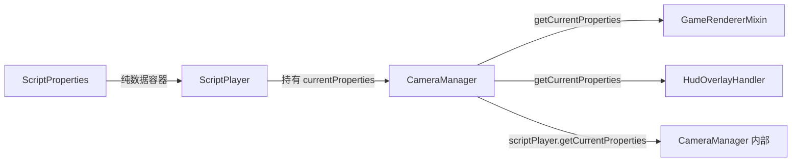

# 修复计划 A：🔴 需修复的问题（3项）

> 验证结果：**全部属实**，以下为详细修复方案。

---

## 问题 #1：`ScriptProperties` 静态单例 + 实例方法混合 — 线程安全隐患

### 问题确认

[`ScriptProperties.java`](src/main/java/com/immersivecinematics/immersive_cinematics/script/ScriptProperties.java:51) 中 `private static ScriptProperties current` 是静态字段，但 [`apply()`](src/main/java/com/immersivecinematics/immersive_cinematics/script/ScriptProperties.java:69) 和 [`revert()`](src/main/java/com/immersivecinematics/immersive_cinematics/script/ScriptProperties.java:93) 是实例方法却修改静态字段。当前有 8 个调用点使用 `ScriptProperties.getCurrent()`：

- [`GameRendererMixin.java`](src/main/java/com/immersivecinematics/immersive_cinematics/mixin/GameRendererMixin.java:45) — 4 处
- [`HudOverlayHandler.java`](src/main/java/com/immersivecinematics/immersive_cinematics/handler/HudOverlayHandler.java:45) — 1 处
- [`CameraManager.java`](src/main/java/com/immersivecinematics/immersive_cinematics/camera/CameraManager.java:134) — 3 处

### 修复方案

**核心思路**：将 `current` 的管理权从 `ScriptProperties` 移到 `ScriptPlayer`，`ScriptProperties` 变为纯数据容器。Mixin/Handler 通过 `CameraManager.getCurrentProperties()` 访问，而非 `ScriptProperties.getCurrent()`。

### 修改步骤

1. **修改 [`ScriptProperties.java`](src/main/java/com/immersivecinematics/immersive_cinematics/script/ScriptProperties.java)**
   - 删除 `private static ScriptProperties current` 字段（第 51 行）
   - 删除 `public static ScriptProperties getCurrent()` 方法（第 58-60 行）
   - 修改 `apply(ScriptMeta meta)` → 移除 `current = this;`，改为纯数据赋值方法
   - 修改 `revert()` → 移除 `current = null;`，改为纯数据重置方法
   - 更新类 Javadoc，移除"单例"描述

2. **修改 [`ScriptPlayer.java`](src/main/java/com/immersivecinematics/immersive_cinematics/script/ScriptPlayer.java)**
   - 添加 `private ScriptProperties currentProperties` 字段（替代原静态字段）
   - 在 [`start()`](src/main/java/com/immersivecinematics/immersive_cinematics/script/ScriptPlayer.java:56) 中：`properties.apply(meta)` 后，将 `properties` 赋值到 `currentProperties`
   - 在 [`stop()`](src/main/java/com/immersivecinematics/immersive_cinematics/script/ScriptPlayer.java:104) 中：`properties.revert()` 后，将 `currentProperties` 设为 `null`
   - 添加 `public ScriptProperties getCurrentProperties()` getter

3. **修改 [`CameraManager.java`](src/main/java/com/immersivecinematics/immersive_cinematics/camera/CameraManager.java)**
   - 添加 `public ScriptProperties getCurrentProperties()` 便捷方法，委托到 `scriptPlayer.getCurrentProperties()`
   - 替换 3 处 `ScriptProperties.getCurrent()` 调用为 `scriptPlayer.getCurrentProperties()`
   - 移除 `import ScriptProperties`（如果不再直接使用）

4. **修改 [`GameRendererMixin.java`](src/main/java/com/immersivecinematics/immersive_cinematics/mixin/GameRendererMixin.java)**
   - 替换 4 处 `ScriptProperties.getCurrent()` 为 `CameraManager.INSTANCE.getCurrentProperties()`
   - 移除 `import ScriptProperties`，改为 `import CameraManager`

5. **修改 [`HudOverlayHandler.java`](src/main/java/com/immersivecinematics/immersive_cinematics/handler/HudOverlayHandler.java)**
   - 替换 1 处 `ScriptProperties.getCurrent()` 为 `CameraManager.INSTANCE.getCurrentProperties()`
   - 更新 import

### 影响范围



---

## 问题 #3：`CameraManager.activate()` 硬编码 Letterbox 参数 — 职责越界

### 问题确认

[`CameraManager.activate()`](src/main/java/com/immersivecinematics/immersive_cinematics/camera/CameraManager.java:91-96) 中硬编码了 `letterbox.setFadeIn(0.5f)` / `setFadeOut(0.5f)` / `setAspectRatio(2.35f)`。而 [`playScript()`](src/main/java/com/immersivecinematics/immersive_cinematics/camera/CameraManager.java:128) 路径下 letterbox 由 `LetterboxTrackPlayer` 从脚本数据驱动，两条路径行为不一致。

### 修复方案

**核心思路**：`activate()` 只做相机激活（设置初始位置/朝向 + 状态标志），letterbox 由调用者按需设置或由脚本驱动。

### 修改步骤

1. **修改 [`CameraManager.activate()`](src/main/java/com/immersivecinematics/immersive_cinematics/camera/CameraManager.java:74-96)**
   - 删除第 91-95 行的 letterbox 操作代码
   - 保留相机激活逻辑（设置初始位置/朝向、`active = true` 等）

2. **评估 `activate()` 的调用者**
   - 搜索 `activate()` 的调用点，确认是否有调用者依赖默认 letterbox 行为
   - 如果有，在调用者处添加 letterbox 设置代码

3. **更新 Javadoc**
   - `activate()` 的文档中移除 letterbox 相关描述
   - 明确说明：letterbox 由 `playScript()` 的 `LetterboxTrackPlayer` 驱动，或由调用者手动设置

### 修改后的 `activate()` 伪代码

```java
public void activate() {
    Minecraft mc = Minecraft.getInstance();
    if (mc.level == null || mc.player == null) return;

    Vec3 playerPos = mc.player.position();
    float playerYaw = mc.player.getYRot();
    float playerPitch = mc.player.getXRot();

    activePath.setPositionDirect(playerPos);
    activeProperties.setYawDirect(playerYaw);
    activeProperties.setPitchDirect(playerPitch);

    stagedReady = false;
    active = true;
    stopping = false;
    // letterbox 由 playScript() 的 LetterboxTrackPlayer 驱动，或由调用者手动设置
}
```

---

## 问题 #2：`CameraProperties.onSetTarget()` 共享 `transitionDuration/transitionProgress` — 语义错误

### 问题确认

[`CameraProperties.onSetTarget()`](src/main/java/com/immersivecinematics/immersive_cinematics/camera/CameraProperties.java:150-164) 中，当 `duration <= 0f` 时，会将**所有 6 个属性**的 current 值同步到 target 值，即使只调用了 `setTargetRoll()`。这会导致正在过渡中的其他属性被强制跳到目标值。

### 修复方案

**短期方案**（本次修复）：在 Javadoc 中明确标注此限制，并修改 `onSetTarget()` 的瞬时跳转逻辑，只跳转调用者指定的属性。

**长期方案**（后续迭代）：每个属性独立插值控制（需要较大重构，不在本次范围内）。

### 修改步骤

1. **修改 [`CameraProperties.onSetTarget()`](src/main/java/com/immersivecinematics/immersive_cinematics/camera/CameraProperties.java:150-164)**
   - 移除 `duration <= 0f` 时的全属性同步逻辑
   - 改为：瞬时跳转时只同步当前调用者设置的属性（通过参数标识）

2. **具体实现**：将 `onSetTarget()` 拆分为按属性跳转的方法
   - 每个 `setTargetXxx()` 方法中，如果 `duration <= 0f`，直接在自身方法内完成 `currentXxx = targetXxx`，不再调用共享的 `onSetTarget()`
   - `onSetTarget()` 只负责设置 `transitionDuration` 和 `transitionProgress`

3. **修改后的 `setTargetXxx()` 伪代码**

```java
public void setTargetYaw(float yaw, float duration) {
    this.startYaw = this.currentYaw;
    this.targetYaw = yaw;
    if (duration <= 0f) {
        this.currentYaw = yaw;       // 只跳转当前属性
        this.transitionProgress = 1f;
    } else {
        onSetTarget(duration);       // 共享过渡控制
    }
}
```

4. **更新 Javadoc**
   - 在 `onSetTarget()` 和各 `setTargetXxx()` 方法中标注：当多个属性同时过渡时，它们共享 `transitionDuration/transitionProgress`
   - 标注此为已知限制，长期方案为独立插值控制

### 注意事项

- 此修改只影响 **staged 缓冲区** 的过渡插值路径
- 帧回调驱动模式（`setXxxDirect()` 路径）不受影响
- 需要验证 `CameraProperties.tick()` 在共享过渡控制下是否仍然正确工作

---

## 修复顺序建议

| 顺序 | 问题 | 原因 |
|------|------|------|
| 1 | #3 activate() 移除硬编码 letterbox | 改动最小，无连锁影响 |
| 2 | #2 onSetTarget() 瞬时跳转修复 | 改动较小，仅影响 staged 缓冲区路径 |
| 3 | #1 ScriptProperties 静态单例重构 | 改动最大，涉及 5 个文件，8 个调用点替换 |
