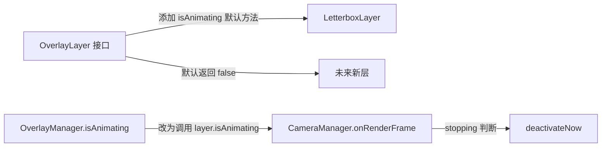

# 修复计划 C：额外发现的问题（10项）

> 来源：对源文件的深入审查，在审查报告 8 个问题之外发现的额外优化点。

---

## 问题 A1：🔴 `OverlayManager.isAnimating()` 语义错误 — 可能导致相机无法停用

### 问题确认

[`OverlayManager.isAnimating()`](src/main/java/com/immersivecinematics/immersive_cinematics/overlay/OverlayManager.java:133-138) 方法名是 `isAnimating()`，但实际检查的是 `layer.isVisible()`。[`LetterboxLayer.isVisible()`](src/main/java/com/immersivecinematics/immersive_cinematics/overlay/LetterboxLayer.java:86-88) 在 `FADE_IN`/`VISIBLE`/`FADE_OUT` 三种状态都返回 true。而 [`CameraManager.onRenderFrame()`](src/main/java/com/immersivecinematics/immersive_cinematics/camera/CameraManager.java:279) 用 `!OverlayManager.INSTANCE.isAnimating()` 判断退场动画是否结束：

```java
if (stopping && !OverlayManager.INSTANCE.isAnimating()) {
    deactivateNow();  // ← 只有所有层都 HIDDEN 才执行
}
```

当前流程恰好能工作（因为 `deactivate()` → `startFadeOut()` → 所有 VISIBLE 层进入 FADE_OUT → tick 驱动到 HIDDEN），但语义不正确。如果未来添加一个"始终可见"的层（如水印层），`isAnimating()` 永远返回 true，相机将永远无法停用。

### 修复方案

**核心思路**：让 `isAnimating()` 真正检查动画状态而非可见状态。在 [`OverlayLayer`](src/main/java/com/immersivecinematics/immersive_cinematics/overlay/OverlayLayer.java) 接口添加 `isAnimating()` 默认方法，[`LetterboxLayer`](src/main/java/com/immersivecinematics/immersive_cinematics/overlay/LetterboxLayer.java:204-206) 已有此方法。

### 修改步骤

1. **修改 [`OverlayLayer.java`](src/main/java/com/immersivecinematics/immersive_cinematics/overlay/OverlayLayer.java)**
   - 添加 `isAnimating()` 默认方法（默认返回 `false`，无动画的层无需关心）：
   ```java
   /**
    * 是否正在执行过渡动画
    * <p>
    * 由 OverlayManager.isAnimating() 遍历调用，
    * 用于判断所有层是否都已完成动画。
    * 默认实现返回 false（无动画的层始终视为非动画状态）。
    */
   default boolean isAnimating() { return false; }
   ```

2. **修改 [`LetterboxLayer.java`](src/main/java/com/immersivecinematics/immersive_cinematics/overlay/LetterboxLayer.java)**
   - 在 `isAnimating()` 方法（第 204-206 行）添加 `@Override` 注解（已有此方法，只需确保注解存在）

3. **修改 [`OverlayManager.isAnimating()`](src/main/java/com/immersivecinematics/immersive_cinematics/overlay/OverlayManager.java:133-138)**
   - 将 `layer.isVisible()` 改为 `layer.isAnimating()`：
   ```java
   public boolean isAnimating() {
       for (OverlayLayer layer : layers) {
           if (layer.isAnimating()) return true;
       }
       return false;
   }
   ```

4. **更新 [`OverlayManager.isAnimating()`](src/main/java/com/immersivecinematics/immersive_cinematics/overlay/OverlayManager.java:128-132) Javadoc**
   - 移除"当前简化实现"描述，更新为准确语义

### 影响范围



---

## 问题 A2：🔴 `CameraClip.isInfinite()` 使用浮点等值比较

### 问题确认

[`CameraClip.isInfinite()`](src/main/java/com/immersivecinematics/immersive_cinematics/script/CameraClip.java:100) 使用 `duration == -1f` 浮点等值比较。虽然 `-1.0` 在 IEEE 754 中可精确表示，当前不会出问题，但这是脆弱的约定。[`ScriptParser`](src/main/java/com/immersivecinematics/immersive_cinematics/script/ScriptParser.java:167) 中 `totalDuration != -1f && totalDuration <= 0f` 的验证逻辑也使用了等值比较，应一并修正。

### 修复方案

改为 `duration < 0f`，与 ScriptParser 的验证逻辑保持一致（负数即视为无限时长）。

### 修改步骤

1. **修改 [`CameraClip.isInfinite()`](src/main/java/com/immersivecinematics/immersive_cinematics/script/CameraClip.java:100)**
   - 将 `return duration == -1f;` 改为 `return duration < 0f;`

2. **修改 [`ScriptParser.parseTimeline()`](src/main/java/com/immersivecinematics/immersive_cinematics/script/ScriptParser.java:167)**
   - 将 `if (totalDuration != -1f && totalDuration <= 0f)` 改为 `if (totalDuration >= 0f && totalDuration <= 0f)` 即 `if (totalDuration == 0f)`，或更清晰地改为：
   ```java
   if (totalDuration > 0f == false && totalDuration < 0f == false) {
       throw new ScriptParseException(p + ".total_duration", "只允许正数或负数，不允许0，实际: " + totalDuration);
   }
   ```
   - 推荐简化为：
   ```java
   if (totalDuration == 0f) {
       throw new ScriptParseException(p + ".total_duration", "不允许为0，正数=有限时长，负数=无限时长，实际: " + totalDuration);
   }
   ```

3. **修改 [`ScriptParser.parseCameraClip()`](src/main/java/com/immersivecinematics/immersive_cinematics/script/ScriptParser.java:236)**
   - 将 `if (duration != -1f && duration <= 0f)` 改为 `if (duration == 0f)`，与上面保持一致

4. **更新 [`CameraClip`](src/main/java/com/immersivecinematics/immersive_cinematics/script/CameraClip.java:40) Javadoc**
   - 将 `/** 片段持续时长（秒），-1 = 无限时长 */` 改为 `/** 片段持续时长（秒），负数 = 无限时长 */`

---

## 问题 A3：🟡 `CameraClip.transition` 是 String 而非枚举 — 类型安全缺失

### 问题确认

[`CameraClip.transition`](src/main/java/com/immersivecinematics/immersive_cinematics/script/CameraClip.java:44) 用 `String` 存储，但只有两个合法值 `"cut"` 和 `"crossfade"`。如果 JSON 中拼写错误（如 `"crossfad"`），不会报错，只会静默回退到 cut 模式。项目已有 [`InterpolationType`](src/main/java/com/immersivecinematics/immersive_cinematics/script/InterpolationType.java)/[`InterpolationScope`](src/main/java/com/immersivecinematics/immersive_cinematics/script/InterpolationScope.java)/[`CurveCompositionMode`](src/main/java/com/immersivecinematics/immersive_cinematics/script/CurveCompositionMode.java) 等枚举先例。

### 修复方案

创建 `TransitionType` 枚举，在 [`ScriptParser`](src/main/java/com/immersivecinematics/immersive_cinematics/script/ScriptParser.java:214) 中解析时验证。

### 修改步骤

1. **创建 [`TransitionType.java`](src/main/java/com/immersivecinematics/immersive_cinematics/script/TransitionType.java)**
   ```java
   package com.immersivecinematics.immersive_cinematics.script;

   /**
    * 片段过渡类型 — 与上一个片段的衔接方式
    */
   public enum TransitionType {
       /** 硬切换：staged → commitStagedState 原子替换 */
       CUT,
       /** 交叉淡化：在两个片段的重叠区间内按比例混合所有属性 */
       CROSSFADE
   }
   ```

2. **修改 [`CameraClip.java`](src/main/java/com/immersivecinematics/immersive_cinematics/script/CameraClip.java)**
   - 将 `private final String transition` 改为 `private final TransitionType transition`
   - 将 `public boolean isCrossfade()` 改为 `return transition == TransitionType.CROSSFADE;`
   - 更新构造器参数类型和 `getTransition()` 返回类型
   - 更新 Javadoc

3. **修改 [`ScriptParser.parseCameraClip()`](src/main/java/com/immersivecinematics/immersive_cinematics/script/ScriptParser.java:214)**
   - 将 `String transition = optString(obj, "transition", "cut");` 改为：
   ```java
   TransitionType transition = parseTransitionType(
           optString(obj, "transition", "cut"), p + ".transition");
   ```

4. **在 [`ScriptParser`](src/main/java/com/immersivecinematics/immersive_cinematics/script/ScriptParser.java) 中添加 `parseTransitionType()` 方法**
   ```java
   private static TransitionType parseTransitionType(String value, String p) throws ScriptParseException {
       try {
           return TransitionType.valueOf(value.toUpperCase());
       } catch (IllegalArgumentException e) {
           throw new ScriptParseException(p, "未知的过渡类型: " + value +
                   "，支持: cut/crossfade");
       }
   }
   ```

5. **验证 JSON 脚本文件兼容性**
   - 现有 JSON 中 `"transition": "cut"` / `"transition": "crossfade"` 的 `toUpperCase()` 后恰好匹配枚举名，无需修改 JSON

---

## 问题 A4：🟡 `ScriptParser.parseMeta()` 直接构造 `RuntimeBehavior` 而非使用 Builder

### 问题确认

[`ScriptParser.parseMeta()`](src/main/java/com/immersivecinematics/immersive_cinematics/script/ScriptParser.java:146-152) 中 15 个布尔参数的位置构造器极其脆弱。如果参数顺序调整（如 `interruptible` 和 `skippable` 互换），编译器不会报错，但运行时行为会错误。[`ScriptMeta.RuntimeBehavior`](src/main/java/com/immersivecinematics/immersive_cinematics/script/ScriptMeta.java:182-184) 已提供 Builder 模式，但 Parser 没有使用。

### 修复方案

Parser 中使用 Builder 模式构建 `RuntimeBehavior`，消除参数顺序依赖。

### 修改步骤

1. **修改 [`ScriptParser.parseMeta()`](src/main/java/com/immersivecinematics/immersive_cinematics/script/ScriptParser.java:146-152)**
   - 将位置构造器替换为 Builder：
   ```java
   ScriptMeta.RuntimeBehavior behavior = ScriptMeta.RuntimeBehavior.builder()
       .blockKeyboard(blockKeyboard)
       .blockMouse(blockMouse)
       .blockMobAi(blockMobAi)
       .hideHud(hideHud)
       .hideArm(hideArm)
       .suppressBob(suppressBob)
       .blockChat(blockChat)
       .blockScoreboard(blockScoreboard)
       .blockActionBar(blockActionBar)
       .blockParticles(blockParticles)
       .renderPlayerModel(renderPlayerModel)
       .pauseWhenGamePaused(pauseWhenGamePaused)
       .interruptible(interruptible)
       .skippable(skippable)
       .holdAtEnd(holdAtEnd)
       .build();

   return new ScriptMeta(id, name, author, version, description,
           behavior, scriptInterpolation, compositionMode);
   ```

---

## 问题 A5：🟡 `LetterboxTrackPlayer.onRenderFrame()` 每帧调用 `startFadeOut()`

### 问题确认

[`LetterboxTrackPlayer.onRenderFrame()`](src/main/java/com/immersivecinematics/immersive_cinematics/script/LetterboxTrackPlayer.java:48-51) 当没有活跃的 letterbox clip 时，`startFadeOut()` 每帧都被调用。虽然 [`LetterboxLayer.startFadeOut()`](src/main/java/com/immersivecinematics/immersive_cinematics/overlay/LetterboxLayer.java:131-136) 是幂等的（只在 VISIBLE/FADE_IN 状态才转换），但每帧调用一个写操作仍然不理想。

### 修复方案

添加状态检查，只在 letterbox 可见时才调用 `startFadeOut()`。

### 修改步骤

1. **修改 [`LetterboxTrackPlayer.onRenderFrame()`](src/main/java/com/immersivecinematics/immersive_cinematics/script/LetterboxTrackPlayer.java:48-51)**
   - 将 `} else if (activeClip == null) {` 改为 `} else if (activeClip == null && letterbox.isVisible()) {`

---

## 问题 A6：🟡 `Config.defaultFov` / `Config.defaultZoom` 未被消费

### 问题确认

[`Config.defaultFov`](src/main/java/com/immersivecinematics/immersive_cinematics/Config.java:40) 和 [`Config.defaultZoom`](src/main/java/com/immersivecinematics/immersive_cinematics/Config.java:41) 在配置文件中可由用户修改，但 [`CameraProperties`](src/main/java/com/immersivecinematics/immersive_cinematics/camera/CameraProperties.java:22-25) 中有独立硬编码的 `DEFAULT_FOV = 70.0f` / `DEFAULT_ZOOM = 1.0f`，Config 值从未被引用。用户在配置文件中修改这些值不会产生任何效果。

### 修复方案

让 `CameraProperties` 使用 `Config.defaultFov`/`Config.defaultZoom` 作为默认值。

### 修改步骤

1. **修改 [`CameraProperties.java`](src/main/java/com/immersivecinematics/immersive_cinematics/camera/CameraProperties.java)**
   - 删除 `private static final float DEFAULT_FOV = 70.0f;`（第 22 行）
   - 删除 `private static final float DEFAULT_ZOOM = 1.0f;`（第 25 行）
   - 添加 `import com.immersivecinematics.immersive_cinematics.Config;`
   - 将所有引用 `DEFAULT_FOV` 的地方改为 `(float) Config.defaultFov`
   - 将所有引用 `DEFAULT_ZOOM` 的地方改为 `(float) Config.defaultZoom`

2. **验证初始化时序**
   - `Config.onLoad()` 在 `ModConfigEvent` 时填充值，而 `CameraProperties` 在 `CameraManager` 构造时初始化
   - 需确认 `CameraProperties` 的 `reset()` 调用时 Config 值已加载
   - 如果时序不确定，可在 `CameraProperties` 中添加 `refreshDefaults()` 方法，从 Config 重新读取

3. **备选方案**：如果认为 Config 和 CameraProperties 的默认值应独立管理，则从 Config 中删除 `defaultFov`/`defaultZoom` 配置项，避免误导用户

---

## 问题 A7：🟡 `CameraTrackPlayer.findActiveClip()` 每帧线性扫描

### 问题确认

[`CameraTrackPlayer.findActiveClip()`](src/main/java/com/immersivecinematics/immersive_cinematics/script/CameraTrackPlayer.java:93-125) 每渲染帧对 clips 列表做 O(n) 线性扫描。clips 按 `startTime` 排序，可用二分查找优化到 O(log n)。当前 clips 数量通常很少（<10），性能影响可忽略，但作为每帧热路径，值得优化。

### 修复方案

缓存上一帧的 active clip 索引作为下一帧搜索起点，实现简单且对常见场景（顺序播放）效率最高。

### 修改步骤

1. **修改 [`CameraTrackPlayer.java`](src/main/java/com/immersivecinematics/immersive_cinematics/script/CameraTrackPlayer.java)**
   - 添加 `private int lastClipIndex = 0;` 字段
   - 修改 `findActiveClip()` 方法：从 `lastClipIndex` 开始搜索，找到后更新 `lastClipIndex`
   - 在 `onStop()` 中重置 `lastClipIndex = 0`

2. **修改后的 `findActiveClip()` 伪代码**
   ```java
   private CameraClip findActiveClip(float globalTime) {
       CameraClip result = null;

       // 从上次匹配位置开始搜索（顺序播放时通常一次命中）
       int startIdx = Math.max(0, Math.min(lastClipIndex, clips.size() - 1));

       // 先从上次位置向后搜索
       for (int i = startIdx; i < clips.size(); i++) {
           CameraClip clip = clips.get(i);
           // ... 原有匹配逻辑
           if (/* 有限时长 clip 精确匹配 */) {
               lastClipIndex = i;
               return clip;
           }
       }

       // 如果没找到，从头搜索（处理时间回退场景）
       for (int i = 0; i < startIdx; i++) {
           // ... 同上
       }

       // ... 原有 fallback 逻辑
   }
   ```

---

## 问题 A8：🟢 `CameraManager.onRenderFrame()` 重复调用 `ScriptProperties.getCurrent()`

### 问题确认

[`CameraManager.onRenderFrame()`](src/main/java/com/immersivecinematics/immersive_cinematics/camera/CameraManager.java:261-289) 中 `ScriptProperties.getCurrent()` 在第 261 行和第 288 行被调用两次并声明同名局部变量。第二次声明会遮蔽第一次。

### 修复方案

在方法开头获取一次，复用局部变量。

### 修改步骤

1. **修改 [`CameraManager.onRenderFrame()`](src/main/java/com/immersivecinematics/immersive_cinematics/camera/CameraManager.java:237-295)**
   - 在方法开头（`if (!active) return;` 之后）获取一次：
   ```java
   ScriptProperties currentProps = ScriptProperties.getCurrent();
   ```
   - 删除第 261 行和第 288 行的重复声明，直接使用方法开头的 `currentProps`

---

## 问题 A9：🟢 `LetterboxLayer.render()` 中 `targetAspectRatio=0` 时的隐式除零

### 问题确认

[`LetterboxLayer.render()`](src/main/java/com/immersivecinematics/immersive_cinematics/overlay/LetterboxLayer.java:64) 中 `float contentHeight = (float) screenWidth / targetAspectRatio;`，当 `targetAspectRatio = 0.0f`（HIDDEN 状态）时，结果为 `Float.POSITIVE_INFINITY`，`Infinity < screenHeight` 为 false，方法跳过渲染。虽然结果正确，但依赖 IEEE 754 浮点行为，不够显式。

### 修复方案

在 `render()` 开头添加显式检查。

### 修改步骤

1. **修改 [`LetterboxLayer.render()`](src/main/java/com/immersivecinematics/immersive_cinematics/overlay/LetterboxLayer.java:62)**
   - 在方法开头添加：
   ```java
   if (targetAspectRatio <= 0f) return;
   ```

---

## 问题 A10：🟢 `ScriptParser.parseDataMap()` 的 `@SuppressWarnings` 无实际作用

### 问题确认

[`ScriptParser.parseDataMap()`](src/main/java/com/immersivecinematics/immersive_cinematics/script/ScriptParser.java:499) 上的 `@SuppressWarnings("unchecked")` 是多余的，方法内无 unchecked cast 操作。

### 修复方案

直接删除多余的注解。

### 修改步骤

1. **修改 [`ScriptParser.java`](src/main/java/com/immersivecinematics/immersive_cinematics/script/ScriptParser.java:499)**
   - 删除第 499 行的 `@SuppressWarnings("unchecked")`

---

## 修复顺序建议

| 顺序 | 编号 | 严重度 | 问题 | 原因 |
|------|------|--------|------|------|
| 1 | A2 | 🔴 | `CameraClip.isInfinite()` 浮点等值比较 | 极小改动，一行代码，零风险 |
| 2 | A1 | 🔴 | `OverlayManager.isAnimating()` 语义错误 | 小改动，涉及 2 个文件，需添加接口默认方法 |
| 3 | A9 | 🟢 | `LetterboxLayer.render()` 隐式除零 | 极小改动，一行守卫条件 |
| 4 | A10 | 🟢 | `parseDataMap()` 多余的 @SuppressWarnings | 极小改动，删除一行 |
| 5 | A8 | 🟢 | `onRenderFrame()` 重复调用 getCurrent() | 极小改动，变量提升 |
| 6 | A5 | 🟡 | LetterboxTrackPlayer 每帧调用 startFadeOut() | 极小改动，添加条件判断 |
| 7 | A4 | 🟡 | Parser 直接构造 RuntimeBehavior 而非 Builder | 小改动，纯重构，无行为变化 |
| 8 | A6 | 🟡 | Config.defaultFov/defaultZoom 未被消费 | 小改动，需验证初始化时序 |
| 9 | A3 | 🟡 | transition 是 String 而非枚举 | 中等改动，需新建枚举类 + 修改 2 个文件 |
| 10 | A7 | 🟡 | findActiveClip() 每帧线性扫描 | 小改动，但需仔细处理边界情况 |

### 与计划 A/B 的关系

- **A1、A2** 建议与计划 A 的 🔴 问题一起修复
- **A3~A7** 可与计划 B 的 🟡 问题排期
- **A8~A10** 可作为代码清理一并处理
