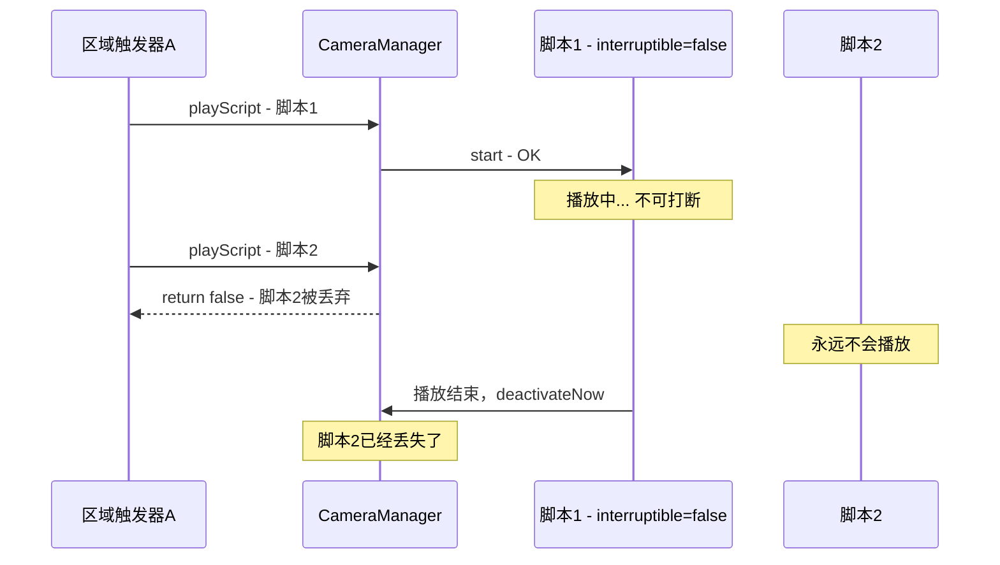
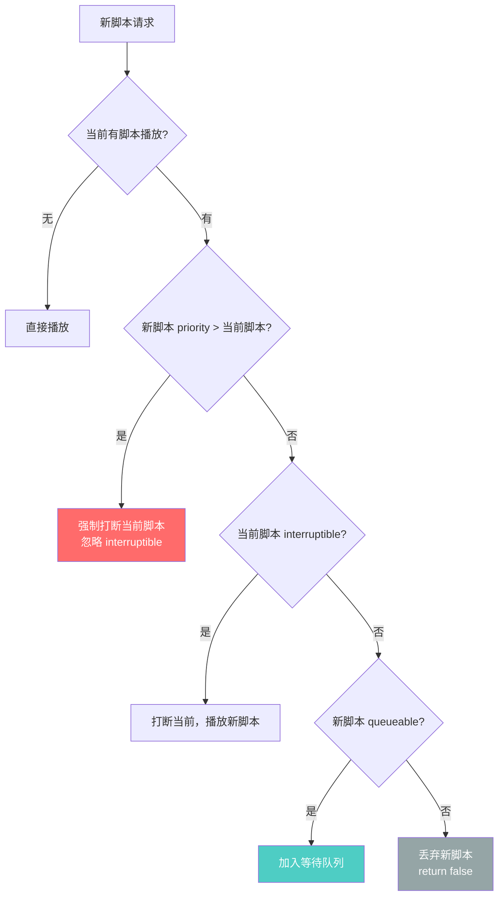

# 修复计划 E：虚拟时钟精度丢失 + 播放队列缺失（2项）

> 来源：对脚本播放管理架构的深度分析，发现两个影响用户体验的核心问题。
> 
> **严重度高于计划 A/B/C/D 中的大部分问题** — 问题 E1 是实测"越来越卡"的直接原因。

---

## 问题 E1：🔴 虚拟时钟 float 精度丢失 — 循环/长时间脚本越来越卡

### 问题确认

[`ScriptPlayer.getElapsedSeconds()`](src/main/java/com/immersivecinematics/immersive_cinematics/script/ScriptPlayer.java:209-211) 中：

```java
private float getElapsedSeconds() {
    return (CameraManager.INSTANCE.getGameTimeNanos() - startGameTimeNanos) / 1_000_000_000f;
}
```

Java 运算顺序：
1. `getGameTimeNanos() - startGameTimeNanos` → `long` 减法，**精确**
2. `long_result / 1_000_000_000f` → `long` 先隐式转为 `float`，再做 float 除法

**第 2 步是 Bug 所在**：`float` 只有 23 位尾数（约 7 位有效数字），当 elapsed nanos 值足够大时，float 无法区分相邻帧的时间差。

[`CameraManager.onRenderFrame()`](src/main/java/com/immersivecinematics/immersive_cinematics/camera/CameraManager.java:247-252) 中 `gameTimeNanos` 每帧累加、永不重置（仅 `deactivateNow()` 时归零），对于循环脚本（`duration=-1`）或长时间脚本，该值会无限增长：

| 运行时长 | elapsed nanos | float 精度 | 除以 1e9 后误差 | 影响 |
|---------|--------------|-----------|---------------|------|
| 1 秒 | 1,000,000,000 | ±0.125 ns | ±0.125 ns | 可忽略 |
| 1 分钟 | 60,000,000,000 | ±4 ns | ±4 ns | 可忽略 |
| 10 分钟 | 600,000,000,000 | ±32 ns | ±32 ns | 开始出现帧抖 |
| 1 小时 | 3,600,000,000,000 | ±256 ns | ±256 ns | **明显卡顿** |
| 3 小时 | 10,800,000,000,000 | ±768 ns | ±768 ns | **严重卡顿** |
| 4.6 小时 | 16,700,000,000,000 | ±1024 ns | ±1024 ns | **相机冻结** |

当 `elapsed nanos` 超过 `2^24 × 1e9 ≈ 16.7 万亿`（约 4.6 小时），float 完全无法区分相邻帧的时间差，`elapsedSeconds` 在多帧之间返回相同的值，导致：

1. **相机位置冻结** — `onRenderFrame()` 计算出相同的 `globalTime`，插值结果不变
2. **OverlayManager.update(deltaTime=0)** — 动画停滞
3. **LetterboxLayer 的 fade 动画卡住** — 看起来像"越来越卡"

**注意**：[`CameraManager.onRenderFrame()`](src/main/java/com/immersivecinematics/immersive_cinematics/camera/CameraManager.java:255) 中计算 `deltaTime` 也有同样的 long→float 转换，但 `gameTimeNanos - prevGameTimeNanos` 通常只有 ~16ms 的纳秒值（~16,000,000），float 精度足够，**所以 deltaTime 的计算是安全的**。

### 修复方案：方案 B — 双精度秒累加器

将虚拟时钟的存储单位从 `long gameTimeNanos` 改为 `double gameTimeSeconds`。

**为什么选方案 B 而非其他方案**：

| 方案 | 描述 | 改动量 | 精度 | 保留全局时钟 | 概念一致性 |
|------|------|--------|------|------------|----------|
| A | `getElapsedSeconds()` 内部用 double 中间计算 | 1 行 | ✅ 无漂移 | ✅ | ❌ 纳秒存储/秒使用 |
| **B** | **`long gameTimeNanos` → `double gameTimeSeconds`** | **~15 行** | **✅ 无漂移** | **✅** | **✅ 秒存储/秒使用** |
| C | 去全局时钟，每脚本独立累加 deltaTime | ~30 行+接口重构 | ⚠️ float 累加有微小漂移（1小时0.12ms，可忽略） | ❌ | ✅ |

**选择 B 的理由**：
1. 精度与 C 的 double 变体相同，`double` 的 52 位尾数意味着运行 292 年精度仍在微秒级
2. 保留全局时钟 — 0.4.0 播放队列的脚本间无缝衔接依赖它（脚本 A 在 `gameTimeSeconds=10.0` 结束，脚本 B 立即在 `10.0` 开始）
3. 存储单位=使用单位（秒），概念一致，未来新消费者无需记住"先转 double 再除 1e9"
4. 方案 C 无全局时钟，脚本间切换时需手动传递偏移量，更复杂且容易出错

**方案 C 的漂移评估**：即使最差的 float 累加变体，1 小时仅漂移 0.12ms，比当前 Bug（1 小时 ±256ms）小 2000 倍，完全可以忽略。但方案 B 无漂移且保留全局时钟，综合更优。

### 修改步骤

1. **修改 [`CameraManager.java`](src/main/java/com/immersivecinematics/immersive_cinematics/camera/CameraManager.java) — 5 处**

   a. **第 63 行**：字段声明
   ```java
   // 旧
   private long gameTimeNanos = 0;
   // 新
   private double gameTimeSeconds = 0;
   ```

   b. **第 247-252 行**：虚拟时钟累加逻辑
   ```java
   // 旧
   long now = System.nanoTime();
   long prevGameTimeNanos = gameTimeNanos;
   if (lastRealNanos != 0) {
       gameTimeNanos += now - lastRealNanos;
   }
   lastRealNanos = now;
   
   // 新
   long now = System.nanoTime();
   double prevGameTimeSeconds = gameTimeSeconds;
   if (lastRealNanos != 0) {
       gameTimeSeconds += (double)(now - lastRealNanos) / 1_000_000_000.0;
   }
   lastRealNanos = now;
   ```

   c. **第 255 行**：deltaTime 计算
   ```java
   // 旧
   float deltaTime = (gameTimeNanos - prevGameTimeNanos) / 1_000_000_000f;
   // 新
   float deltaTime = (float)(gameTimeSeconds - prevGameTimeSeconds);
   ```

   d. **第 300-302 行**：公开接口
   ```java
   // 旧
   public long getGameTimeNanos() {
       return gameTimeNanos;
   }
   // 新
   public double getGameTimeSeconds() {
       return gameTimeSeconds;
   }
   ```

   e. **第 311 行**：deactivateNow() 重置
   ```java
   // 旧
   gameTimeNanos = 0;
   // 新
   gameTimeSeconds = 0;
   ```

2. **修改 [`ScriptPlayer.java`](src/main/java/com/immersivecinematics/immersive_cinematics/script/ScriptPlayer.java) — 3 处**

   a. **第 38 行**：字段声明
   ```java
   // 旧
   private long startGameTimeNanos = 0;
   // 新
   private double startGameTimeSeconds = 0;
   ```

   b. **第 66 行**：start() 中记录起始时间
   ```java
   // 旧
   this.startGameTimeNanos = CameraManager.INSTANCE.getGameTimeNanos();
   // 新
   this.startGameTimeSeconds = CameraManager.INSTANCE.getGameTimeSeconds();
   ```

   c. **第 209-211 行**：getElapsedSeconds()
   ```java
   // 旧
   private float getElapsedSeconds() {
       return (CameraManager.INSTANCE.getGameTimeNanos() - startGameTimeNanos) / 1_000_000_000f;
   }
   // 新
   private float getElapsedSeconds() {
       return (float)(CameraManager.INSTANCE.getGameTimeSeconds() - startGameTimeSeconds);
   }
   ```

3. **更新 Javadoc**
   - [`CameraManager`](src/main/java/com/immersivecinematics/immersive_cinematics/camera/CameraManager.java:62): `// 🎬 虚拟时钟：只在非暂停时前进，暂停时自动冻结` → 补充说明单位为秒（double）
   - [`ScriptPlayer`](src/main/java/com/immersivecinematics/immersive_cinematics/script/ScriptPlayer.java:37): `// 虚拟时间驱动` → 补充说明使用秒（double）

### 验证

- 循环脚本（`test_loop_patrol.json`）运行 10+ 分钟无卡顿
- 长时间脚本（1 小时+）相机运动平滑
- `deltaTime` 值与修改前一致（~0.0167s@60fps）
- 暂停/恢复行为不变
- `deactivateNow()` 正确重置时钟

---

## 问题 E2：🟡 无播放队列 — 被拒绝的脚本直接丢失

### 问题确认

[`CameraManager.playScript()`](src/main/java/com/immersivecinematics/immersive_cinematics/camera/CameraManager.java:128-156) 第 133-139 行：

```java
if (active && scriptPlayer.isPlaying()) {
    ScriptProperties currentProps = ScriptProperties.getCurrent();
    if (currentProps != null && !currentProps.isInterruptible()) {
        LOGGER.debug("脚本 {} 不可打断(interruptible=false)，拒绝新脚本: {}",
                scriptPlayer.getScriptId(), script.getId());
        return false;  // ← 直接返回 false，新脚本被丢弃
    }
    // 当前脚本可打断，先停用
    deactivateNow();
}
```

**当前没有队列机制**。新脚本被拒绝后，调用者（如命令、触发器）无法知道"什么时候可以再试"。



### 这带来的实际问题

1. **区域触发器链式脚本断裂**：区域 A 的固定视角脚本（interruptible=false）播放期间，区域 B 的触发器脚本被丢弃，玩家进入区域 B 后看不到任何脚本效果
2. **紧急过场动画无法播放**：Boss 战开场等紧急脚本，如果当前有不可打断脚本，无法强制抢占
3. **调用者无法重试**：`playScript()` 返回 `false` 后，调用者不知道当前脚本何时结束，无法实现"等待后重试"

### 修复方案：混合策略 — 排队 + 优先级抢占



**设计要点**：

| 属性 | 类型 | 默认值 | 说明 |
|------|------|--------|------|
| `priority` | int | 0 | 优先级，数值越大越优先。高优先级可强制打断低优先级的 interruptible=false 脚本 |
| `queueable` | boolean | true | 被拒绝时是否进入等待队列。false=直接丢弃（当前行为） |

**队列行为**：
- 当前脚本结束后（`deactivateNow()`），自动检查队列，播放下一个
- 队列中的脚本按 priority 降序排列（同 priority 按 FIFO）
- 队列最大容量限制（建议 8），防止内存泄漏
- 脚本入队时应检查"触发条件是否仍然满足"（如区域触发器需检查玩家是否仍在区域内）

### 修改步骤

> ⚠️ 此问题属于 0.4.0 架构设计范畴，修改步骤为**设计规格**，实际实现需在 0.4.0 周期中完成。
> 
> 本次修复计划 E 中，**仅实现 E1（虚拟时钟精度修复）**，E2 记录在此作为设计参考。

1. **扩展 [`ScriptMeta.RuntimeBehavior`](src/main/java/com/immersivecinematics/immersive_cinematics/script/ScriptMeta.java) record**
   - 添加 `int priority()` 默认 0
   - 添加 `boolean queueable()` 默认 true

2. **扩展 [`ScriptProperties`](src/main/java/com/immersivecinematics/immersive_cinematics/script/ScriptProperties.java)**
   - 添加 `int priority` 字段
   - 添加 `boolean queueable` 字段
   - `apply()` / `revert()` 中处理新字段

3. **创建 `ScriptQueue` 类**
   ```java
   public class ScriptQueue {
       private final PriorityQueue<QueuedScript> queue = new PriorityQueue<>();
       private static final int MAX_QUEUE_SIZE = 8;
       
       public boolean enqueue(CinematicScript script, int priority);
       public QueuedScript dequeue();
       public boolean isEmpty();
       public void clear();
   }
   ```

4. **修改 [`CameraManager.playScript()`](src/main/java/com/immersivecinematics/immersive_cinematics/camera/CameraManager.java:128-156)**
   - 实现优先级比较逻辑
   - 被拒绝且 queueable=true 的脚本入队
   - 被拒绝且 queueable=false 的脚本返回 false

5. **修改 [`CameraManager.deactivateNow()`](src/main/java/com/immersivecinematics/immersive_cinematics/camera/CameraManager.java:307-316)**
   - 在停用后检查队列，如有待播放脚本则自动启动

6. **扩展 JSON 脚本格式**
   - `meta` 中添加 `priority` 和 `queueable` 字段
   - [`ScriptParser`](src/main/java/com/immersivecinematics/immersive_cinematics/script/ScriptParser.java) 解析新字段

7. **扩展 [`CinematicCommand`](src/main/java/com/immersivecinematics/immersive_cinematics/command/CinematicCommand.java)**
   - `/cinematic play <id> --priority N` 命令行参数
   - 队列状态查询命令 `/cinematic queue`

### 依赖关系

- E2 的队列实现依赖 E1 的全局时钟（`gameTimeSeconds`），因为脚本间无缝切换需要全局时间参考
- E2 与计划 D 的 B2（CinematicCommand 异步反馈不准确）相关，队列状态反馈应一并设计

---

## 修复顺序建议

| 顺序 | 编号 | 严重度 | 问题 | 实施时机 |
|------|------|--------|------|---------|
| 1 | E1 | 🔴 | 虚拟时钟 float 精度丢失 | **立即修复**（当前迭代） |
| 2 | E2 | 🟡 | 无播放队列 | 0.4.0 迭代（需架构设计） |

### 与计划 A/B/C/D 的关系

- **E1 应优先于所有其他修复** — 这是实测"越来越卡"的直接原因，影响用户体验最严重
- **E1 修复后**，计划 D 的 B5（holdAtEnd 魔法数 `0.0001f`）和 B6（双重扫描）可以安全修复，因为时间精度问题已解决
- **E2 与计划 D 的 B2**（CinematicCommand 反馈不准确）有依赖：队列实现后，命令反馈应包含队列状态
- **E2 的全局时钟依赖**：E1 修复后 `gameTimeSeconds` 为 E2 的脚本间无缝切换提供了时间基础

### E1 修复后的精度保证

| 运行时长 | gameTimeSeconds (double) | double 精度 | 误差 |
|---------|-------------------------|------------|------|
| 1 秒 | 1.0 | ±1.1e-16 秒 | 完美 |
| 1 小时 | 3600.0 | ±4.0e-13 秒 | 完美 |
| 1 天 | 86400.0 | ±9.5e-12 秒 | 完美 |
| 1 年 | 3.15e7 | ±3.5e-9 秒 | 完美 |
| 292 年 | 9.2e9 | ±1.0e-6 秒 | 仍可用 |
