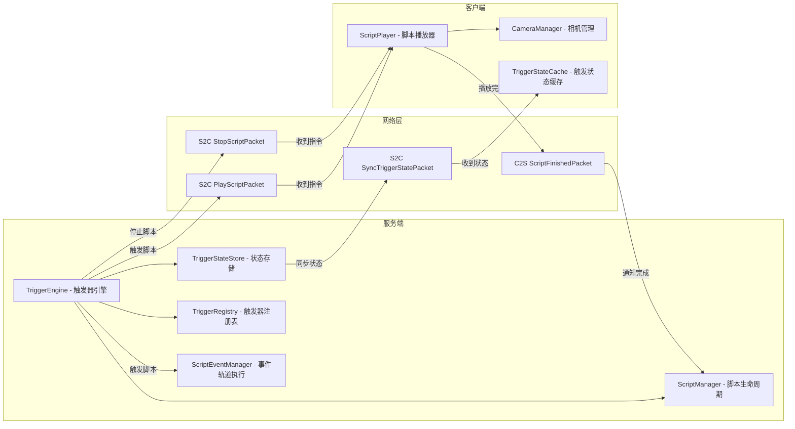
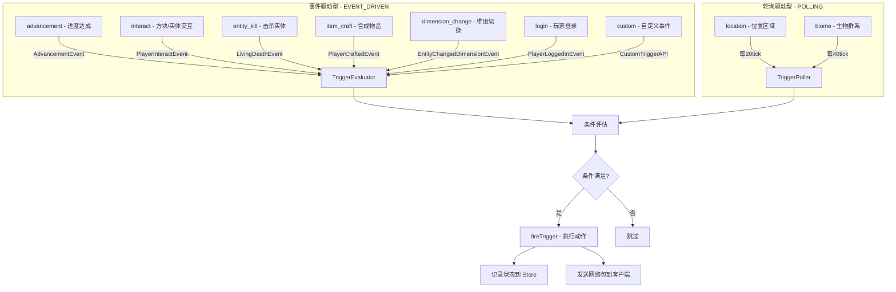
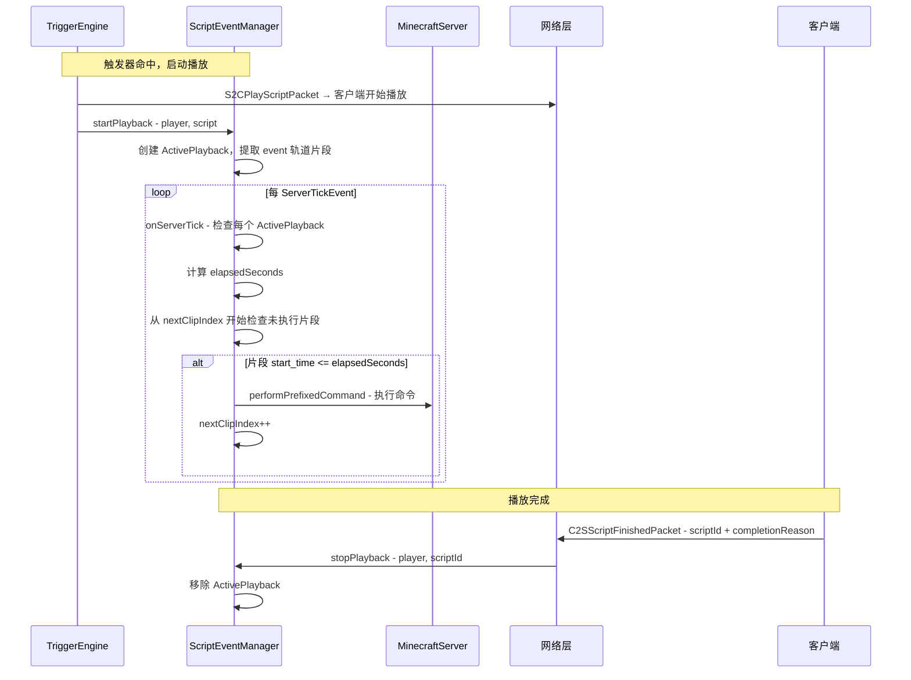
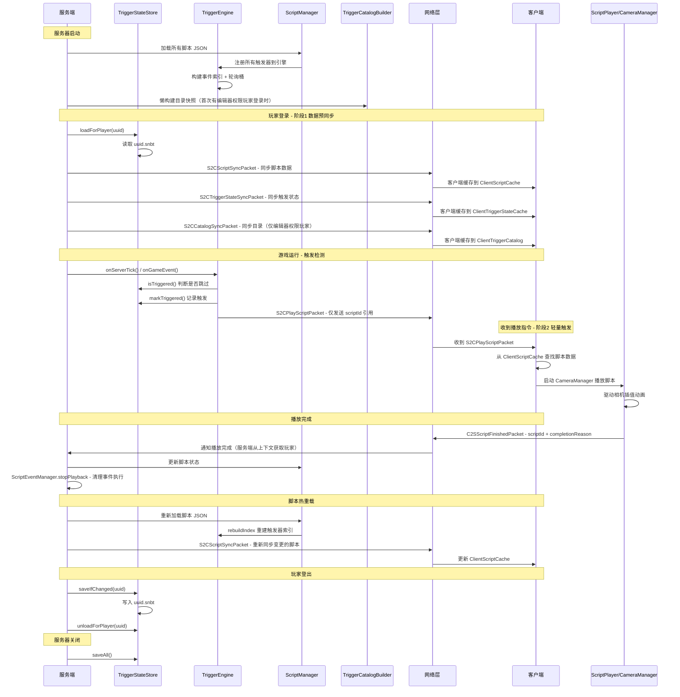
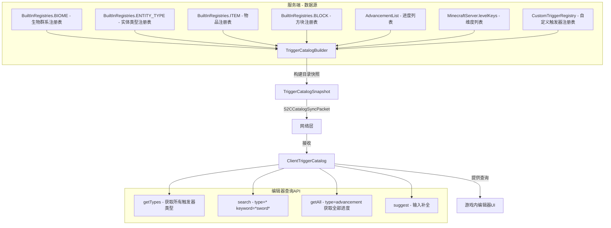
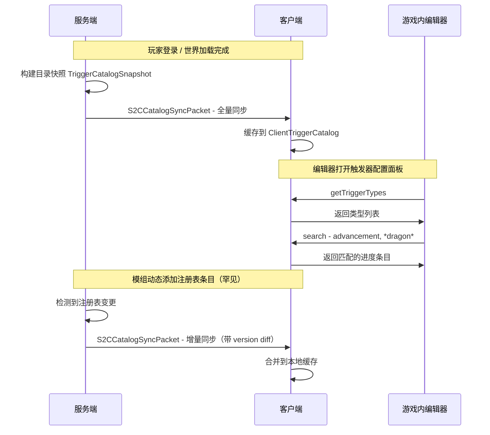
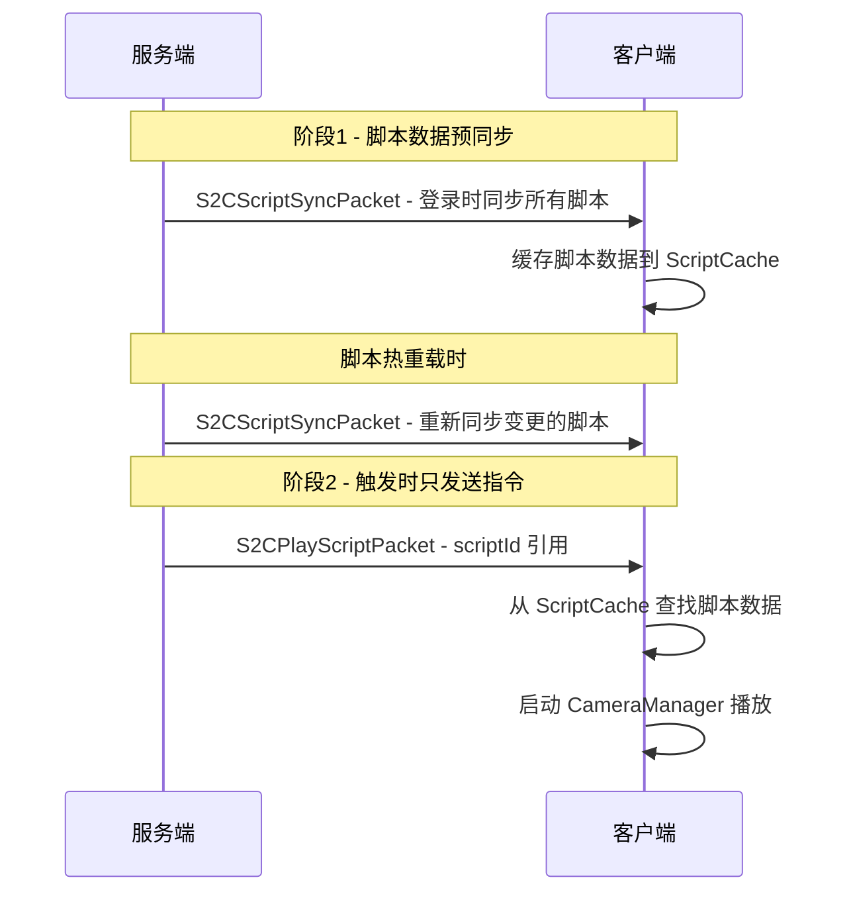

# ImmersiveCinematics 触发器系统设计 v4

> **状态**：✅ 核心系统已实现（0.3.0）
>
> ### 实现对照
>
> | 章节 | 设计状态 | 实际实现 |
> |------|---------|---------|
> | 1-7 核心引擎、存储、网络、评估器、动作 | ✅ 按设计实现 | TriggerEngine + TriggerStateStore(SNBT) + 14种评估器 + 4种动作 + 6个packet |
> | 8 目录系统（TriggerCatalogBuilder + S2CCatalogSyncPacket） | ❌ 设计未使用 | **替代方案**：编辑器通过 `BuiltInRegistries`、`AdvancementList`、动态注册表在**客户端本地**直接读取候选列表，无需服务端目录同步（见 `SingleIdEditor.getCandidates()`） |
> | 9 方案修正（两阶段分发、安全性） | ✅ 按设计实现 | C2S 包不携带 playerId，服务端从 NetworkContext 获取发送者 |
> | 10 包结构 | ⚠️ 略有差异 | evaluator 合并为单文件 `Evaluators.java`，无独立 `catalog/` 子包 |
> | 11 CustomTriggerAPI | ❌ 未实现 | 当前无第三方模组集成需求，后续可加 |

原版参考：
**`CriterionTrigger.java`** — 有用

直接抄它的 `addPlayerListener` / `removePlayerListeners` 模式：

```java
// 我们的版本
public class TriggerType {
    // 每个 TriggerType 知道自己怎么监听/轮询
    void register(ServerPlayer player, PlayerTriggerState state);
    void unregister(ServerPlayer player);
}
```

的好处：`TriggerEngine` 启动时不用自己手写所有触发器的监听逻辑，每个触发器类型自己实现 `register()`。

---

**`Criterion.java`** — 有用

`criterionFromJson()` 一行的设计：

```
triggers JSON 的 "trigger" 字段 → CriteriaTriggers.getCriterion(id) → createInstance(conditions)
```

直接对应我们的 `TriggerDefinition`：

```
TriggerDefinition.type → TriggerType.REGISTRY.lookup(type) → createInstance(conditions)
```

好处：每个触发器类型自己解析自己的 conditions 结构，不用 `TriggerDefinition` 存一个无类型的 `Map<String, Object>`。

---

**`PlayerAdvancements.java`** — 有用

三个东西可以直接抄：

1. **`progress: Map<Advancement, AdvancementProgress>`** → 我们的 `PlayerTriggerState` 用 `Map<String, TriggerProgress>` 同样结构

2. **`save()` / `load()`** → GSON → JSON 文件，按玩家 UUID 存到 `world/immersive_cinematics/triggers/`

3. **`registerListeners()` / `stopListening()`** → 玩家上线注册所有触发器，下线/触发后注销

---


> **状态**：⏳ 设计完成，尚未开始编码。这是触发器系统的最终设计文档，编码时以此为准。

## 1. 核心决策

### 1.1 为什么不用 NBT 存储触发状态

| 维度 | NBT 存储 | 自定义文件存储 |
|------|---------|--------------|
| 扩展性 | 每个玩家 NBT 是单体 blob，脚本越多 NBT 越大 | 按玩家独立文件，条目式追加 |
| 读写开销 | 每次保存玩家数据都会序列化全部触发记录 | 只在触发状态变更时写单个文件 |
| 人类可读 | 需要专用工具解析 NBT | SNBT 可直接文本编辑 |
| 跨模组兼容 | 可能与其他模组的 NBT 字段冲突 | 完全隔离的命名空间 |
| 回滚/调试 | 难以单独回滚触发记录 | 可直接删除/编辑单个玩家文件 |

**结论**：采用自定义 SNBT 文件存储，与 FTB Quests 的 `TeamData.saveIfChanged()` 方案一致。

### 1.2 去除冷却机制

过场动画触发器是一次性语义，不需要冷却机制：
- `repeatable: false`（默认）：触发一次，永久记录，永不重复
- `repeatable: true`：每次条件满足都触发，由脚本作者控制条件精确度（如用命令重置触发状态）
- 无 `cooldown_ms` 字段，无 `triggerTimestamps` 数据结构

---

## 2. 客户端-服务端分离架构

### 2.1 职责划分



### 2.2 服务端职责（权威端）

| 职责 | 说明 |
|------|------|
| 脚本生命周期管理 | 加载/热重载/卸载脚本 JSON |
| 触发器注册 | 从脚本 JSON 解析触发器并注册到引擎 |
| 触发条件检测 | 事件驱动 + 轮询驱动双通道 |
| 触发状态存储 | SNBT 文件持久化玩家触发记录 |
| 脚本分发 | 触发后向目标客户端发送播放指令 |
| 事件轨道命令执行 | ScriptEventManager 每 tick 检查事件片段时间戳，执行服务端命令 |
| 播放完成回收 | 收到客户端完成通知后更新状态，清理 ScriptEventManager |

### 2.3 客户端职责（执行端）

| 职责 | 说明 |
|------|------|
| 接收播放指令 | 收到 S2C 包后启动 CameraManager 播放 |
| 接收停止指令 | 收到 S2C 包后停止当前播放 |
| 脚本播放执行 | 驱动 CameraProperties / CameraPath 插值 |
| 播放完成通知 | 播放结束后发送 C2S 包通知服务端 |
| 触发状态缓存 | 接收服务端同步的状态，用于 UI 显示 |

### 2.4 网络协议

```
服务端 → 客户端:
  S2CPlayScriptPacket:
    - scriptId: String              // 要播放的脚本ID（引用，客户端本地已有脚本数据）
    
  S2CStopScriptPacket:
    - scriptId: String              // 要停止的脚本ID（留空表示停止全部）
    
  S2CScriptSyncPacket:
    - scripts: CompoundTag          // 脚本全量数据（登录时/脚本重载时同步）

  S2CTriggerStateSyncPacket:
    - triggeredScripts: CompoundTag // 已触发记录同步（用于客户端UI显示）
    - completedScripts: ListTag     // 已完成脚本列表

  S2CCatalogSyncPacket:
    - version: String               // 目录版本号
    - fullSync: boolean             // 是否全量同步
    - catalogs: CompoundTag         // 目录数据（详见第8节）

客户端 → 服务端:
  C2SScriptFinishedPacket:
    - scriptId: String              // 已完成的脚本ID
    - completionReason: String      // 完成原因：FINISHED / SKIPPED / INTERRUPTED / STOPPED

  C2SEditorRequestCatalogPacket:
    - typeId: String                // 按需请求特定类型的目录
```

---

## 3. 存储系统设计

### 3.1 存储路径

```
<world_save>/
  └── immersive_cinematics/
      └── trigger_state/
          ├── <player_uuid_1>.snbt
          ├── <player_uuid_2>.snbt
          └── ...
```

### 3.2 SNBT 文件结构（关系存储法）

采用**关系存储法**：scriptId → Set\<triggerId\>，查询效率高、去重天然保证、扩展灵活。

```snbt
{
    version: 1,
    player_uuid: "xxxxxxxx-xxxx-xxxx-xxxx-xxxxxxxxxxxx",
    
    // 核心：scriptId → 已触发的 triggerId 集合
    triggered_scripts: {
        "intro_cinematic": {
            triggers: [
                "location_trigger_1",
                "time_trigger_0"
            ]
        },
        "dragon_scene": {
            triggers: [
                "event_trigger_advancement"
            ]
        }
    },
    
    // 已完成的脚本集合（所有trigger都触发的脚本）
    completed_scripts: [
        "intro_cinematic"
    ]
}
```

### 3.3 内存数据结构

```java
public class PlayerTriggerState {
    // scriptId → 已触发的 triggerId 集合
    private final Object2ObjectMap<String, Set<String>> triggeredScripts;
    
    // 已完成的脚本集合
    private final Set<String> completedScripts;
    
    // 脏标记：只在变更时写磁盘
    private boolean dirty;
}
```

### 3.4 存储管理器 API

```java
public class TriggerStateStore {
    public static final TriggerStateStore INSTANCE = new TriggerStateStore();
    
    // ===== 查询 =====
    boolean isTriggered(UUID player, String scriptId, String triggerId);
    boolean isScriptCompleted(UUID player, String scriptId);
    Set<String> getTriggeredIds(UUID player, String scriptId);
    
    // ===== 变更 =====
    boolean markTriggered(UUID player, String scriptId, String triggerId);
    void resetScript(UUID player, String scriptId);
    void resetAll(UUID player);
    
    // ===== 持久化 =====
    void saveAll();
    void loadForPlayer(UUID player);
    void unloadForPlayer(UUID player);
}
```

---

## 4. 触发器监听系统设计

### 4.1 设计理念

借鉴 FTB Quests 混合原版方案：
- **事件驱动**：FTB Quests 的 `FTBQuestsInventoryListener` 监听物品栏变化
- **轮询驱动**：FTB Quests 的 `LocationTask.autoSubmitOnPlayerTick()` 每3tick检查位置、`AdvancementTask.autoSubmitOnPlayerTick()` 每5tick检查进度
- **懒保存**：FTB Quests 的 `TeamData.saveIfChanged()` 只在脏标记为 true 时写磁盘

在此基础上增加**类型化事件总线**，使不同类型的触发器只在相关事件发生时才执行检查，避免无效轮询。

### 4.2 触发器类型与监听策略



### 4.3 触发器注册表

```java
public class TriggerRegistry {
    private static final Map<String, TriggerType> TYPES = new HashMap<>();
    
    public static void register(String typeId, TriggerType type) {
        TYPES.put(typeId, type);
    }
    
    public static TriggerType get(String typeId) {
        return TYPES.get(typeId);
    }
}

public class TriggerType {
    private final String id;
    private final ListenStrategy strategy;       // EVENT_DRIVEN or POLLING
    private final int pollInterval;              // 轮询间隔（tick），仅 POLLING 类型
    private final BiPredicate<ServerPlayer, JsonObject> evaluator;
    private final Set<Class<? extends Event>> listenedEvents;
}
```

### 4.4 触发器引擎（服务端核心）

```java
public class TriggerEngine {
    
    private final TriggerStateStore stateStore;
    private final ScriptManager scriptManager;
    
    // 通道1：事件驱动 - 按事件类型索引
    private final Map<Class<? extends Event>, List<TriggerRegistration>> eventIndex;
    
    // 通道2：轮询驱动 - 按轮询频率分组
    private final Int2ObjectMap<List<TriggerRegistration>> pollBuckets;
    private int tickCounter;
    
    /** 事件驱动入口 */
    public <T extends Event> void onGameEvent(T event, ServerPlayer player) {
        List<TriggerRegistration> triggers = eventIndex.get(event.getClass());
        if (triggers == null || triggers.isEmpty()) return;
        
        for (TriggerRegistration reg : triggers) {
            if (shouldSkip(player, reg)) continue;
            if (reg.type.getEvaluator().test(player, reg.conditions)) {
                fireTrigger(player, reg);
            }
        }
    }
    
    /** 轮询驱动入口 — 由 ServerTickEvent 调用 */
    public void onServerTick() {
        tickCounter++;
        for (Int2ObjectMap.Entry<List<TriggerRegistration>> entry : pollBuckets.int2ObjectEntrySet()) {
            int interval = entry.getIntKey();
            if (tickCounter % interval != 0) continue;
            
            for (TriggerRegistration reg : entry.getValue()) {
                for (ServerPlayer player : getOnlinePlayers()) {
                    if (shouldSkip(player, reg)) continue;
                    if (reg.type.getEvaluator().test(player, reg.conditions)) {
                        fireTrigger(player, reg);
                    }
                }
            }
        }
    }
    
    /** 触发器命中 — 执行动作并记录状态 */
    private void fireTrigger(ServerPlayer player, TriggerRegistration reg) {
        boolean isNew = stateStore.markTriggered(player.getUUID(), reg.scriptId, reg.triggerId);
        if (!isNew) return;
        
        // 检查脚本是否所有 trigger 都满足
        if (stateStore.isScriptCompleted(player.getUUID(), reg.scriptId)) {
            stateStore.markScriptCompleted(player.getUUID(), reg.scriptId);
        }
        
        // 执行动作
        for (TriggerAction action : reg.actions) {
            action.execute(player);
        }
    }
    
    /** 是否跳过检测 */
    private boolean shouldSkip(ServerPlayer player, TriggerRegistration reg) {
        if (!reg.repeatable) {
            // 一次性触发器：已触发过就跳过
            return stateStore.isTriggered(player.getUUID(), reg.scriptId, reg.triggerId);
        }
        // 可重复触发器：永远不跳过
        return false;
    }
    
    /** 脚本热重载后重建索引 */
    public void rebuildIndex() {
        eventIndex.clear();
        pollBuckets.clear();
        // 重新从 ScriptManager 加载所有触发器注册
    }
}
```

### 4.5 各触发器类型评估器

#### 位置触发器 (location) — 轮询，每20tick

```java
public class LocationTriggerEvaluator {
    public static boolean evaluate(ServerPlayer player, JsonObject conditions) {
        String targetDim = conditions.get("dimension").getAsString();
        if (!player.level().dimension().location().toString().equals(targetDim)) {
            return false;
        }
        JsonObject pos = conditions.getAsJsonObject("position");
        double dx = player.getX() - pos.get("x").getAsDouble();
        double dy = player.getY() - pos.get("y").getAsDouble();
        double dz = player.getZ() - pos.get("z").getAsDouble();
        double radius = conditions.get("radius").getAsDouble();
        return dx*dx + dy*dy + dz*dz <= radius*radius;
    }
}
```

#### 进度触发器 (advancement) — 事件驱动

```java
@SubscribeEvent
public void onAdvancement(AdvancementEvent event) {
    ServerPlayer player = (ServerPlayer) event.getEntity();
    triggerEngine.onGameEvent(event, player);
}
```

#### 自定义事件触发器 (custom) — 暴露API供第三方模组调用

```java
public class CustomTriggerAPI {
    public static void fireCustomEvent(String eventId, ServerPlayer player) {
        triggerEngine.onCustomEvent(eventId, player);
    }
}
```

### 4.6 触发器注册数据结构

```java
public class TriggerRegistration {
    String scriptId;              // 所属脚本ID
    String triggerId;             // 触发器ID
    TriggerType type;             // 触发器类型
    JsonObject conditions;        // 触发条件
    List<TriggerAction> actions;  // 触发后动作
    boolean repeatable;           // 是否可重复触发，默认 false
}
```

### 4.7 服务端事件轨道执行（ScriptEventManager）

当触发器命中并启动脚本播放时，服务端需要同步执行脚本中的事件轨道命令。客户端不处理事件轨道——所有命令在服务端执行。



**核心数据结构**：

```java
public class ScriptEventManager {
    // player → 活跃播放状态
    private final Map<UUID, ActivePlayback> activePlaybacks = new HashMap<>();
    
    public void startPlayback(ServerPlayer player, CinematicScript script) { ... }
    public void stopPlayback(UUID playerUuid, String scriptId) { ... }
    public void onServerTick(MinecraftServer server) { ... }
}

public class ActivePlayback {
    String scriptId;
    long startTick;                    // 开始时的游戏 tick（server.getTickCount()）
    List<EventClip> eventClips;        // 事件轨道片段（已按 start_time 排序）
    int nextClipIndex;                 // 下一个待检查的片段索引（只前进不后退）
    
    public float getElapsedSeconds(int currentTick) {
        return (currentTick - startTick) / 20.0f;
    }
}

public record EventClip(double startTime, String command) {}
```

**关键优化**：`nextClipIndex` 指针只前进不后退，每 tick 只检查未执行的片段，已执行的片段永久跳过。

---

## 5. 触发器 JSON 扩展

在现有 `script_design.md` 的 triggers 结构基础上新增字段：

```json
{
    "id": "location_trigger_1",
    "type": "location",
    "repeatable": false,
    "conditions": {
        "dimension": "minecraft:overworld",
        "position": { "x": 100.0, "y": 64.0, "z": 200.0 },
        "radius": 15.0
    },
    "actions": [
        {
            "type": "start_playback",
            "script_id": "dragon_scene"
        }
    ]
}
```

新增字段：
| 字段 | 类型 | 说明 | 默认值 |
|------|------|------|--------|
| `repeatable` | boolean | 是否可重复触发 | `false` |

---

## 6. 系统生命周期



---

## 7. 包结构规划

```
com.immersivecinematics.immersive_cinematics/
├── trigger/                                  // 触发器系统根包
│   ├── server/                               // === 服务端 ===
│   │   ├── TriggerEngine.java                // 触发器引擎（双通道调度）
│   │   ├── TriggerRegistry.java              // 触发器类型注册表
│   │   ├── TriggerType.java                  // 触发器类型定义
│   │   ├── TriggerRegistration.java          // 触发器注册项
│   │   ├── ListenStrategy.java               // 监听策略枚举
│   │   ├── store/
│   │   │   ├── TriggerStateStore.java        // 存储管理器（单例）
│   │   │   └── PlayerTriggerState.java       // 单玩家触发状态
│   │   ├── evaluator/
│   │   │   ├── LocationTriggerEvaluator.java
│   │   │   ├── AdvancementTriggerEvaluator.java
│   │   │   ├── BiomeTriggerEvaluator.java
│   │   │   ├── InteractTriggerEvaluator.java
│   │   │   ├── DimensionTriggerEvaluator.java
│   │   │   └── CustomTriggerEvaluator.java
│   │   ├── action/
│   │   │   ├── StartPlaybackAction.java      // 发送 S2CPlayScriptPacket
│   │   │   ├── StopPlaybackAction.java       // 发送 S2CStopScriptPacket
│   │   │   ├── PlaySoundAction.java          // 播放音效
│   │   │   ├── ExecuteCommandAction.java     // 执行命令
│   │   │   └── CustomAction.java             // 自定义动作
│   │   └── CustomTriggerAPI.java             // 第三方模组API
│   │
│   ├── client/                               // === 客户端 ===
│   │   ├── ClientTriggerStateCache.java      // 触发状态缓存（从服务端同步）
│   │   ├── ClientScriptReceiver.java         // 接收服务端播放/停止指令
│   │   └── ClientScriptNotifier.java         // 播放完成后通知服务端
│   │
│   └── network/                              // === 网络层 ===
│       ├── S2CPlayScriptPacket.java          // 服务端→客户端：播放脚本
│       ├── S2CStopScriptPacket.java          // 服务端→客户端：停止脚本
│       ├── S2CSyncTriggerStatePacket.java    // 服务端→客户端：同步触发状态
│       └── C2SScriptFinishedPacket.java      // 客户端→服务端：播放完成
```

---

## 8. 游戏内编辑器集成：触发器索引目录系统

### 8.1 核心需求

编辑器是**游戏内搭建**的，因此触发器系统必须为编辑器提供完整的**索引与查询能力**，让编辑器用户能够：
- 浏览所有可用的触发器类型
- 对每种触发器类型，列出所有可选的目标对象（如所有进度、所有生物群系、所有实体类型等）
- 使用通配符搜索和过滤
- 实时预览当前世界中可用的资源

**关键原则**：编辑器看到的可用内容来自**服务端**（服务端知道所有注册表数据），编辑器 UI 在**客户端**渲染，因此需要服务端→客户端的目录同步机制。

### 8.2 TriggerCatalog 架构



### 8.3 目录数据结构

```java
/** 单个目录条目 */
public class CatalogEntry {
    String registryId;        // 如 "minecraft:zombie", "minecraft:plains"
    String displayKey;        // 翻译键，如 "entity.minecraft.zombie"
    String namespace;         // "minecraft" 或模组ID
    Map<String, String> tags; // 相关标签，如 {"category": "monster"}
}

/** 某个触发器类型的完整目录 */
public class TriggerTypeCatalog {
    String typeId;                    // 如 "advancement", "biome", "entity_kill"
    String displayName;               // 翻译键
    List<CatalogEntry> entries;       // 所有可用条目
    boolean supportsWildcard;         // 是否支持通配符（默认 true）
    boolean supportsPositionPicker;   // 是否需要位置选择器（如 location 类型）
}

/** 完整的目录快照 */
public class TriggerCatalogSnapshot {
    String version;                              // 目录版本号（用于增量同步）
    Map<String, TriggerTypeCatalog> typeCatalogs; // typeId → 目录
}
```

### 8.4 各触发器类型的目录来源

| 触发器类型 | 目录来源 | 注册表/API | 数量级 |
|-----------|---------|-----------|--------|
| `location` | **无目录** — 使用位置选择器在世界中拾取坐标 | N/A | N/A |
| `advancement` | 所有已注册进度 | `AdvancementList.getAllAdvancements()` | 数十~数百 |
| `biome` | 所有生物群系 | `BuiltInRegistries.BIOME` | 数十~数百 |
| `dimension` | 所有维度 | `MinecraftServer.levelKeys()` | 3~数十 |
| `entity_kill` | 所有实体类型 | `BuiltInRegistries.ENTITY_TYPE` | 数百 |
| `interact` | 方块 + 实体类型 | `BuiltInRegistries.BLOCK` + `ENTITY_TYPE` | 数千 |
| `item_craft` | 所有可合成物品 | `BuiltInRegistries.ITEM` + 过滤可合成 | 数百 |
| `custom` | 自定义事件注册表 | `CustomTriggerAPI.getRegisteredEvents()` | 按模组注册 |
| `login` | **无目录** — 无需选择目标 | N/A | N/A |
| `dimension_change` | 同 `dimension` | 同上 | 同上 |

### 8.5 通配符查询系统

编辑器支持以下通配符模式：

```
查询语法：  <namespace>:<path_pattern>

示例：
  minecraft:*              → 所有 minecraft 命名空间下的条目
  *:plains                 → 任何命名空间中名为 plains 的条目
  *sword*                  → 路径中包含 sword 的所有条目
  minecraft:*sword*        → minecraft 命名空间下路径含 sword 的条目
  *                        → 所有条目（谨慎使用，可能很大）
```

```java
/** 客户端目录查询 API — 供游戏内编辑器调用 */
public class ClientTriggerCatalog {
    
    /** 获取所有触发器类型列表 */
    public List<TriggerTypeInfo> getTriggerTypes();
    
    /** 通配符搜索 */
    public List<CatalogEntry> search(String typeId, String pattern);
    
    /** 获取某个类型的所有条目（分页） */
    public List<CatalogEntry> getAll(String typeId, int page, int pageSize);
    
    /** 输入补全建议 */
    public List<String> suggest(String typeId, String partialInput);
}

/** 服务端通配符匹配 */
public class WildcardMatcher {
    /** 将通配符模式转换为正则表达式 */
    public static Pattern toRegex(String pattern) {
        // * → .* , 其他字符转义
        // "minecraft:*sword*" → "^minecraft:.*sword.*$"
        String regex = pattern.replace(".", "\\.")
                              .replace("*", ".*");
        return Pattern.compile("^" + regex + "$");
    }
}
```

### 8.6 目录同步策略



**同步设计要点**：
- **登录时全量同步**：玩家进入世界时，服务端一次性构建并发送完整目录快照
- **增量同步**：通过 `version` 字段检测变更，只发送差异部分（极少发生）
- **分页传输**：如果目录过大（如 `interact` 类型合并了方块+实体），可分多包传输
- **客户端缓存**：目录数据在客户端内存中缓存，编辑器直接从本地查询，无网络延迟
- **懒构建**：服务端只在有编辑器权限的玩家登录时才构建目录（非编辑器玩家不发送）

### 8.7 目录与网络协议的补充

在原有网络协议基础上新增：

```
服务端 → 客户端:
  S2CCatalogSyncPacket:
    - version: String                    // 目录版本号
    - fullSync: boolean                  // 是否全量同步
    - catalogs: CompoundTag              // TriggerCatalogSnapshot 序列化数据
      或（增量同步时）
    - diff: CompoundTag                  // 只包含变更的条目
    
客户端 → 服务端:
  C2SRequestCatalogPacket:
    - typeId: String                     // 请求特定类型的目录（按需加载模式）
```

---

## 9. 方案修正

### 9.1 网络包设计修正

**原方案问题**：
1. `S2CPlayScriptPacket` 同时包含 `scriptId` 和 `scriptData`，语义不明确 — 到底是引用还是全量传输？
2. `C2SScriptFinishedPacket` 包含 `playerId: UUID` — 但服务端可从网络上下文获取发送者，无需客户端提供，且存在伪造风险
3. `S2CSyncTriggerStatePacket` 一次性同步全部状态，对大量脚本的玩家可能过大

**修正方案**：

```
服务端 → 客户端:
  S2CPlayScriptPacket:
    - scriptId: String              // 脚本ID（引用，客户端本地已有脚本数据）
    // 不携带 scriptData：脚本数据在登录/脚本加载时已同步到客户端
    // 原因：避免每次触发都重复传输大量脚本数据
    
  S2CStopScriptPacket:
    - scriptId: String              // 要停止的脚本ID（留空表示停止当前播放的所有脚本）
    
  S2CScriptSyncPacket:              // 重命名，明确是脚本数据同步
    - scripts: CompoundTag          // 脚本全量数据（登录时/脚本重载时发送）
    
  S2CTriggerStateSyncPacket:        // 重命名，更精确
    - triggeredScripts: CompoundTag // 已触发记录
    - completedScripts: ListTag     // 已完成脚本列表
    
  S2CCatalogSyncPacket:             // 新增：目录同步
    - 见 8.7 节

客户端 → 服务端:
  C2SScriptFinishedPacket:
    - scriptId: String              // 已完成的脚本ID
    - completionReason: String      // 完成原因：FINISHED / SKIPPED / INTERRUPTED / STOPPED
    // 移除 playerId：服务端从 NetworkContext 获取发送者
    // 安全性：服务端不信任客户端提供的 UUID
    
  C2SEditorRequestCatalogPacket:    // 新增：编辑器目录请求
    - typeId: String                // 按需请求特定类型目录
```

### 9.2 脚本分发流程修正

**原方案**：触发时在 `S2CPlayScriptPacket` 中携带完整脚本数据
**修正方案**：脚本数据与触发指令分离，采用两阶段分发



**优势**：
- 触发时网络包更轻量，延迟更低
- 避免重复传输相同脚本数据
- 脚本重载时只需同步一次，所有后续触发都引用最新数据

### 9.3 安全性修正

1. **服务端权威**：所有触发判断在服务端完成，客户端无法伪造触发
2. **C2S 包最小化**：客户端只发送 `scriptId`，服务端从网络上下文推断发送者
3. **目录权限控制**：`S2CCatalogSyncPacket` 只发送给有编辑器权限的玩家
4. **脚本数据隔离**：客户端只能收到已授权的脚本数据，无法提前获取未解锁的脚本

---

## 10. 与 FTB Quests 方案的对比

| 特性 | FTB Quests | ImmersiveCinematics |
|------|-----------|-------------------|
| 存储格式 | SNBT 文件（per team） | SNBT 文件（per player） |
| 存储内容 | Long2LongMap (taskId→progress) | Object2ObjectMap (scriptId→Set\<triggerId\>) |
| 轮询策略 | 固定间隔 (3/5/20 tick) | 按类型可配置间隔 (20/40 tick) |
| 事件监听 | ContainerListener + Forge事件 | 纯Forge事件 + 自定义事件总线 |
| 进度模型 | 数值进度 (0→maxProgress) | 布尔触发 (triggered / not triggered) |
| 脏保存 | shouldSave + saveIfChanged() | dirty + saveIfChanged() |
| 第三方扩展 | CustomTask + CustomTaskEvent | CustomTriggerAPI + CustomAction |
| CS架构 | 服务端权威 + 客户端展示 | 服务端权威触发 + 客户端执行播放 |
| 编辑器集成 | 外部配置文件/SNBT编辑 | 游戏内编辑器 + 目录索引 + 通配符查询 |
| 脚本分发 | N/A（ quests 随世界存档） | 两阶段分发：预同步 + 触发时引用 |

---

## 11. 更新后的包结构

```
com.immersivecinematics.immersive_cinematics/
├── trigger/                                  // 触发器系统根包
│   ├── server/                               // === 服务端 ===
│   │   ├── TriggerEngine.java                // 触发器引擎（双通道调度）
│   │   ├── ScriptEventManager.java           // 服务端事件轨道执行（每tick检查命令时间戳）
│   │   ├── TriggerRegistry.java              // 触发器类型注册表
│   │   ├── TriggerType.java                  // 触发器类型定义
│   │   ├── TriggerRegistration.java          // 触发器注册项
│   │   ├── ListenStrategy.java               // 监听策略枚举
│   │   ├── store/
│   │   │   ├── TriggerStateStore.java        // 存储管理器（单例）
│   │   │   └── PlayerTriggerState.java       // 单玩家触发状态
│   │   ├── evaluator/
│   │   │   ├── LocationTriggerEvaluator.java
│   │   │   ├── AdvancementTriggerEvaluator.java
│   │   │   ├── BiomeTriggerEvaluator.java
│   │   │   ├── InteractTriggerEvaluator.java
│   │   │   ├── DimensionTriggerEvaluator.java
│   │   │   └── CustomTriggerEvaluator.java
│   │   ├── action/
│   │   │   ├── StartPlaybackAction.java      // 发送 S2CPlayScriptPacket
│   │   │   ├── StopPlaybackAction.java       // 发送 S2CStopScriptPacket
│   │   │   ├── PlaySoundAction.java          // 播放音效
│   │   │   ├── ExecuteCommandAction.java     // 执行命令
│   │   │   └── CustomAction.java             // 自定义动作
│   │   ├── catalog/                          // === 目录系统 ===
│   │   │   ├── TriggerCatalogBuilder.java    // 从注册表构建目录
│   │   │   ├── TriggerCatalogSnapshot.java   // 目录快照
│   │   │   ├── TriggerTypeCatalog.java       // 单类型目录
│   │   │   ├── CatalogEntry.java             // 目录条目
│   │   │   └── WildcardMatcher.java          // 通配符匹配器
│   │   └── CustomTriggerAPI.java             // 第三方模组API
│   │
│   ├── client/                               // === 客户端 ===
│   │   ├── ClientTriggerStateCache.java      // 触发状态缓存（从服务端同步）
│   │   ├── ClientScriptReceiver.java         // 接收服务端播放/停止指令
│   │   ├── ClientScriptNotifier.java         // 播放完成后通知服务端
│   │   ├── ClientScriptCache.java            // 脚本数据缓存（预同步）
│   │   └── ClientTriggerCatalog.java         // 客户端目录缓存 + 查询API
│   │
│   └── network/                              // === 网络层 ===
│       ├── S2CPlayScriptPacket.java          // 服务端→客户端：播放脚本（引用ID）
│       ├── S2CStopScriptPacket.java          // 服务端→客户端：停止脚本
│       ├── S2CScriptSyncPacket.java          // 服务端→客户端：脚本数据同步
│       ├── S2CTriggerStateSyncPacket.java    // 服务端→客户端：触发状态同步
│       ├── S2CCatalogSyncPacket.java         // 服务端→客户端：目录同步
│       ├── C2SScriptFinishedPacket.java      // 客户端→服务端：播放完成
│       └── C2SEditorRequestCatalogPacket.java// 客户端→服务端：编辑器目录请求
```

---

## 12. 关键实现注意事项

1. **线程安全**：`TriggerEngine.onServerTick()` 和 `onGameEvent()` 必须在服务端主线程执行，所有触发器评估和状态变更都在主线程完成，无需额外同步。

2. **防重复触发**：`fireTrigger()` 中先检查 `markTriggered()` 的返回值，确保同一触发器不会重复执行动作。

3. **懒加载与懒保存**：玩家登录时才加载其 SNBT 文件，登出时卸载内存数据；借鉴 FTB Quests 的 `TeamData.shouldSave` 模式，只在数据变更时写磁盘。

4. **脚本动态加载**：支持热加载脚本 JSON 后重新注册触发器，`TriggerEngine.rebuildIndex()` 重建事件索引和轮询桶；脚本重载后通过 `S2CScriptSyncPacket` 推送到所有在线客户端。

5. **客户端不参与触发决策**：所有触发判断在服务端完成，客户端只负责执行播放指令。即使客户端本地有 `ClientTriggerStateCache`，也仅用于 UI 显示，不参与触发逻辑。

6. **Forge事件注册**：服务端触发器事件监听器注册在 `@Mod.EventBusSubscriber(bus = Bus.FORGE)` 上（不加 `value = Dist.CLIENT` 限制），确保在服务端生效。

7. **网络包注册**：使用 Forge 1.20.1 的 `SimpleChannel` 注册所有 S2C/C2S 网络包，在 `FMLCommonSetupEvent` 中完成注册。

8. **目录构建时机**：`TriggerCatalogBuilder` 在服务端 `ServerAboutToStartEvent` 或 `FMLServerStartedEvent` 时构建，确保所有注册表条目已就绪。目录构建是懒触发 — 只在有编辑器权限的玩家登录时才构建和同步。

9. **通配符性能**：客户端目录查询在本地内存中执行，不涉及网络IO。`WildcardMatcher` 使用预编译正则，对大量条目的匹配仍保持毫秒级响应。

10. **两阶段脚本分发**：脚本数据在登录时通过 `S2CScriptSyncPacket` 全量同步到客户端 `ClientScriptCache`；触发时只发送轻量的 `S2CPlayScriptPacket`（仅 scriptId），客户端从本地缓存查找脚本数据启动播放，减少触发时延迟。

11. **C2S 包安全**：`C2SScriptFinishedPacket` 不携带 `playerId`，服务端从 `NetworkContext` 获取发送者身份，防止客户端伪造。
