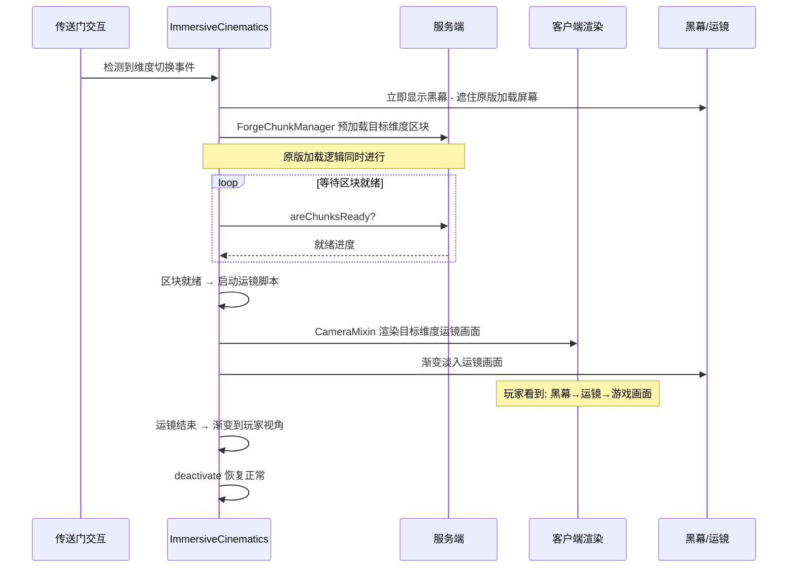
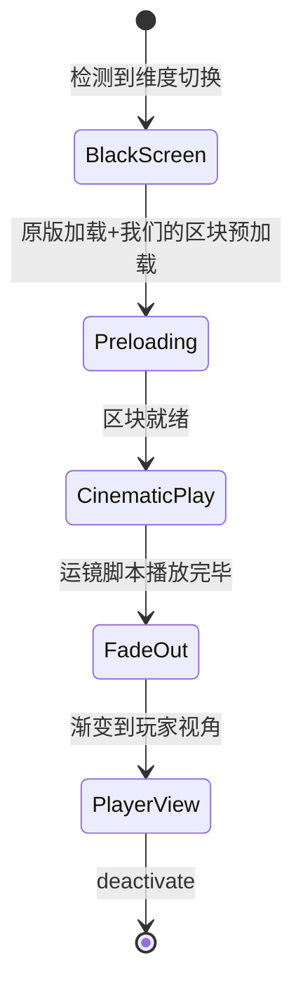

# ImmersiveCinematics 完全重构技术规范（修订版）

## 1. 项目概述

### 1.1 核心目标
- **完全替换游戏现有相机系统和脚本执行框架**
- **实现高性能、解耦式相机系统**
- **支持多加载器（Forge/Fabric/NeoForge）架构**
- **提供编辑器-播放器分离的双产品版本**

### 1.2 架构原则
1. **解耦式相机系统** - CameraProperties与CameraPath完全分离
2. **客户端-服务器分离** - 服务端仅负责脚本分发，客户端专注播放
3. **游戏内编辑器集成** - 编辑器作为模组内置功能，在游戏内运行
4. **双产品版本支持** - 完整版（包含编辑器）和播放器版（仅播放逻辑）
5. **多加载器支持** - Forge/Fabric/NeoForge统一架构
6. **纯数据架构** - 相机系统不依赖Minecraft Entity，使用纯POJO数据类管理所有相机属性和位置
7. **CameraManager唯一桥梁** - CameraProperties与CameraPath互不知晓，通过CameraManager间接交互
8. **Mixin只读Manager** - Mixin注入层不直接依赖CameraProperties/CameraPath，统一从CameraManager读取

## 2. 核心模块边界定义

### 2.1 整体项目结构
```
ImmersiveCinematics/
├── common/                          # 核心共享库（不依赖特定加载器）
│   ├── camera/                    # 相机系统
│   ├── timeline/                  # 时间轴系统
│   ├── script/                    # 脚本格式与解析
│   ├── events/                    # 事件系统
│   ├── network/                   # 网络通信协议
│   └── editor/                    # 游戏内编辑器（作为核心功能）
├── forge/                         # Forge加载器实现
├── fabric/                        # Fabric加载器实现
└── neoforge/                      # NeoForge加载器实现
```

### 2.2 模块职责划分

| 模块 | 职责 |
|------|------|
| **core** | CameraProperties/CameraPath/CameraManager、时间轴数据结构、脚本格式与序列化、网络协议定义、事件系统接口 |
| **forge/fabric/neoforge** | 加载器特定注册和初始化、网络包注册和处理器、事件总线集成、配置系统适配 |
| **editor** | 可视化时间轴编辑器、3D场景预览、脚本导入/导出、关键帧编辑工具（`build.editor` 开关控制） |
| **player** | 脚本解析和执行、相机系统运行时、事件触发器、网络通信客户端 |

## 3. 核心相机组件设计 ✅ 已实施

> **架构决策已验证**：纯 POJO 数据类方案完全成功，比旧 Entity 方案轻量 80-85%。
>
> 实施结果与原设计的关键差异（均为改进）：
> - CameraPath 只管 position(x,y,z)，yaw/pitch 移到了 CameraProperties（原设计 CameraPath 含 yaw/pitch）
> - 增加了双缓冲 staged/commit 架构支持多段镜头硬切换
> - 增加了 partialTick 帧级插值消除 20tick/s 阶梯感
> - Roll 通过 Forge 事件 `ViewportEvent.ComputeCameraAngles` 实现（原设计为 PoseStack Z轴旋转 Mixin）
> - HUD 通过 Forge 事件 `RenderGuiOverlayEvent.Pre` + 白名单机制（原设计未规划）
> - 额外屏蔽了 bobHurt/bobView/spinningEffectIntensity
>
> 详见实际代码：`CameraPath.java` / `CameraProperties.java` / `CameraManager.java` / `CameraMixin.java` / `GameRendererMixin.java` / `HudOverlayHandler.java`
>
> 详细实施记录见 `plans/camera_separation_plan.md` 和 `plans/camera_feature_implementation_plan.md`

## 4. 时间轴系统设计 ⏳ 待实施

### 4.1 多轨道时间轴结构

- **MasterTimelineManager** — 总时长 + 轨道集合 + 当前播放时间 + 序列化
- **TimelineTrack** — 抽象基类，TrackType枚举（CAMERA/AUDIO/VIDEO/EVENT/MOD_PLUGIN/CUSTOM）
- **CameraTrack** — CameraKeyframe列表 + 插值类型（LINEAR/SMOOTH/EASE_IN/EASE_OUT/EASE_IN_OUT）
- **EventTrack** — TimelineEvent列表 + EventType枚举（SOUND/PARTICLE/MOD/COMMAND/CUSTOM）

### 4.2 第三方事件插件API

- **IEventPlugin** — registerEventTypes + createEvent + validateEvent
- **EventRegistry** — type→EventFactory 映射

## 5. 客户端-服务器通信协议 ⏳ 被 trigger_system_plan_v4 替代

> **注意**：本节的简单脚本分发模型已被 `plans/trigger_system_plan_v4.md` 中的完整触发器系统取代。
> 新方案包含：SNBT存储、双通道触发引擎、目录系统、两阶段脚本分发。
> 未来实施时以 `trigger_system_plan_v4.md` 为准。

## 6. 多加载器实现方案 ⏳ 待实施

- 适配器模式：IModInitializer + IModContext 接口
- 各加载器实现 ForgeModInitializer / FabricModInitializer
- 构建系统：根 build.gradle 统一配置 + 子项目加载器特定依赖

## 8. 构建和部署策略 ⏳ 待实施

- 完整版：`./gradlew :forge:build -Pbuild.editor=true`
- 播放器版：`./gradlew :forge:build -Pbuild.editor=false`
- UI库选择：`build.ui_library` 属性（imgui/javaui等）

## 9. 开发路线图

### ✅ 阶段1：核心架构实现
- [x] 实现CameraProperties/CameraPath/CameraManager纯数据组件
- [x] 修改现有Mixin（CameraMixin/GameRendererMixin）从CameraManager读取
- [x] 删除CinematicCameraEntity和CinematicCameraHandler
- [x] 添加Roll注入（Forge事件 ViewportEvent.ComputeCameraAngles）
- [x] 添加Zoom实现（FOV除法）
- [x] 添加partialTick帧级插值
- [x] 添加双缓冲staged/commit硬切换架构
- [x] HUD隐藏（白名单机制）+ 手臂/摇晃/反胃屏蔽
- [x] CameraTestPlayer 18段叙事运镜测试脚本验证

### ⏳ 阶段2：播放器模块开发
- [ ] 实现轻量级脚本解析和执行引擎（JSON脚本格式 → CameraManager驱动）
- [ ] 相机系统与时间轴对接
- [ ] 实现事件触发器系统（仅用于启动/停止脚本）
- [ ] 优化运行时性能，建立性能基准
- [ ] 创建自动化测试框架和测试用例
- [ ] 删除CameraTestPlayer临时测试代码

### ⏳ 阶段3：网络和同步系统
- [ ] 实现服务端触发器引擎（见 trigger_system_plan_v4.md）
- [ ] 建立客户端接收和确认机制
- [ ] 设计增量更新和压缩传输算法
- [ ] 创建脚本注册表和状态跟踪系统
- [ ] 实现网络同步和错误恢复机制

### ⏳ 阶段4：编辑器模块开发
- [ ] 集成第三方UI库（如ImGui）
- [ ] 开发可视化时间轴编辑器
- [ ] 实现3D场景预览和相机操作工具
- [ ] 创建关键帧编辑和插值控制系统
- [ ] 实现脚本导入/导出和版本管理

### ⏳ 阶段5：第三方事件插件系统
- [ ] 设计插件API接口和注册机制
- [ ] 实现事件工厂和验证系统
- [ ] 创建示例插件和文档
- [ ] 建立插件加载和生命周期管理
- [ ] 设计安全沙箱和权限控制系统

### ⏳ 阶段6：集成测试与优化
- [ ] 端到端功能测试和验证
- [ ] 性能基准测试和优化
- [ ] 多加载器兼容性测试
- [ ] 多版本支持验证
- [ ] 用户验收测试和反馈收集

### ⏳ 阶段7：文档与部署
- [ ] 编写完整的技术文档
- [ ] 创建用户指南和API文档
- [ ] 建立持续集成/持续部署流程
- [ ] 准备发布包和分发渠道
- [ ] 建立社区支持和反馈机制

## 10. 关键技术决策与实现细节

### 10.1 相机系统初始化 ✅ 已实施

> 已通过 `Immersive_cinematics.java` 中的 `ClientTickEvent` 实现。
> CameraManager 在 ClientTickEvent.Phase.END 中驱动 tick()。

### 10.2 时间轴执行引擎 ⏳ 待实施

TimelineExecutor：play/pause/seek/stop，基于 Minecraft tick 系统驱动，每 tick 推进 currentTime 并更新所有轨道。

### 10.3 关键帧插值系统 ⏳ 待实施

KeyframeInterpolator：支持 LINEAR/SMOOTH/EASE_IN/EASE_OUT/EASE_IN_OUT 五种曲线。
- SMOOTH: 3t² - 2t³
- EASE_IN: t²
- EASE_OUT: 1 - (1-t)²
- 角度插值需处理 -180°~180° 环绕

### 10.4 构建配置 ⏳ 待实施

settings.gradle 多子项目 + gradle.properties 版本配置。

## 11. 风险缓解策略

- **多加载器兼容性**：适配器模式，每加载器独立实现模块
- **性能目标**：建立基准测试，持续监控
- **第三方UI集成**：评估多UI库，准备备用方案
- **模块间依赖**：清晰API契约，接口隔离
- **构建复杂性**：自动化构建流程
- **向后兼容性**：可扩展数据格式 + 迁移工具

## 12. 成功标准与验收标准

### 性能指标
- 播放器模块内存 < 50MB
- 相机动画 60+ FPS
- 脚本分发延迟 < 100ms
- 编辑器启动 < 5秒

### 功能完整性
- 相机系统：支持所有定位模式和插值类型
- 时间轴系统：支持多轨道同步和第三方事件
- 网络系统：支持脚本分发、接收确认和状态跟踪
- 编辑器功能：提供完整的可视化编辑工具

### 兼容性要求
- 同时支持Forge、Fabric和NeoForge
- 支持Minecraft 1.20.1，架构可扩展
- 提供完善的插件API和文档

## 13. 版本发布计划

| 版本 | 目标 | 阶段依赖 |
|------|------|---------|
| 0.3.0 Alpha | 核心相机+时间轴 | 阶段1 ✅ |
| 0.4.0 Beta | 播放器模块 | 阶段2 |
| 0.5.0 RC1 | 网络+同步 | 阶段3 |
| 0.6.0 RC2 | 编辑器基础 | 阶段4 |
| 1.0.0 正式版 | 完整产品 | 全部 |

---

**文档状态**：阶段1已实施完成，压缩归档
**最后更新**：2026/4/30
**下一步**：阶段2 — 播放器模块（JSON脚本解析执行引擎 + 时间轴对接）

## 14. 远期愿景：维度过渡运镜

> 本节为远期愿景，不在 0.3.0 范围内。Phase 1.5 仅预留 `DimensionTransitionCallback` 接口和 `ChunkLoadingManager.onDimensionChange()` 方法（零成本）。

### 14.1 愿景概述

当玩家进入末地传送门/下界传送门时，不显示原版的 "Loading terrain..." 进度条，而是播放一段预设的运镜过场动画，让维度切换体验从"等待加载"变为"沉浸式过渡"。

### 14.2 与沉浸式传送门（Immersive Portals）的区别

| 维度 | 沉浸式传送门 | 我们的方案 |
|------|-------------|-----------|
| 核心机制 | 传送门另一侧实时渲染目标维度 | 维度切换时播放预设运镜过场动画 |
| 渲染时机 | 传送前就开始渲染 | 维度切换后、区块就绪后才开始渲染 |
| 技术复杂度 | 极高（自定义渲染管线/深度缓冲/着色器） | 中等（复用现有 CameraMixin + 区块预加载） |
| 光影兼容性 | 严重冲突 | 完全兼容（复用原版渲染管线） |
| 体验 | 真正的"无缝" | "伪无缝"：黑幕→运镜→游戏，体验流畅 |

### 14.3 核心矛盾

原版 `ReceivingLevelScreen` 显示期间，客户端还没有目标维度的区块数据，**无法渲染一个还不存在的世界**。因此不能在维度切换瞬间就开始运镜，必须等区块数据到达。

### 14.4 解决方案：黑幕过渡 + 区块就绪后运镜



### 14.5 状态机



### 14.6 分层实现策略

| 层级 | 版本 | 内容 | 说明 |
|------|------|------|------|
| **接口预留** | 0.3.0 Phase 1.5 | `DimensionTransitionCallback` + `ChunkLoadingManager.onDimensionChange()` | 区块预加载和运镜播放的基础能力已在 Phase 1.5 具备 |
| **维度切换拦截** | 0.5.5 | `ReceivingLevelScreenMixin` + `CinematicTransitionScreen` | 拦截原版加载屏幕，替换为我们的过渡屏幕 |
| **创作者 API** | 0.5.5+ | JSON 配置维度过渡运镜脚本 | 整合包作者自定义维度过渡动画 |

### 14.7 需要新增的文件（0.5.5 版本）

| 文件 | 位置 | 说明 |
|------|------|------|
| `ReceivingLevelScreenMixin.java` | `mixin/` 包 | 拦截原版维度切换屏幕 |
| `CinematicTransitionScreen.java` | `transition/` 包 | 自定义过渡屏幕：黑幕等待→运镜播放→渐变到玩家视角 |
| `DimensionTransitionConfig.java` | `transition/` 包 | 维度过渡脚本配置映射 |

### 14.8 关键技术障碍

1. **ReceivingLevelScreen 阻塞渲染**：原版加载屏幕完全接管渲染循环，需 Mixin `Minecraft.setScreen()` 替换为我们的过渡屏幕
2. **区块就绪检测**：`ReceivingLevelScreen` 内部有 `waitingForChunks` 逻辑，完全跳过可能导致玩家在区块未就绪时被放入世界
3. **玩家实体时序**：维度切换时玩家实体被移动到目标维度，需精确在玩家到达后激活相机模式
4. **多人模式**：维度切换是客户端行为，C2S 网络包需通知服务端预加载目标维度区块
