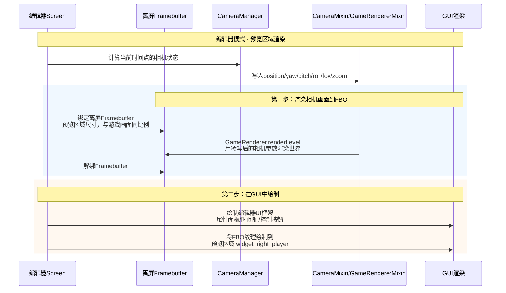

# 沉浸式电影摄影模组 - UI规划 v3.0（FBO预览区域渲染版）

**版本**: 3.0（对齐0.3.0已完成代码 + editor/包结构设计）
**日期**: 2026/5/1
**状态**: 草案 - 基于FBO预览区域渲染架构设计，对齐MOD_DESIGN.md §8包结构

---

## 🔄 基于重建文档的理解

### **关键架构理解**：

1. **编辑器是游戏内功能**：编辑器作为模组内置功能，在游戏内运行，所有代码在 `editor/` 包下
2. **播放器和时间轴联动**：像剪辑软件那样，播放时时间轴有竖线指示当前时间
3. **FBO预览区域渲染**：编辑器模式下，Mixin渲染注入切换目标——从全屏渲染变为GUI区域渲染
4. **动态布局**：根据窗口大小动态适配，由 `editor/layout/` 子包管理
5. **关键帧系统**：使用关键帧系统，摒弃旧版固定路线方式
6. **staged/commit双缓冲**：CameraManager已有staged/commit架构，编辑器scrub通过staged写入→commit提交→Mixin读取

### **编辑器预览方案核心原理**：

在编辑器模式下，相机画面渲染到离屏Framebuffer（FBO），然后将FBO纹理绘制到编辑器GUI的预览区域中，就像视频剪辑软件那样。



### **双模式渲染切换**：

| 模式 | 渲染目标 | 调用者 | Mixin行为 |
|------|----------|--------|-----------|
| **播放模式** | 主Framebuffer（全屏） | Minecraft主循环 | CameraMixin覆写相机参数 → 全屏显示相机画面 |
| **编辑器模式** | 离屏FBO（预览区域尺寸） | 编辑器Screen | CameraMixin覆写相机参数 → 渲染到FBO → 绘制到预览区域 |

**关键点**：不需要修改Mixin本身的覆写逻辑，只需要控制"谁来调用renderLevel()"和"渲染到哪个Framebuffer"。

---

## 🎨 UI规划（基于javaui.ui布局参考）

### **UI整体架构**：

```
┌─────────────────────────────────┐
│         MenuBar (30px)           │  # 文件、编辑、帮助
├──────────┬──────────────────────┤
│          │  包名标签 (15px)      │
│  左侧    ├──────────────────────┤
│  控制区  │                      │
│  (240px) │   📺 预览区域        │  ← FBO纹理绘制到这里
│          │   (与游戏画面同比例)   │     CameraMixin渲染的结果
│  属性    │                      │
│  面板    ├──────────────────────┤
│          │  播放控制 (15px)      │
├──────────┴──────────────────────┤
│       时间轴区域 (285px)         │  # 多轨道，左侧冻结区域
└─────────────────────────────────┘
```

### **动态布局参数（基于javaui.ui参考）**：
- **窗口最小尺寸**：1200×900像素
- **菜单栏高度**：30像素（固定）
- **左侧控制区宽度**：240像素（固定或百分比）
- **播放区域宽度**：960像素（剩余宽度）
- **时间轴高度**：285像素（固定或百分比）

### **百分比布局规则**：
- 菜单栏：固定高度30px（~3.3%）
- 左侧控制区：宽度20%（可根据需求调整）
- 时间轴：高度30%（可根据需求调整）
- 播放区域：剩余空间（66.7%高度，80%宽度）

---

## 🏗️ 各区域功能规划

### **1. 顶部菜单栏 (MenuBar)**
| 组件 | 功能 | 状态 |
|------|------|------|
| 文件菜单 | 新建、打开、保存、导出 | 待设计 |
| 编辑菜单 | 撤销、重做、设置 | 待设计 |
| 帮助菜单 | 教程、文档、关于 | 待设计 |

**布局要求**：
- 固定高度或百分比高度
- 随窗口宽度变化
- 包含下拉菜单

### **2. 左侧控制区 (widget_left_controls)**
| 组件 | 功能 | 状态 |
|------|------|------|
| 属性面板 | 显示选中对象的属性 | 待设计 |
| 功能按钮 | 添加、删除、复制等 | 待设计 |
| 参数调节 | 数值输入、滑块 | 待设计 |

**动态行为**：
- 当选择时间轴上的镜头行时，显示对应属性
- 无关键帧：显示基础属性（总时长等）
- 有关键帧：显示关键帧属性（位置、镜头属性等）
- 支持两个关键帧间的属性平滑

**布局要求**：
- 固定宽度或百分比宽度
- 垂直滚动（如需要）

### **3. 右侧播放区 (widget_right_player)** ← FBO预览区域

| 组件 | 功能 | 状态 |
|------|------|------|
| **FBO实时预览** | 显示相机视角渲染结果 | **已确定：FBO预览区域渲染** |
| 播放控制 | 播放、暂停、停止 | 待设计 |
| 状态显示 | 当前时间、帧率等 | 待设计 |

**FBO预览区域渲染原理**：

1. **离屏渲染**：创建 `SimpleFramebuffer`，尺寸与预览区域相同，保持游戏画面宽高比
2. **渲染流程**：
   - 编辑器Screen在 `render()` 中绑定FBO
   - 调用 `GameRenderer.renderLevel()` 渲染世界（CameraMixin已覆写相机参数）
   - 解绑FBO
   - 将FBO的颜色纹理绘制到预览区域（`widget_right_player`）
3. **时间联动**：拖动时间轴 → 计算该时间点相机状态 → 写入CameraManager → 下一帧FBO预览自动更新

**布局要求**：
- 剩余宽度（减去左侧控制区）
- 可随窗口大小调整
- 保持宽高比（与游戏画面比例相同）
- FBO尺寸随预览区域尺寸动态调整

### **4. 底部时间轴区 (widget_bottom)**
| 组件 | 功能 | 状态 |
|------|------|------|
| 冻结区域 | 左侧固定，显示每行代表什么 | 待设计 |
| 时间轴 | 无限向右和上下滚动的多时间轴布局 | 待设计 |

**复杂需求**：
1. **无限滚动**：可向右和上下无限滚动
2. **动态滚动范围**：根据内容动态变化
3. **冻结区域**：
   - 左侧固定区域
   - 左右滚动时：一直显示在最左侧
   - 上下滚动时：随行一起滚动
4. **多时间轴布局**：类似剪辑软件

**滚动逻辑**：
- **向右滚动**：根据时间轴内容动态变化
- **上下滚动**：根据行数动态变化
- **动态范围**：防止出错，根据实际内容计算

---

## 🔧 技术实现架构

### **核心架构 — FBO预览区域渲染**

```java
// editor/CameraEditorScreen.java
public class CameraEditorScreen extends Screen {
    private Framebuffer previewFBO;  // 离屏帧缓冲
    private MenuBarWidget menuBar;                    // editor/panel/MenuBarWidget
    private PropertyPanelWidget leftControls;         // editor/panel/PropertyPanelWidget
    private PlayerPanelWidget rightPlayer;            // editor/panel/PlayerPanelWidget
    private TimelinePanelWidget bottomTimeline;       // editor/panel/TimelinePanelWidget
    private EditorSyncSystem syncSystem;              // editor/sync/EditorSyncSystem
    
    // 预览区域坐标（由 EditorLayout 计算）
    private int previewX, previewY, previewWidth, previewHeight;
    
    @Override
    protected void init() {
        super.init();
        
        // 使用 EditorLayout 动态计算布局（基于javaui.ui比例）
        EditorLayout layout = EditorLayout.calculate(this.width, this.height);
        
        // 初始化组件
        menuBar = new MenuBarWidget(0, 0, this.width, layout.menuHeight);
        leftControls = new PropertyPanelWidget(0, layout.menuHeight,
            layout.leftWidth, layout.mainHeight);
        rightPlayer = new PlayerPanelWidget(layout.leftWidth, layout.menuHeight,
            this.width - layout.leftWidth, layout.mainHeight);
        bottomTimeline = new TimelinePanelWidget(0, layout.menuHeight + layout.mainHeight,
            this.width, layout.bottomHeight);
        
        // 初始化联动系统
        syncSystem = new EditorSyncSystem(rightPlayer, bottomTimeline, leftControls);
        
        // 计算预览区域（基于javaui.ui的widget_right_player布局）
        previewX = layout.leftWidth;
        previewY = layout.menuHeight + 15; // +15是包名标签
        previewWidth = this.width - layout.leftWidth;
        previewHeight = layout.mainHeight - 30; // -30 控制区+标签
        
        // 创建FBO，保持游戏画面宽高比
        previewFBO = new SimpleFramebuffer(previewWidth, previewHeight, true);
        
        addRenderableWidget(menuBar);
        addRenderableWidget(leftControls);
        addRenderableWidget(rightPlayer);
        addRenderableWidget(bottomTimeline);
    }
    
    @Override
    public void render(GuiGraphics graphics, int mouseX, int mouseY, float partialTick) {
        // === 第一步：渲染相机视角到FBO ===
        CameraManager mgr = CameraManager.INSTANCE;
        mgr.setEditorPreviewMode(true);
        
        previewFBO.bindWrite(true);
        Minecraft.getInstance().gameRenderer.renderLevel(partialTick);
        previewFBO.unbindWrite();
        
        mgr.setEditorPreviewMode(false);
        
        // === 第二步：绘制编辑器GUI ===
        this.renderBackground(graphics);
        
        // 绘制预览区域（FBO纹理）
        graphics.blit(previewFBO.getColorTexture(),
            previewX, previewY, 0, 0, previewWidth, previewHeight);
        
        // 绘制编辑器UI组件
        menuBar.render(graphics, mouseX, mouseY, partialTick);
        leftControls.render(graphics, mouseX, mouseY, partialTick);
        rightPlayer.render(graphics, mouseX, mouseY, partialTick);
        bottomTimeline.render(graphics, mouseX, mouseY, partialTick);
    }
    
    /** 时间轴拖动 → 更新预览（使用staged/commit双缓冲） */
    private void onTimelineScrub(double time) {
        CameraState state = scriptPlayer.getStateAtTime(time);
        // 通过staged写入（不直接修改active，避免与ScriptPlayer冲突）
        CameraManager mgr = CameraManager.INSTANCE;
        mgr.stageTargetPosition(state.position, 0);
        mgr.stageTargetYaw(state.yaw, 0);
        mgr.stageTargetPitch(state.pitch, 0);
        mgr.stageTargetRoll(state.roll, 0);
        mgr.stageTargetFov(state.fov, 0);
        mgr.stageTargetZoom(state.zoom, 0);
        mgr.commitStagedState();
        // 下一帧渲染时，CameraMixin自动使用新值 → FBO预览更新
    }
    
    @Override
    public void onClose() {
        // 清理FBO
        if (previewFBO != null) {
            previewFBO.destroyBuffers();
            previewFBO = null;
        }
        CameraManager.INSTANCE.setEditorPreviewMode(false);
        super.onClose();
    }
}
```

### **1. 播放器区域实现（FBO预览渲染）**

```java
// editor/panel/PlayerPanelWidget.java
public class PlayerPanelWidget extends ContainerWidget {
    private PlaybackControlsWidget controls;    // editor/playback/PlaybackControlsWidget
    private TimeDisplayWidget timeDisplay;      // editor/playback/TimeDisplayWidget
    private double currentTime = 0.0;
    
    public PlayerPanelWidget(int x, int y, int width, int height) {
        super(x, y, width, height);
        
        // 创建播放控制
        controls = new PlaybackControlsWidget();
        controls.setOnTimeUpdate(this::onTimeUpdated);
        
        // 创建时间显示
        timeDisplay = new TimeDisplayWidget();
    }
    
    // 时间更新回调
    private void onTimeUpdated(double newTime) {
        this.currentTime = newTime;
        
        // 1. 更新自己的时间显示
        timeDisplay.setTime(newTime);
        
        // 2. 通过联动系统通知时间轴更新竖线位置
        syncSystem.syncTime(newTime);
        
        // 3. 更新相机状态（通过staged/commit → 下一帧FBO自动渲染新视角）
        updateCameraAtTime(newTime);
    }
    
    // 根据时间更新相机（使用staged/commit双缓冲）
    private void updateCameraAtTime(double time) {
        // 调用脚本系统计算相机状态
        CameraState state = scriptPlayer.getStateAtTime(time);
        
        // 通过staged写入（不直接修改active，避免与ScriptPlayer冲突）
        CameraManager mgr = CameraManager.INSTANCE;
        mgr.stageTargetPosition(state.position, 0);
        mgr.stageTargetYaw(state.yaw, 0);
        mgr.stageTargetPitch(state.pitch, 0);
        mgr.stageTargetRoll(state.roll, 0);
        mgr.stageTargetFov(state.fov, 0);
        mgr.stageTargetZoom(state.zoom, 0);
        mgr.commitStagedState();
    }
    
    // 渲染方法（FBO纹理绘制由CameraEditorScreen统一处理）
    @Override
    public void render(GuiGraphics graphics, int mouseX, int mouseY, float delta) {
        super.render(graphics, mouseX, mouseY, delta);
        
        // 绘制播放控制和时间显示
        // 注意：FBO纹理的绘制在CameraEditorScreen.render()中统一处理
        controls.render(graphics, mouseX, mouseY, delta);
        timeDisplay.render(graphics, mouseX, mouseY, delta);
    }
}
```

### **2. 时间轴区域实现**

```java
// editor/panel/TimelinePanelWidget.java
public class TimelinePanelWidget extends ContainerWidget {
    private FrozenHeaderWidget frozenHeader;      // editor/timeline/FrozenHeaderWidget
    private TimelineCanvas timelineCanvas;         // editor/timeline/TimelineCanvas
    private PlayheadWidget playhead;               // editor/timeline/PlayheadWidget
    private TimeRulerWidget timeRuler;             // editor/timeline/TimeRulerWidget
    
    // 无限滚动参数
    private double maxHorizontalScroll; // 动态计算
    private int maxVerticalScroll;      // 动态计算
    
    public TimelinePanelWidget(int x, int y, int width, int height) {
        super(x, y, width, height);
        
        // 1. 创建冻结区域（左侧）
        frozenHeader = new FrozenHeaderWidget(0, 0, FROZEN_WIDTH, height);
        
        // 2. 创建时间轴画布（可滚动区域）
        timelineCanvas = new TimelineCanvas(FROZEN_WIDTH, 0,
            width - FROZEN_WIDTH, height);
        
        // 3. 创建时间标尺
        timeRuler = new TimeRulerWidget(FROZEN_WIDTH, 0, width - FROZEN_WIDTH, RULER_HEIGHT);
        
        // 4. 创建播放头
        playhead = new PlayheadWidget();
        
        // 5. 设置滚动监听
        timelineCanvas.setOnScroll(this::onScroll);
    }
    
    // 设置当前时间（来自播放器区域/联动系统）
    public void setCurrentTime(double time) {
        // 1. 更新播放头位置
        playhead.setTime(time);
        
        // 2. 如果需要，自动滚动到可见区域
        ensureTimeVisible(time);
    }
    
    // 确保时间在可见区域内
    private void ensureTimeVisible(double time) {
        double timeX = timeToXPosition(time);
        double visibleStart = getScrollX();
        double visibleEnd = visibleStart + getVisibleWidth();
        
        if (timeX < visibleStart || timeX > visibleEnd) {
            // 滚动到使时间在中间位置
            double targetX = timeX - getVisibleWidth() / 2;
            setScrollX(targetX);
        }
    }
    
    // 动态计算滚动范围
    private void updateScrollLimits() {
        // 水平：根据最大时间
        this.maxHorizontalScroll = timeline.getDuration() * PIXELS_PER_SECOND;
        
        // 垂直：根据轨道数量
        this.maxVerticalScroll = timeline.getTrackCount() * TRACK_HEIGHT;
        
        // 防止出错：设置合理上限
        this.maxHorizontalScroll = Math.min(maxHorizontalScroll, MAX_HORIZONTAL);
        this.maxVerticalScroll = Math.min(maxVerticalScroll, MAX_VERTICAL);
    }
    
    // 处理滚动
    private void onScroll(double deltaX, double deltaY) {
        // 水平滚动：时间轴滚动
        double newScrollX = getScrollX() + deltaX;
        newScrollX = Math.max(0, Math.min(newScrollX, maxHorizontalScroll));
        setScrollX(newScrollX);
        
        // 垂直滚动：轨道滚动，冻结区域也滚动
        double newScrollY = getScrollY() + deltaY;
        newScrollY = Math.max(0, Math.min(newScrollY, maxVerticalScroll));
        setScrollY(newScrollY);
        
        // 更新冻结区域位置
        frozenHeader.setScrollY(newScrollY);
    }
}
```

### **3. 联动系统设计**

```java
// editor/sync/EditorSyncSystem.java
public class EditorSyncSystem {
    private final PlayerPanelWidget playerPanel;
    private final TimelinePanelWidget timelinePanel;
    private final PropertyPanelWidget propertyPanel;
    
    // 时间同步
    public void syncTime(double time) {
        // 1. 播放器区域更新
        playerPanel.setCurrentTime(time);
        
        // 2. 时间轴区域更新
        timelinePanel.setCurrentTime(time);
        
        // 3. 属性面板更新
        TimelineSelection selection = timelinePanel.getSelectionAtTime(time);
        propertyPanel.onSelectionChanged(selection);
    }
    
    // 选择同步
    public void syncSelection(TimelineSelection selection) {
        // 1. 属性面板显示属性
        propertyPanel.onSelectionChanged(selection);
        
        // 2. 如果选择的是关键帧，播放器预览该帧
        if (selection.hasKeyframes()) {
            playerPanel.previewKeyframe(selection.getKeyframes().get(0));
        }
    }
}
```

### **4. 动态布局系统**

```java
// editor/layout/EditorLayout.java
public class EditorLayout {
    public final int menuHeight;
    public final int bottomHeight;
    public final int leftWidth;
    public final int mainHeight;
    
    private EditorLayout(int menuHeight, int bottomHeight, int leftWidth, int mainHeight) {
        this.menuHeight = menuHeight;
        this.bottomHeight = bottomHeight;
        this.leftWidth = leftWidth;
        this.mainHeight = mainHeight;
    }
    
    public static EditorLayout calculate(int windowWidth, int windowHeight) {
        // 使用百分比而非固定像素（基于javaui.ui参考）
        int menuHeight = (int)(windowHeight * 0.05);  // 5%
        int bottomHeight = (int)(windowHeight * 0.3); // 30%
        int leftWidth = (int)(windowWidth * 0.2);     // 20%
        int mainHeight = windowHeight - menuHeight - bottomHeight;
        return new EditorLayout(menuHeight, bottomHeight, leftWidth, mainHeight);
    }
}
```

```java
// editor/layout/EditorConstants.java
public final class EditorConstants {
    // 基于javaui.ui的布局参考
    public static final int MIN_WINDOW_WIDTH = 1200;
    public static final int MIN_WINDOW_HEIGHT = 900;
    public static final int FIXED_LEFT_WIDTH = 240;     // widget_left_controls
    public static final int FIXED_MENU_HEIGHT = 30;     // MenuBar
    public static final int FIXED_BOTTOM_HEIGHT = 285;  // widget_bottom
    public static final int PACKAGE_LABEL_HEIGHT = 15;  // packagename标签
    public static final int PLAYER_CONTROLS_HEIGHT = 15;// widget_player_controls
    
    // 布局百分比（动态模式）
    public static final double MENU_HEIGHT_RATIO = 0.05;    // ~3.3%
    public static final double BOTTOM_HEIGHT_RATIO = 0.3;   // 30%
    public static final double LEFT_WIDTH_RATIO = 0.2;      // 20%
}
```

### **5. CameraManager编辑器模式支持**

```java
// camera/CameraManager.java — 需要新增编辑器预览模式标志
// 现有代码已有 staged/commit 双缓冲架构，编辑器scrub通过staged写入
public class CameraManager {
    private boolean editorPreviewMode = false;
    
    public void setEditorPreviewMode(boolean mode) {
        this.editorPreviewMode = mode;
    }
    
    public boolean isEditorPreviewMode() {
        return editorPreviewMode;
    }
    
    // 现有staged/commit方法（已实现）：
    // stageTargetPosition/commitStagedState 等
    // 编辑器scrub时：stageXxx() → commitStagedState() → Mixin读取active值
}
```

**Mixin行为说明**：
- CameraMixin 和 GameRendererMixin 的覆写逻辑**不需要修改**
- 编辑器模式下，由编辑器Screen控制 `renderLevel()` 的调用和渲染目标
- 播放模式下，由Minecraft主循环控制 `renderLevel()`，Mixin照常覆写相机参数到全屏
- 编辑器scrub时通过 `stageTargetXxx()` + `commitStagedState()` 写入，避免直接修改active状态与ScriptPlayer冲突

---

## 📁 editor/包结构与javaui.ui映射

| javaui.ui组件 | editor/包类 | 子包 | 说明 |
|---------------|------------|------|------|
| `Form` (整体窗口) | `CameraEditorScreen` | `editor/` | Screen主类，布局框架 |
| — | `PreviewRenderer` | `editor/` | FBO离屏渲染+纹理绘制 |
| — | `EditorLayout` | `editor/layout/` | 动态布局计算 |
| — | `EditorConstants` | `editor/layout/` | 布局常量 |
| `MenuBar` | `MenuBarWidget` | `editor/panel/` | 顶部菜单栏 |
| `widget_left_controls` | `PropertyPanelWidget` | `editor/panel/` | 左侧属性面板 |
| `widget_right_player` | `PlayerPanelWidget` | `editor/panel/` | 右侧预览区 |
| `widget_bottom` | `TimelinePanelWidget` | `editor/panel/` | 底部时间轴 |
| — | `TimelineCanvas` | `editor/timeline/` | 时间轴可滚动画布 |
| — | `FrozenHeaderWidget` | `editor/timeline/` | 左侧冻结区域 |
| — | `TimeRulerWidget` | `editor/timeline/` | 时间标尺 |
| — | `PlayheadWidget` | `editor/timeline/` | 播放头竖线 |
| — | `TrackRowWidget` | `editor/timeline/` | 单轨道行 |
| — | `ClipBlockWidget` | `editor/timeline/` | 片段块 |
| — | `KeyframeEditorWidget` | `editor/property/` | 关键帧属性编辑 |
| — | `Vector3Input` | `editor/property/` | 三维向量输入 |
| — | `FloatInput` | `editor/property/` | 浮点数输入 |
| — | `PositionPicker` | `editor/property/` | 游戏内坐标拾取 |
| — | `PlaybackControlsWidget` | `editor/playback/` | 播放控制 |
| — | `TimeDisplayWidget` | `editor/playback/` | 时间显示 |
| — | `EditorSyncSystem` | `editor/sync/` | 联动系统 |
